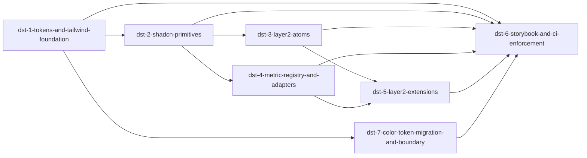

# Phase 1: design-system-and-tokens

**Parent Todo ID:** `design-system-and-tokens`
**Phase:** Phase 1
**Dependency Layer:** Layer 0 (Foundational UX framework)
**D1 decomposition by:** gemini-3.1-pro

*TDD Note: Each ticket's Test plan files are authored FIRST and must FAIL before any implementation begins.*

## Ticket Dependency Graph

## Tickets

### Ticket: `dst-1-tokens-and-tailwind-foundation`

#### Scope (1 paragraph)
Installs the Tailwind CSS and @shadcn/ui CLI foundations, establishing the Layer 0 tokens. This ticket provisions the OKLCH tier color tokens, Geist Sans and Geist Mono typography scales, 8px grid spacing tokens, and CSS variables for dark/light mode themes. It modifies the existing Tailwind configuration to support these tokens and sets up the central `tokens.css` file for the Studio UI. It explicitly does NOT migrate existing components to use these tokens yet.

#### Files affected
- `src/bma_cfengine_app/ui/package.json` — modified; adds tailwindcss, shadcn CLI dependencies.
- `src/bma_cfengine_app/ui/tailwind.config.ts` — modified; configures OKLCH colors, Geist fonts, spacing.
- `src/bma_cfengine_app/ui/src/styles/tokens.css` — new; defines root CSS variables for light/dark themes.
- `src/bma_cfengine_app/ui/src/styles/index.css` — modified; imports `tokens.css`.

#### Dependencies
- None

#### User journeys (1-3)
1. GIVEN the Studio application WHEN the user toggles between light and dark modes THEN the OKLCH CSS variables in `tokens.css` seamlessly switch, providing a consistent base palette.
2. GIVEN the updated Tailwind configuration WHEN a developer uses class names like `text-geist-sans` or `bg-tier-primary` THEN the respective fonts and OKLCH colors are applied.

#### Acceptance criteria (numbered, testable)
1. Tailwind configuration is updated to use OKLCH colors, overriding default color scales.
2. `Geist Sans` and `Geist Mono` are installed and configured as the primary font families.
3. Light and dark mode themes are established using CSS variables in a new `tokens.css` file.
4. An 8px spacing system is enforced in the Tailwind configuration.

#### Test plan
- `src/bma_cfengine_app/ui/src/styles/tokens.test.ts::test_oklch_variables_defined_for_light_and_dark_themes` — AC 1, 3
- `src/bma_cfengine_app/ui/src/styles/tailwind.config.test.ts::test_tailwind_config_includes_geist_and_oklch_extensions` — AC 1, 2, 4

#### Out-of-scope notes
Do not modify existing components to use the new tokens yet.

---

### Ticket: `dst-2-shadcn-primitives`

#### Scope (1 paragraph)
Installs and configures shadcn/ui Layer 1 primitives and migrates legacy standalone components to use them. This ticket adds primitives such as Button, Input, Select, Dialog, Drawer, Sheet, Tooltip, and Popover using the shadcn CLI. It then replaces hand-rolled instances of `FormSelect`, `CollapsiblePanel`, `MetricCard`, `PillToggle`, and `EmptyState` across the application with compositions of the new Layer 1 primitives, removing the legacy components.

#### Files affected
- `src/bma_cfengine_app/ui/components.json` — new; shadcn configuration.
- `src/bma_cfengine_app/ui/src/components/ui/*` — new; shadcn Layer 1 primitives.
- `src/bma_cfengine_app/ui/src/components/FormSelect.tsx` — deleted.
- `src/bma_cfengine_app/ui/src/components/CollapsiblePanel.tsx` — deleted.
- `src/bma_cfengine_app/ui/src/components/MetricCard.tsx` — deleted.
- `src/bma_cfengine_app/ui/src/components/PillToggle.tsx` — deleted.
- `src/bma_cfengine_app/ui/src/components/EmptyState.tsx` — deleted.
- Consumer files throughout `src/bma_cfengine_app/ui/src/` — modified.

#### Dependencies
- `dst-1-tokens-and-tailwind-foundation`

#### User journeys (1-3)
1. GIVEN a form using the legacy `FormSelect` WHEN the user interacts with it THEN it behaves consistently as a Radix-backed shadcn `Select` component.
2. GIVEN a view previously using `MetricCard` WHEN rendered THEN it uses the new Layer 1 `Card` and typography primitives, aligning with the new design system.

#### Acceptance criteria (numbered, testable)
1. Layer 1 primitives (Button, Input, Select, Dialog, Drawer, Sheet, Tooltip, Popover, Card, Collapsible) are installed into `src/components/ui/`.
2. All usages of the 5 legacy components (`FormSelect`, `CollapsiblePanel`, `MetricCard`, `PillToggle`, `EmptyState`) are replaced with shadcn-backed implementations.
3. The legacy component files are completely removed from the repository.

#### Test plan
- `src/bma_cfengine_app/ui/src/components/ui/Button.test.tsx::test_button_renders_with_theme_tokens` — AC 1
- `src/bma_cfengine_app/ui/src/components/ui/Select.test.tsx::test_select_replaces_formselect_functionality` — AC 2
- Playwright component tests to assert the removal and replacement of the 5 legacy components across key routes.

#### Out-of-scope notes
Do not build domain-specific Layer 2 components here; focus only on the generic Layer 1 primitives and the immediate replacement of the listed legacy components.

---

### Ticket: `dst-3-layer2-atoms`

#### Scope (1 paragraph)
Builds the canonical Layer-2 domain atoms using Layer 1 primitives and Layer 0 tokens. This ticket creates `TierChip`, `SourceChip`, `StateOverlay`, `MetricMonoValue`, `DiagnosticChip`, and `RateOrScheduleEditor`. These components encapsulate financial and domain-specific UI patterns, ensuring that domain semantics (like tier coloring or diagnostic severity) are consistently mapped to the underlying design system.

#### Files affected
- `src/bma_cfengine_app/ui/src/components/system/TierChip.tsx` — new.
- `src/bma_cfengine_app/ui/src/components/system/SourceChip.tsx` — new.
- `src/bma_cfengine_app/ui/src/components/system/StateOverlay.tsx` — new.
- `src/bma_cfengine_app/ui/src/components/system/MetricMonoValue.tsx` — new.
- `src/bma_cfengine_app/ui/src/components/system/DiagnosticChip.tsx` — new.
- `src/bma_cfengine_app/ui/src/components/system/RateOrScheduleEditor.tsx` — new.

#### Dependencies
- `dst-2-shadcn-primitives`

#### User journeys (1-3)
1. GIVEN a tranche displayed in the UI WHEN its tier is rendered THEN the `TierChip` component strictly maps the tier to its designated OKLCH token color.
2. GIVEN a validation warning WHEN displayed in a list THEN the `DiagnosticChip` renders with the consistent warning token colors and iconography.

#### Acceptance criteria (numbered, testable)
1. `TierChip` supports all valid deal tiers and maps them to specific Layer 0 tokens.
2. `SourceChip` and `StateOverlay` render correctly based on their domain states.
3. `MetricMonoValue` uses the `Geist Mono` font and formats numbers according to standard conventions.
4. `DiagnosticChip` renders severity levels (info, warning, error) with corresponding styling.
5. `RateOrScheduleEditor` provides a cohesive interface for editing scalar rates or schedule arrays.

#### Test plan
- `src/bma_cfengine_app/ui/src/components/system/TierChip.test.tsx::test_tierchip_maps_tiers_to_correct_tokens` — AC 1
- `src/bma_cfengine_app/ui/src/components/system/MetricMonoValue.test.tsx::test_metricmonovalue_uses_geist_mono` — AC 3
- `src/bma_cfengine_app/ui/src/components/system/DiagnosticChip.test.tsx::test_diagnosticchip_variants` — AC 4

#### Out-of-scope notes
Do not implement the complex extensions (like `ScheduleBandEditor` or `LineageEdge`) here.

---

### Ticket: `dst-4-metric-registry-and-adapters`

#### Scope (1 paragraph)
Implements a typed MetricRegistry and surface-specific adapters, resolving the architectural issue of an overloaded `MetricPicker`. Instead of forcing solver targets, trigger editing, compare diffs, and calculation builders through one generic picker, this ticket establishes a shared registry of metrics and creates specialized adapters (`SolverTargetAdapter`, `SolverConstraintAdapter`, `TriggerThresholdAdapter`, `CompareDiffAdapter`, `CalculationBuilderAdapter`, `AIArgumentAdapter`).

#### Files affected
- `src/bma_cfengine_app/ui/src/features/metrics/MetricRegistry.ts` — new; shared registry.
- `src/bma_cfengine_app/ui/src/components/system/adapters/SolverTargetAdapter.tsx` — new.
- `src/bma_cfengine_app/ui/src/components/system/adapters/SolverConstraintAdapter.tsx` — new.
- `src/bma_cfengine_app/ui/src/components/system/adapters/TriggerThresholdAdapter.tsx` — new.
- `src/bma_cfengine_app/ui/src/components/system/adapters/CompareDiffAdapter.tsx` — new.
- `src/bma_cfengine_app/ui/src/components/system/adapters/CalculationBuilderAdapter.tsx` — new.
- `src/bma_cfengine_app/ui/src/components/system/adapters/AIArgumentAdapter.tsx` — new.

#### Dependencies
- `dst-2-shadcn-primitives`

#### User journeys (1-3)
1. GIVEN the solver builder WHEN a user selects a constraint THEN they interact with the `SolverConstraintAdapter`, which provides constraints-specific operators without exposing trigger-specific features.
2. GIVEN a trigger threshold configuration WHEN edited THEN the `TriggerThresholdAdapter` provides access to rolling windows and polarity, unique to triggers.

#### Acceptance criteria (numbered, testable)
1. A strongly-typed `MetricRegistry` is defined, housing shared metric definitions.
2. Six distinct adapter components are created, each consuming the `MetricRegistry` but exposing only the props and UI relevant to their surface.
3. The adapters do not leak generic or unneeded configurations to their respective surfaces.

#### Test plan
- `src/bma_cfengine_app/ui/src/features/metrics/MetricRegistry.test.ts::test_metric_registry_exports_valid_schema` — AC 1
- `src/bma_cfengine_app/ui/src/components/system/adapters/SolverTargetAdapter.test.tsx::test_solver_target_adapter_exposes_valid_props` — AC 2, 3
- `src/bma_cfengine_app/ui/src/components/system/adapters/TriggerThresholdAdapter.test.tsx::test_trigger_threshold_adapter_supports_rolling_windows` — AC 2, 3

#### Out-of-scope notes
Do not fully wire these adapters into the Phase 2/3 panes yet; just build the components and their Storybook stories.

---

### Ticket: `dst-5-layer2-extensions`

#### Scope (1 paragraph)
Builds the advanced Layer-2 extensions and node-graph primitives. This ticket implements `ScheduleBandEditor`, `ConditionGateBadge`, `RuleHeaderPills`, `EntityEmptyState`, `HelpChip`, `LineageEdge`, and `TriggerDependencyEdge`. These components combine the atoms and adapters to form complex, reusable patterns required by the Phase 2 panes.

#### Files affected
- `src/bma_cfengine_app/ui/src/components/system/ScheduleBandEditor.tsx` — new.
- `src/bma_cfengine_app/ui/src/components/system/ConditionGateBadge.tsx` — new.
- `src/bma_cfengine_app/ui/src/components/system/RuleHeaderPills.tsx` — new.
- `src/bma_cfengine_app/ui/src/components/system/EntityEmptyState.tsx` — new.
- `src/bma_cfengine_app/ui/src/components/system/HelpChip.tsx` — new.
- `src/bma_cfengine_app/ui/src/components/system/LineageEdge.tsx` — new.
- `src/bma_cfengine_app/ui/src/components/system/TriggerDependencyEdge.tsx` — new.

#### Dependencies
- `dst-3-layer2-atoms`
- `dst-4-metric-registry-and-adapters`

#### User journeys (1-3)
1. GIVEN a schedule requiring multiple speed bands WHEN edited THEN the `ScheduleBandEditor` provides a cohesive UI for adding, modifying, and removing bands.
2. GIVEN a graph view of deal dependencies WHEN rendered THEN `LineageEdge` and `TriggerDependencyEdge` display semantically rich connections between nodes.

#### Acceptance criteria (numbered, testable)
1. All 7 extension components are built using Layer 1 and Layer 2 atoms.
2. `ScheduleBandEditor` supports multi-band editing with validation.
3. Edge components (`LineageEdge`, `TriggerDependencyEdge`) support correct layout routing props and styling.

#### Test plan
- `src/bma_cfengine_app/ui/src/components/system/ScheduleBandEditor.test.tsx::test_schedule_band_editor_validation` — AC 1, 2
- `src/bma_cfengine_app/ui/src/components/system/LineageEdge.test.tsx::test_lineage_edge_renders_paths` — AC 1, 3

#### Out-of-scope notes
Do not integrate these into the main application views yet.

---

### Ticket: `dst-6-storybook-and-ci-enforcement`

#### Scope (1 paragraph)
Sets up Storybook and strictly enforces its use in CI for all Layer 1, 2, and 3 components. This ticket configures Storybook for the project, authors stories for the components developed in the previous tickets (covering all variants, states, and reduced-motion preferences), and adds a CI step that automatically fails if a component in `src/components/ui/` or `src/components/system/` lacks a corresponding `.stories.tsx` file.

#### Files affected
- `src/bma_cfengine_app/ui/.storybook/main.ts` — new.
- `src/bma_cfengine_app/ui/.storybook/preview.ts` — new.
- `.github/workflows/ui-ci.yml` — modified; adds story-existence check and smoke tests.
- `scripts/check_stories.py` (or `.js`) — new; script to verify story coverage.
- Various `*.stories.tsx` files for components.

#### Dependencies
- `dst-1-tokens-and-tailwind-foundation` (runs after or parallel to component creation to enforce them).

#### User journeys (1-3)
1. GIVEN a developer adding a new component to the `system/` directory WHEN they push code without a story THEN the CI pipeline fails with a clear message enforcing story creation.
2. GIVEN a UI reviewer WHEN they open Storybook THEN they can view all variants, hover states, and dark/light modes of the design system.

#### Acceptance criteria (numbered, testable)
1. Storybook is configured and successfully builds locally.
2. A `.stories.tsx` file exists for EVERY component created in `dst-2`, `dst-3`, `dst-4`, and `dst-5`.
3. Stories explicitly demonstrate dark mode, light mode, and reduced-motion states.
4. CI pipeline includes a job that executes a script asserting a 1:1 mapping of components in `ui/` and `system/` to `.stories.tsx` files.

#### Test plan
- `src/bma_cfengine_app/ui/scripts/check_stories.test.ts::test_check_stories_fails_on_missing_story` — AC 4
- Verify CI passes only when all stories are present.
- Storybook visual smoke test via Chromatic or similar in CI (if configured).

#### Out-of-scope notes
Do not write stories for Layer 4 workbench surfaces (panes) in this ticket.

---

### Ticket: `dst-7-color-token-migration-and-boundary`

#### Scope (1 paragraph)
Establishes the hard boundary against hardcoded colors and installs required structural UI dependencies. This ticket installs `framer-motion`, `vaul`, `react-resizable-panels`, `cmdk`, and `react-hotkeys-hook`. It implements a Stylelint or ESLint custom rule to prevent any hardcoded hex/rgb colors in `src/components/ui/` and `src/components/system/` (the "no hardcoded colors in NEW or MODIFIED Studio code" boundary). Finally, it creates the living `CATALOG.md` document that defines the 5-layer hierarchy.

#### Files affected
- `src/bma_cfengine_app/ui/package.json` — modified; adds new dependencies.
- `src/bma_cfengine_app/ui/.eslintrc.cjs` (or stylelint config) — modified; adds the boundary lint rule.
- `src/bma_cfengine_app/ui/src/components/system/CATALOG.md` — new; documents the component layers.

#### Dependencies
- `dst-1-tokens-and-tailwind-foundation`

#### User journeys (1-3)
1. GIVEN a developer modifying a Studio component WHEN they attempt to use a hardcoded color like `text-[#123456]` THEN the linter immediately rejects the change, pointing them to the token system.
2. GIVEN a reviewer looking at the architecture WHEN they read `CATALOG.md` THEN they understand exactly which file paths correspond to Layer 0 tokens through Layer 4 surfaces.

#### Acceptance criteria (numbered, testable)
1. `framer-motion`, `vaul`, `react-resizable-panels`, `cmdk`, and `react-hotkeys-hook` are installed.
2. A lint rule is enforced in CI that forbids `#hex`, `rgb()`, or `rgba()` values in styles/classNames within `src/components/ui/` and `src/components/system/`.
3. `components/system/CATALOG.md` is created, defining Layer 0 (tokens), Layer 1 (shadcn), Layer 2 (domain atoms), Layer 3 (entity components), and Layer 4 (workbench surfaces) with concrete folder paths.

#### Test plan
- `src/bma_cfengine_app/ui/test/lint.test.ts::test_linter_rejects_hardcoded_colors_in_system_components` — AC 2
- Assert package.json contains all 5 required libraries.
- Assert `CATALOG.md` exists and defines the 5 layers.

#### Out-of-scope notes
Do not refactor existing legacy application code outside of `ui/` and `system/` to pass the new color lint rule (apply the rule strictly to the designated boundaries).

---

## Phase 1 Sequencing Impact

The `design-system-and-tokens` set forms the UX foundation for the Studio.
- **dst-1-tokens-and-tailwind-foundation**: Must land first. Unblocks all subsequent UI work.
- **dst-2-shadcn-primitives**: Requires `dst-1`. Must land before any Phase 2 pane work begins, as all new panes use these primitives.
- **dst-3-layer2-atoms** and **dst-4-metric-registry-and-adapters**: Require `dst-2`. Unblock `dst-5`.
- **dst-5-layer2-extensions**: Requires `dst-3` and `dst-4`. 
- **dst-6-storybook-and-ci-enforcement**: Can run parallel to `dst-3/4/5` but must block Phase 2 work until the CI gate is active to prevent regressions in component quality.
- **dst-7-color-token-migration-and-boundary**: Must land before any large-scale Phase 2 UI implementation to ensure the color and structural boundaries are enforced by linting from day one.

## Flags for the R1 Reviewer

1. **Adapter Pattern vs MetricPicker (dst-4):** This ticket splits the overloaded generic `MetricPicker` into a typed registry and specialized adapters (as flagged in the Phase 0 review). Reviewers should ensure the boundaries between the generic registry and surface adapters remain strict.
2. **Color Migration Scope (dst-7):** The "no hardcoded colors" rule is intentionally scoped to `src/components/ui/` and `src/components/system/` for Phase 1. Trying to lint the entire legacy codebase would stall Phase 1 unnecessarily.
3. **CI Enforcement (dst-6):** The CI requirement for Storybook coverage is a hard gate. The script must definitively block PRs that introduce components without stories.
4. **Five-Layer Catalog (dst-7):** The Phase 0 review noted an inconsistency (calling it 4 layers while listing 5). `CATALOG.md` standardizes this as a **five-layer** architecture (Layers 0 through 4).
