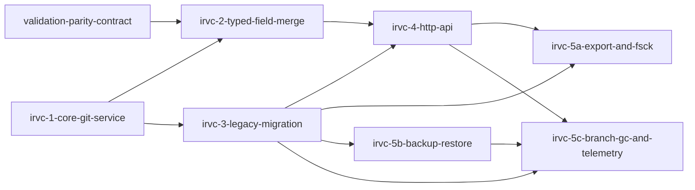

# Phase 1: ir-version-control-foundation

**Parent Todo ID:** `ir-version-control-foundation`
**Phase:** Phase 1
**Dependency Layer:** Layer 0 (No Phase-1 prerequisites)
**D1 decomposition by:** gemini-3.1-pro (separate agent invocation, read-only)
**R1 review pass 1:** RETURN-FOR-REVISION — `ir-version-control-foundation.r1-review-pass1.md`
**Revision pass 2:** D1 resumed; 7 tickets (split irvc-5)
**R1 review pass 2:** RETURN-FOR-REVISION — `ir-version-control-foundation.r1-review-pass2.md`
**Revision pass 3:** D1 resumed with all pass-2 findings folded back; parent-agent verification (no R1 pass-3 per user "don't over-engineer planning" directive)
**Status:** APPROVED FOR T1 (test author) following parent verification below.

*TDD Note: Each ticket's Test plan files are authored FIRST and must FAIL before any implementation begins.*

## Ticket Dependency Graph

## Tickets

### Ticket: `irvc-1-core-git-service`

#### Scope (1 paragraph)
Introduces the foundational git wrapper service and its dependencies. This ticket adds `pygit2` as an optional dependency to `pyproject.toml` (the application installs and runs without it, falling back to the git CLI subprocess) and implements a thin Python `GitService` wrapping the operations the rest of the app needs (`commit_deal`, `branch_create`, `branch_delete`, `diff`, `merge_base`, `log`, `show`, `branch_list`). It implements single-host, cross-process per-repo file locking with bounded timeout, and strict branch-name validation. It explicitly does NOT implement three-way merge logic, HTTP endpoints, or the legacy deal migration.

#### Files affected
- `pyproject.toml` — modified; adds `pygit2` to `[project.optional-dependencies]` under a `git` extra.
- `src/bma_cfengine_app/orchestrator/deals/git_service.py` — new; implements the core git wrapper, lazy `pygit2` import with CLI fallback, branch validation, and file locking.
- `.github/workflows/ci.yml` (or equivalent CI config) — modified; adds a CI matrix that runs the suite both with and without the `git` extra.

#### Dependencies
- none

#### User journeys (1-3)
1. GIVEN a deal directory WHEN the backend calls `commit_deal` THEN a git commit is created with the specified author and message, and the cross-process write lock prevents race conditions while permitting same-process reentrant acquisition.
2. GIVEN an environment where `pygit2` is not installed (the default install path) WHEN `GitService` is instantiated THEN it transparently uses the git CLI subprocess implementation; GIVEN an environment where `bma-cfengine[git]` is installed WHEN `GitService` is instantiated THEN it transparently uses the libgit2 backend.

#### Acceptance criteria (numbered, testable)
1. `pygit2` is added to `pyproject.toml` `[project.optional-dependencies]` under a `git` extra (following the existing `numba` / `fred` precedent). The application package installs without `pygit2` and the CLI fallback is exercised by default; `pip install bma-cfengine[git]` installs the libgit2 backend. `GitService` lazily imports `pygit2` via `try: import pygit2 except ImportError: pygit2 = None`.
2. `commit_deal` writes `deal.json` and creates a commit with the specified author, message, and parent SHA.
3. `branch_create`, `branch_delete`, `log`, `show`, `branch_list`, `diff`, and `merge_base` function correctly using both the `pygit2` and CLI fallback backends.
4. Write operations acquire a single-host, cross-process per-repo advisory lock at `.git/bma_write.lock` (separate from `.git/index.lock` to avoid colliding with git's own index lock). The lock is acquired via `fcntl.LOCK_EX | fcntl.LOCK_NB` with a bounded retry loop (default 5s timeout); on timeout, raises `LOCK_TIMEOUT`. Same-process reentrancy is supported via a thread-local counter: acquiring an already-held lock from the same process increments the counter; release decrements; the actual `fcntl` release happens only when the counter reaches 0. The locking site includes the marker: `# FUTURE: cross-host-locking — replace with distributed lock when multi-host backend lands`.
5. Branch names are strictly validated: only `main`, `ai/turn-{slug}`, `solver/run-{slug}`, and `what-if/{slug}` patterns are accepted. The slug grammar is `[a-z0-9][a-z0-9-]{0,63}` (lowercase alphanumeric + hyphen, leading character must be alphanumeric, max 64 chars). Any other pattern (including path traversal attempts like `../foo` or `..\\foo`, leading hyphens, uppercase, dots, slugs > 64 chars) raises `INVALID_BRANCH_NAME`.
6. CI workflow includes a matrix with two jobs: (a) install WITHOUT the `git` extra, ensure `git` CLI is on the runner, run the full test suite (proves CLI fallback is real); (b) install WITH the `git` extra (`pip install bma-cfengine[git]`), run the full test suite (proves the pygit2 path works).

#### Test plan
- `tests/orchestrator/deals/test_git_service_pygit2.py::test_commit_deal_creates_commit_with_expected_metadata` — AC 1, 2
- `tests/orchestrator/deals/test_git_service_cli.py::test_cli_fallback_parity_when_pygit2_unavailable` — AC 1, 3 (parametrized to simulate `pygit2 = None`)
- `tests/orchestrator/deals/test_git_service_locking.py::test_cross_process_concurrent_writes_timeout` — AC 4 (uses separate processes; asserts `LOCK_TIMEOUT` after 5s)
- `tests/orchestrator/deals/test_git_service_locking.py::test_same_process_reentrant_acquire_and_release` — AC 4 (asserts thread-local counter behavior; nested acquires do not deadlock; release happens only at counter=0)
- `tests/orchestrator/deals/test_git_service_branches.py::test_branch_name_validation_accepts_canonical_patterns` — AC 5 (positive boundary cases: 1-char slug, 64-char slug, hyphen-internal slug, all four namespaces)
- `tests/orchestrator/deals/test_git_service_branches.py::test_branch_name_validation_rejects_path_traversal_and_invalid_slugs` — AC 5 (negative cases: `../foo`, `..\\foo`, leading hyphen, uppercase, dots, > 64 chars, empty slug)

#### Out-of-scope notes
Do not implement the three-way merge logic or attempt to expose these functions via FastAPI endpoints yet. Do not migrate existing deals.

*Risk Note:* `pygit2` is the optional fast path; the application's correctness contract is satisfied by the CLI fallback. Wheel availability for `pygit2` across Python 3.12+ varies by platform/`libgit2` version, but because the package is optional, missing wheels never block installation — they just keep the deployment on the CLI path.

---

### Ticket: `irvc-2-typed-field-merge`

#### Scope (1 paragraph)
Implements application-level typed field merge over git's commit graph. This ticket adds the `merge(branch, into=main)` function to the git service, which uses `git merge-base` to find the ancestor, loads the ancestor, ours, and theirs as `DealDefinition` Pydantic models, and performs an entity-keyed, field-level merge. It pins the `MERGE_CONFLICT` diagnostic payload schema and integrates with the diagnostic catalog established by `validation-parity-contract` to register the code via the decorator+guard pattern. It explicitly does NOT implement a gitattributes JSON merge driver.

#### Files affected
- `src/bma_cfengine_app/orchestrator/deals/git_service.py` — modified; adds the `merge` method.
- `src/bma_cfengine_app/orchestrator/deals/merge.py` — new; implements the typed field merge logic and the `MERGE_CONFLICT` diagnostic payload schema.

#### Dependencies
- `irvc-1-core-git-service`
- `validation-parity-contract` (Phase 1 sister ticket; the diagnostic catalog mechanism must land before this ticket can merge)

#### User journeys (1-3)
1. GIVEN an ephemeral branch with non-overlapping field edits to `main` WHEN `merge` is called THEN the edits are successfully combined into a new commit on `main`.
2. GIVEN an ephemeral branch with overlapping field edits to the same entity in `main` WHEN `merge` is called THEN the merge halts and returns a `MERGE_CONFLICT` diagnostic object whose payload precisely identifies the conflicting entity, field path, and the three values.

#### Acceptance criteria (numbered, testable)
1. `merge` successfully combines non-overlapping field edits within the same entity (e.g., branch A edits bond 1 coupon, branch B edits bond 1 balance).
2. `merge` detects overlapping field edits and returns a `MERGE_CONFLICT` diagnostic object rather than corrupting the JSON.
3. The merge logic operates strictly on `DealDefinition` Pydantic models, not raw text diffs.
4. The `MERGE_CONFLICT` diagnostic code is formally registered in the catalog via the decorator+guard pattern established by `validation-parity-contract`.
5. The `MERGE_CONFLICT` diagnostic payload schema is pinned in this ticket (not deferred to `validation-parity-contract`). Required fields:
   - `entity_kind: Literal['bond', 'account', 'fee', 'trigger', 'calculation', 'rule', 'collateral_group']`
   - `entity_id: str` (name or id)
   - `field_path: str` (dotted JSON path within the entity)
   - `ours_value: Any`
   - `theirs_value: Any`
   - `ancestor_value: Any`

   The catalog registration via `validation-parity-contract` adopts this schema; if the catalog mechanism later requires changes, those are tracked as a coordinated migration rather than re-pinning here.

#### Test plan
- `tests/orchestrator/deals/test_merge.py::test_non_overlapping_field_merge_succeeds` — AC 1, 3
- `tests/orchestrator/deals/test_merge.py::test_overlapping_field_merge_yields_conflict` — AC 2
- `tests/orchestrator/deals/test_merge_diagnostics.py::test_merge_conflict_code_is_registered_in_catalog` — AC 4
- `tests/orchestrator/deals/test_merge_diagnostics.py::test_merge_conflict_payload_schema_is_stable` — AC 5 (asserts all six required fields are present with correct types across multiple entity-kind conflict scenarios)

#### Out-of-scope notes
Do not build a UI for conflict resolution. Do not attempt to use a gitattributes merge driver.

---

### Ticket: `irvc-3-legacy-migration`

#### Scope (1 paragraph)
Replaces the existing `deal_store.py` canonical-deal persistence with the new git-backed service and implements the legacy migration hook. This ticket collapses `manifest.json` to non-git metadata only, with explicitly transitional studio fields preserved during the migration window. It implements an idempotent first-open hook that runs `git init` and commits each legacy `v{N}.json` file in a linear chain. Crucially, it preserves all existing `studio_v{N}.json` APIs unchanged during the transition. It explicitly does NOT migrate `studio_v{N}.json` sidecars (which belongs to `studio-document-persistence-and-migration`).

#### Files affected
- `src/bma_cfengine_app/orchestrator/deals/deal_store.py` — modified; wires up `GitService`, collapses manifest, implements the git migration hook (orchestrator code).
- `src/bma_standard_formulas/deals/schemas/migrations/__init__.py` — modified (if necessary); supports schema migration logic. The schema `migrate_deal_payload` continues to be called BEFORE `DealDefinition.model_validate` during the per-commit load.

#### Dependencies
- `irvc-1-core-git-service`

#### User journeys (1-3)
1. GIVEN a legacy deal directory with `v1.json` and `v2.json` WHEN the deal is loaded for the first time THEN a git repo is initialized, two commits are created with author `system:migration` and exact messages `Migrate v1`, `Migrate v2` in linear order, and `manifest.json` is collapsed.
2. GIVEN an already-migrated deal WHEN it is loaded THEN the migration is skipped idempotently based on `.git/` presence.
3. GIVEN an existing deal directory with both canonical `v{N}.json` and `studio_v{N}.json` snapshots WHEN the migration runs THEN the canonical IR moves into git history while the studio snapshots and their associated APIs remain fully functional.

#### Acceptance criteria (numbered, testable)
1. First open of a legacy deal creates a linear git commit history. The author MUST be `system:migration`. The commit messages MUST be exactly `Migrate v1`, `Migrate v2`, etc., in legacy version order. The parent chain MUST be linear (each commit's parent is the previous commit). The final `deal.json` payload MUST equal the latest legacy version.
2. Subsequent opens skip migration idempotently by checking for `.git/`.
3. `manifest.json` is rewritten to contain ONLY this allowed field set: `deal_id`, `deal_name`, `asset_class`, `schema_version_pin`, `created_at`, `updated_at`, plus the TRANSITIONAL fields `studio_current_version` and `studio_versions`. The transitional fields are clearly annotated in the manifest writer code as "transitional — migrate out as part of `studio-document-persistence-and-migration`". *Note: After `studio-document-persistence-and-migration` lands, AC 3 of `irvc-3` would be modified to reject these transitional fields, but that modification is out of scope for `irvc-3` itself.*
4. `save_deal` and `load_deal` correctly route to `GitService`. During load, the schema `migrate_deal_payload` is called BEFORE `DealDefinition.model_validate`.
5. Existing `save_studio_ir`, `load_studio_snapshot`, `list_studio_deals`, `save_solver_preset`, `list_solver_presets`, and the FastAPI router endpoints that consume them are preserved UNCHANGED and continue to function alongside the new git paths.

#### Test plan
- `tests/orchestrator/deals/test_deal_store_migration.py::test_legacy_migration_creates_linear_history_with_exact_metadata` — AC 1 (asserts: author = `system:migration`; message sequence = `['Migrate v1', 'Migrate v2', ...]`; parent chain is linear; final `deal.json` equals the latest legacy version byte-for-byte after canonical serialization)
- `tests/orchestrator/deals/test_deal_store_migration.py::test_migration_is_idempotent` — AC 2
- `tests/orchestrator/deals/test_deal_store_migration.py::test_manifest_keys_match_allowed_set` — AC 3 (inverse / exhaustive: asserts the manifest contains only the allowed set including transitional `studio_current_version` and `studio_versions`; any unexpected key fails the test)
- `tests/orchestrator/deals/test_deal_store_git.py::test_save_load_routes_to_git_and_applies_schema_migration_first` — AC 4
- `tests/orchestrator/deals/test_deal_store_git.py::test_schema_migration_runs_before_pydantic_validation_negative_case` — AC 4 (uses a 1.x fixture payload — e.g., legacy `account_type` field or legacy `kind="Z_BOND"`; asserts direct `DealDefinition.model_validate(payload)` raises `ValidationError`, and `DealDefinition.model_validate(migrate_deal_payload(payload))` succeeds; this proves the load path actually calls `migrate_deal_payload` first)
- `tests/orchestrator/deals/test_deal_store_legacy_studio.py::test_studio_apis_preserved_during_transition` — AC 5

#### Out-of-scope notes
Do not migrate `studio_v{N}.json` or Blockly layout XML. Do not route studio APIs through `GitService`. Do not remove the transitional `studio_current_version` / `studio_versions` fields from the manifest. All three are the explicit job of `studio-document-persistence-and-migration`.

---

### Ticket: `irvc-4-http-api`

#### Scope (1 paragraph)
Exposes the git operations via exact FastAPI endpoints and implements the Last-Writer-Wins conflict UX. This ticket adds thin endpoints for commit, branch list/create/delete, merge, diff, log, show, plus an SSE endpoint streaming a pinned `MergeProgressEvent` schema. It implements the 409 Conflict response when a client attempts to commit with a stale `parent_sha`, including `FUTURE: collaboration` markers at conflict-handling sites. It explicitly does NOT build the frontend UI for these endpoints.

#### Files affected
- `src/bma_cfengine_app/api/routers/deals.py` — modified; adds git endpoints, request/response Pydantic models, SSE telemetry, and `MergeProgressEvent`.

#### Dependencies
- `irvc-2-typed-field-merge`
- `irvc-3-legacy-migration`

#### User journeys (1-3)
1. GIVEN a client with a stale `parent_sha` WHEN they attempt to `POST /deals/{id}/commit` THEN the server returns a 409 Conflict to trigger the "Reload / Save anyway" UX.
2. GIVEN a client deleting an ephemeral branch like `ai/turn-abc123` WHEN they call `DELETE /deals/{id}/branches/ai/turn-abc123` THEN the path-typed segment is correctly URL-decoded and the branch is deleted.
3. GIVEN a client invoking a long-running merge WHEN they connect to `GET /deals/{id}/merge/stream` THEN they receive a deterministic ordered sequence of `MergeProgressEvent` JSON lines terminating in a `merge_complete` or `merge_failed` event followed by stream closure.

#### Acceptance criteria (numbered, testable)
1. The following exact routes are implemented with corresponding Pydantic request/response models:
   - `POST /deals/{id}/commit` — Body: `CommitRequest(author: str, message: str, parent_sha: str, force: bool = False)`. Response: `CommitResponse(sha: str)`. Returns `409 Conflict` if `parent_sha` does not match `main` HEAD and `force=False`.
   - `GET /deals/{id}/branches` — Response: `BranchListResponse(branches: list[BranchInfo])` where `BranchInfo` carries `name: str`, `tip_sha: str`, `created_at: datetime`.
   - `POST /deals/{id}/branches` — Body: `BranchCreateRequest(name: str, from_sha: str)`. Response: `201 Created` with `BranchInfo`.
   - `DELETE /deals/{id}/branches/{name:path}` — The path segment is `path`-typed (not `str`-typed) so embedded `/` characters in branch namespaces (`ai/turn-…`, `solver/run-…`, `what-if/…`) are permitted; the framework URL-decodes the segment before passing to the handler. Response: `204 No Content`.
   - `POST /deals/{id}/merge` — Body: `MergeRequest(branch: str, into: str = "main")`. Response: `MergeResult(status: Literal['success', 'conflict'], sha: str | None, diagnostic: MergeConflictPayload | None)`.
   - `GET /deals/{id}/diff?a={sha}&b={sha}` — Response: `DiffResponse(structural_diff: list[StructuralDiffEntry])`.
   - `GET /deals/{id}/log?branch={name}&limit={n}` — Response: `LogResponse(commits: list[CommitMeta])` where `CommitMeta` carries `sha`, `author`, `message`, `committed_at`, `parent_sha`.
   - `GET /deals/{id}/show?sha={sha}&path={path}` — Response: raw bytes (octet-stream).
   - `GET /deals/{id}/merge/stream?branch={name}` — SSE endpoint yielding `MergeProgressEvent` JSON lines. Schema: `event_type: Literal['merge_started', 'entity_merged', 'merge_complete', 'merge_failed']`, `progress: float` (in `[0.0, 1.0]`), `current_entity: str | None`, `total_entities: int`. Terminal events are `merge_complete` (carries final SHA) and `merge_failed` (carries error diagnostic). The stream closes after the terminal event.
2. `POST /deals/{id}/commit` returns `409 Conflict` if the provided `parent_sha` does not match `main` HEAD and `force=False`.
3. `POST /deals/{id}/commit` with `force=true` successfully overwrites upstream changes (Last-Writer-Wins).
4. Conflict-handling sites include `# FUTURE: collaboration — replace last-writer-wins with merge UI` (in Python) and `// FUTURE: collaboration — replace last-writer-wins with merge UI` (in TypeScript). The post-prefix marker text is identical across languages so a single grep finds all sites.

#### Test plan
- `tests/api/routers/test_deals_git.py::test_commit_endpoint_returns_409_on_stale_sha` — AC 1, 2
- `tests/api/routers/test_deals_git.py::test_commit_endpoint_force_true_overwrites` — AC 1, 3, 4
- `tests/api/routers/test_deals_git.py::test_git_read_endpoints_conform_to_schema` — AC 1
- `tests/api/routers/test_deals_git.py::test_branch_delete_namespace_ai_turn` — AC 1 (covers `DELETE /deals/{id}/branches/ai/turn-<slug>` path-typed routing)
- `tests/api/routers/test_deals_git.py::test_branch_delete_namespace_solver_run` — AC 1
- `tests/api/routers/test_deals_git.py::test_branch_delete_namespace_what_if` — AC 1
- `tests/api/routers/test_deals_git.py::test_merge_sse_telemetry_yields_progress_events_with_terminal_close` — AC 1 (asserts: ordering of `merge_started` → `entity_merged*` → terminal; presence of exactly one terminal event of type `merge_complete` or `merge_failed`; stream closes immediately after the terminal event; payload conforms to `MergeProgressEvent` schema)

#### Out-of-scope notes
Do not build the frontend Zustand store or UI components that consume these endpoints.

---

### Ticket: `irvc-5a-export-and-fsck`

#### Scope (1 paragraph)
Implements immediate-deploy-safety operational hardening: export hardening, repository corruption checks, and the `restore_deal` core function backing the `REPO_CORRUPT` diagnostic action. This ticket adds the `export_deal` function and its corresponding API endpoint, enforcing strict isolation of the canonical `deal.json` from sidecars and git history. It runs `git fsck --no-progress` on the first git-touching call per deal per process (memoized), emits a `REPO_CORRUPT` diagnostic on failure with a "Restore from latest backup" action, and includes the `restore_deal` core function so the action has a backing implementation in the same PR. It does NOT add the bundle-creation CLI scripts (those are `irvc-5b`).

#### Files affected
- `src/bma_cfengine_app/orchestrator/deals/operational.py` — new; export, fsck (with per-process memoization), `restore_deal` core function, audit log writer.
- `src/bma_cfengine_app/orchestrator/deals/deal_store.py` — modified; wires up the memoized `git fsck` invocation at every git-touching entry point.
- `src/bma_cfengine_app/api/routers/deals.py` — modified; implements the hardened export endpoint.

#### Dependencies
- `irvc-3-legacy-migration`
- `irvc-4-http-api` (router file collision)

#### User journeys (1-3)
1. GIVEN a corrupt git repository AND a previously-stored bundle WHEN the deal is loaded THEN `git fsck` fails, the system emits a `REPO_CORRUPT` diagnostic with a "Restore from latest backup" action, the user (or test) invokes the action, `restore_deal` unbundles the backup, the audit log records detect + attempt + result, and the subsequent deal load succeeds.
2. GIVEN a request to export a deal WHEN the export endpoint is called THEN only `deal.json` is returned, and `.git/`, `sidecar.json`, `scenarios.json`, `turn_transcripts/`, and `discarded_branches/` are strictly unreachable.

#### Acceptance criteria (numbered, testable)
1. `export_deal(deal_id: str, sha: str) -> bytes` takes no user-controlled path argument. It strictly returns the bytes of `deal.json` at the requested SHA via `git show <sha>:deal.json`.
2. `export_deal` CANNOT return any of these forbidden artifacts: `.git/` (any path under it), `sidecar.json`, `scenarios.json`, `turn_transcripts/` (any path under it), or `discarded_branches/` (any path under it). The function has no argument that could be coerced into requesting these paths.
3. `GET /deals/{id}/export?sha={sha}` endpoint is implemented to serve the exported bytes as `application/json`.
4. `git fsck --no-progress` runs once per process per deal (memoized via a process-local `set[str]` keyed by absolute repo path) at the FIRST git-touching call regardless of entry point (`load_deal`, `load_studio_snapshot`, `_ensure_canonical_deal`, `commit_deal`, etc.). The memoization is process-local; restarting the process re-runs fsck on the next load.
5. On fsck failure, the system emits a `REPO_CORRUPT` diagnostic with a "Restore from latest backup" action that invokes `restore_deal(deal_id, bundle_path)`.
6. `restore_deal(deal_id: str, bundle_path: Path) -> None` is implemented in this ticket. It calls `git bundle unbundle` into a fresh repo directory and rewires `manifest.json`. (CLI orchestration that finds the latest bundle on disk and calls this core function lives in `irvc-5b`.)
7. Audit log entries are written for: corruption detection, restore attempt initiation, and restore result (success or failure). The audit log is structured (one JSON record per event with timestamp, deal_id, event_type, outcome).

#### Test plan
- `tests/orchestrator/deals/test_operational_export.py::test_export_deal_strictly_isolates_deal_json_and_blocks_forbidden_artifacts` — AC 1, 2 (Test setup seeds every forbidden artifact: `.git/HEAD`, `sidecar.json`, `scenarios.json`, `turn_transcripts/turn_abc.json`, `discarded_branches/branch_def/`. The test then enumerates the `export_deal` function's surface and asserts none of those paths are reachable through any argument or code path.)
- `tests/api/routers/test_deals_export.py::test_export_endpoint_returns_deal_json` — AC 3
- `tests/orchestrator/deals/test_operational_fsck.py::test_fsck_detects_corruption_via_load_deal_entry_point` — AC 4, 5, 7
- `tests/orchestrator/deals/test_operational_fsck.py::test_fsck_detects_corruption_via_load_studio_snapshot_entry_point` — AC 4, 5, 7
- `tests/orchestrator/deals/test_operational_fsck.py::test_fsck_detects_corruption_via_commit_deal_entry_point` — AC 4, 5, 7
- `tests/orchestrator/deals/test_operational_fsck.py::test_fsck_runs_once_per_process_per_deal` — AC 4 (asserts memoization: a second load in the same process does not re-run fsck; a fresh process does)
- `tests/orchestrator/deals/test_operational_restore.py::test_repo_corrupt_diagnostic_invokes_restore_from_bundle_end_to_end` — AC 5, 6, 7 (end-to-end: seed bundle in test setup, corrupt the repo, trigger fsck via load, assert `REPO_CORRUPT` diagnostic emitted with restore action, invoke action, assert `restore_deal` unbundles successfully, assert audit log records detect + attempt + result, assert subsequent deal load succeeds)

#### Out-of-scope notes
Do not implement the bundle-creation scripts (those are `irvc-5b`). Do not implement the `export-deal-package` bundle logic (Phase 4 ticket). Keep export strictly limited to the canonical `deal.json`.

---

### Ticket: `irvc-5b-backup-restore`

#### Scope (1 paragraph)
Implements operations-runbook tooling for backup creation and the CLI surface around restore. This ticket adds scripts to create `git bundle` files for per-deal and tenant-level backups, plus a CLI wrapper around the `restore_deal` core function (which lives in `irvc-5a`). It does not re-implement the restore core; it only provides the operator-facing entry point.

#### Files affected
- `scripts/backup_deals.py` — new; CLI orchestration for per-deal and tenant-level backups.
- `scripts/restore_deal.py` — new; CLI wrapper around `restore_deal` from `irvc-5a` (locates the latest bundle for a deal, invokes the core function).
- `src/bma_cfengine_app/orchestrator/deals/operational.py` — modified (minor); exposes any helpers needed by the CLI scripts (e.g., bundle path resolver).

#### Dependencies
- `irvc-3-legacy-migration`

#### User journeys (1-3)
1. GIVEN a tenant with multiple deals WHEN the backup script runs THEN a self-contained `git bundle` is created for each deal and archived into a tenant-level tar.
2. GIVEN a corrupted deal WHEN an operator runs the restore CLI THEN the latest bundle is located, `restore_deal` is invoked, and the repository is successfully unbundled.

#### Acceptance criteria (numbered, testable)
1. `scripts/backup_deals.py --deal {id}` runs `git bundle create deal_{id}.bundle --all` to create a self-contained backup for one deal.
2. `scripts/backup_deals.py --tenant {tenant_id}` orchestrates per-deal bundles for every deal in the tenant and archives them into a single tar.
3. `scripts/restore_deal.py --deal {id}` locates the latest bundle for a deal and invokes `restore_deal` (from `irvc-5a`) to unbundle into a fresh repo and rewire `manifest.json`.

#### Test plan
- `tests/orchestrator/deals/test_operational_backup.py::test_per_deal_backup_bundle_is_self_contained` — AC 1
- `tests/orchestrator/deals/test_operational_backup.py::test_tenant_level_backup_orchestrates_all_deals` — AC 2
- `tests/orchestrator/deals/test_operational_backup.py::test_restore_cli_locates_latest_bundle_and_unbundles` — AC 3 (round-trip: backup script creates bundle, corrupt repo, restore CLI succeeds)

#### Out-of-scope notes
Do not implement automated scheduled cron jobs within the application layer; assume external orchestration (e.g., Kubernetes CronJob) will call these scripts. Do not duplicate `restore_deal`'s core unbundle logic — it lives in `irvc-5a/operational.py` and this ticket only wraps it.

---

### Ticket: `irvc-5c-branch-gc-and-telemetry`

#### Scope (1 paragraph)
Implements runtime-policy for branch garbage collection and repository size telemetry, wired into the API endpoints that drive the Apply/Discard lifecycle. This ticket enforces the lifecycle of ephemeral branches (immediate deletion via API endpoint hooks on Apply/Discard, 7d retention for non-applied branches), redacts PII from tool-call arguments at GC time, and implements weekly `.git/` size monitoring. It depends on `irvc-5b` so backups exist before GC retention windows expire for ephemeral branches.

#### Files affected
- `src/bma_cfengine_app/orchestrator/deals/operational.py` — modified; GC implementation (`gc_branch_after_apply`, `gc_branch_after_discard`, `gc_stale_ephemeral_branches`, `redact_pii_in_commit_messages`) and telemetry (`measure_git_directory_size`).
- `src/bma_cfengine_app/api/routers/deals.py` — modified; wires `gc_branch_after_apply` into the merge-success path and `gc_branch_after_discard` into the branch-delete path.

#### Dependencies
- `irvc-3-legacy-migration`
- `irvc-4-http-api` (router file is wired here)
- `irvc-5b-backup-restore` (backups must exist before GC retention windows expire for ephemeral branches)

#### User journeys (1-3)
1. GIVEN a successful Apply (merge) of an ephemeral branch via `POST /deals/{id}/merge` WHEN the merge succeeds THEN the endpoint calls `gc_branch_after_apply` and the branch is immediately deleted.
2. GIVEN ephemeral branches older than 7 days WHEN the GC job runs THEN they are deleted and their tool-call arguments in commit messages are redacted to `(model, tool_name, arg_shape)` summaries.
3. GIVEN a deal whose `.git/` size has grown large WHEN the weekly telemetry job runs THEN it aggregates a tenant p95 and emits a structured alert if it exceeds the 100MB default threshold.

#### Acceptance criteria (numbered, testable)
1. The `POST /deals/{id}/merge` endpoint, on success, calls `gc_branch_after_apply(branch)`; the `DELETE /deals/{id}/branches/{name:path}` endpoint, on success, calls `gc_branch_after_discard(branch)`. Both functions immediately delete `ai/turn-*` and `solver/run-*` branches.
2. Non-applied ephemeral branches are retained for 7d, then GC'd by `gc_stale_ephemeral_branches` (a job entry point).
3. PII Redaction: At GC time (both the 7d-stale path and the apply/discard paths if commit messages persist transiently), tool-call arguments embedded in commit messages are redacted to `(model, tool_name, arg_shape)` summaries; verbatim user prompts and tool-call argument values are removed.
4. `what-if/*` branches are NEVER auto-GC'd by any of these jobs.
5. `measure_git_directory_size` is invoked weekly (job entry point provided; cron orchestration external) per deal, runs `git count-objects -v`, aggregates a tenant p95 size, and emits a structured alert log line if the p95 exceeds the default 100MB threshold (configurable).

#### Test plan
- `tests/api/routers/test_deals_gc.py::test_apply_endpoint_triggers_gc_branch_after_apply` — AC 1 (exercises `POST /deals/{id}/merge` endpoint; asserts ephemeral branch is deleted post-success)
- `tests/api/routers/test_deals_gc.py::test_discard_endpoint_triggers_gc_branch_after_discard` — AC 1 (exercises `DELETE /deals/{id}/branches/{name:path}` endpoint; asserts branch is deleted post-success)
- `tests/orchestrator/deals/test_operational_gc.py::test_non_applied_ephemeral_branches_gcd_after_7d_with_pii_redaction` — AC 2, 3
- `tests/orchestrator/deals/test_operational_gc.py::test_pii_redaction_replaces_verbatim_args_with_arg_shape_summary` — AC 3
- `tests/orchestrator/deals/test_operational_gc.py::test_what_if_branches_never_auto_gcd` — AC 4 (asserts: a 30d-old `what-if/foo` branch is not deleted by `gc_stale_ephemeral_branches`)
- `tests/orchestrator/deals/test_operational_telemetry.py::test_git_count_objects_telemetry_aggregates_p95_and_alerts_on_threshold` — AC 5

#### Out-of-scope notes
Do not implement the actual alerting integration (e.g., PagerDuty/Slack); emitting the structured log/metric is sufficient. Do not schedule cron orchestration within the application layer; provide job entry points that external orchestration invokes.

---

## Phase 1 Sequencing Impact

All seven tickets in this set are **deploy-blocking**. No pane ticket (`graph-pane-react-flow`, `spreadsheet-pane-glide`, `text-pane-monaco-yaml`, `studio-document-and-store`, `studio-document-persistence-and-migration`, `problems-panel`, `command-palette-and-keyboard`, etc.) opens until `irvc-5a`, `irvc-5b`, AND `irvc-5c` are merged. The ordering within the set is:

- **irvc-1-core-git-service**: Layer 0; unblocks `irvc-2` and `irvc-3`.
- **irvc-2-typed-field-merge**: Unblocks `irvc-4`. Coupled to `validation-parity-contract` for catalog registration.
- **irvc-3-legacy-migration**: Unblocks `irvc-4`, `irvc-5a`, `irvc-5b`, and `irvc-5c`. Also the foundational dependency for `studio-document-persistence-and-migration` (which lands in a later wave once `irvc-5*` is merged).
- **irvc-4-http-api**: Unblocks `irvc-5a` (router file collision) and `irvc-5c` (Apply/Discard wiring into endpoints).
- **irvc-5a-export-and-fsck**: Immediate-deploy-safety prerequisite; lands the export contract, fsck-on-load, and the `restore_deal` core function backing the corruption recovery action.
- **irvc-5b-backup-restore**: Operations-runbook tooling. Must land before `irvc-5c` so backups exist before any ephemeral branch hits its 7d GC window.
- **irvc-5c-branch-gc-and-telemetry**: Runtime-policy enforcement wired into the API endpoints. Final ticket in the set; once merged, pane work opens.

## Flags for the R1 Reviewer

1. **Diagnostic Catalog Coupling:** `irvc-2` depends on `validation-parity-contract` for the decorator+guard catalog mechanism, but pins the `MERGE_CONFLICT` payload schema itself (per M17 fold-in) so this ticket is not blocked on catalog-mechanism revisions later.
2. **Lock Tuning:** `irvc-1` specifies a 5-second timeout for the per-repo advisory lock at `.git/bma_write.lock`. Underlying storage performance may motivate tuning during implementation; if so, it should land as a subsequent atomic ticket, not silently in this set.
3. **PII Redaction Shape:** `irvc-5c` redacts to `(model, tool_name, arg_shape)`. The exact `arg_shape` representation is left to the implementer, provided no raw user input survives. A regression test should pin the chosen shape once landed.
4. **Router-File Concurrency:** `irvc-5a`, `irvc-5c`, and `irvc-4` all touch `src/bma_cfengine_app/api/routers/deals.py`. `irvc-5c` modifies the router file to wire branch GC into the Apply/Discard call sites; the per-deal `operational.py` module hosts the GC implementation called by the router. Sequencing is enforced by the dependency graph, but implementation order matters: land `irvc-4` first, then `irvc-5a`, then `irvc-5c`.
5. **`pygit2` Wheel Risk Posture:** Per M14 fold-in, `pygit2` is now optional. The CI matrix's "without `git` extra" job is the correctness-contract job; the "with `git` extra" job is the fast-path job. If wheel availability degrades on a future Python release, the CLI fallback continues to work without code change.
