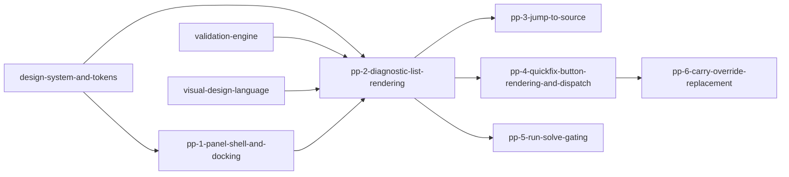

# Phase 1: problems-panel

**Parent Todo ID:** `problems-panel`
**Phase:** Phase 1
**Dependency Layer:** Layer 4 (depends on `validation-engine`, `design-system-and-tokens`, `visual-design-language`)
**D1 decomposition by:** gemini-3.1-pro (separate agent invocation, read-only)
**Status:** D1 DRAFT

*TDD Note: Each ticket's Test plan files are authored FIRST and must FAIL before any implementation begins.*

## Ticket Dependency Graph

## Tickets

### Ticket: `pp-1-panel-shell-and-docking`

#### Scope (1 paragraph)
Implements the VS Code-style Problems Panel shell docked at the bottom of the workbench. This ticket uses `react-resizable-panels` to create a collapsible bottom dock, establishing the layout primitive for the panel. It implements a tab system (initially just "Problems", but extensible for "Output" or "Terminal" later) and persists the collapsed/expanded state and height in the `DocumentSession` or local storage so the layout survives reloads. It explicitly does NOT render the diagnostics list or implement the Run/Solve gating.

#### Files affected
- `src/bma_cfengine_app/ui/src/features/deals/WorkbenchLayout.tsx` (or equivalent layout root) — modified; introduces the resizable bottom panel.
- `src/bma_cfengine_app/ui/src/features/problems/ProblemsPanel.tsx` — new; the shell component.
- `src/bma_cfengine_app/ui/src/features/problems/ProblemsPanelHeader.tsx` — new; tabs and collapse controls.

#### Dependencies
- `design-system-and-tokens` (layout primitives)

#### User journeys (1-3)
1. GIVEN the workbench WHEN the user opens a deal THEN a bottom panel is visible containing a "Problems" tab.
2. GIVEN the bottom panel is expanded WHEN the user clicks the collapse button or drags the sash to the bottom THEN the panel collapses to a thin header, and this state persists across page reloads.

#### Acceptance criteria (numbered, testable)
1. A resizable bottom panel is integrated into the main workbench layout using `react-resizable-panels`.
2. The panel includes a header with a "Problems" tab and a collapse/expand toggle.
3. The panel's height and collapsed state are persisted (either in `DocumentSession` or `localStorage`) so they survive a page reload.
4. The panel can be resized by dragging the top sash.

#### Test plan
- `src/bma_cfengine_app/ui/src/features/problems/ProblemsPanel.test.tsx::test_panel_renders_and_toggles_collapse` — AC 1, 2
- `src/bma_cfengine_app/ui/src/features/problems/ProblemsPanel.test.tsx::test_panel_persists_state_across_remounts` — AC 3

#### Out-of-scope notes
Do not render the actual list of diagnostics. Do not implement jump-to-source or quick fixes.

---

### Ticket: `pp-2-diagnostic-list-rendering`

#### Scope (1 paragraph)
Renders the list of diagnostics inside the Problems Panel by consuming `state.sessions[active].diagnostics` from the Zustand store. This ticket uses the Layer-2 `DiagnosticChip` from `design-system-and-tokens` to render each item. It implements severity icons (error, warning, info), filtering by severity, and displays the count of each severity in the panel header. It handles both worker and backend diagnostics transparently since the store's merge semantics (`ve-4`) already unify them.

#### Files affected
- `src/bma_cfengine_app/ui/src/features/problems/ProblemsList.tsx` — new; renders the list of diagnostics.
- `src/bma_cfengine_app/ui/src/features/problems/ProblemsPanelHeader.tsx` — modified; adds severity counts and filter toggles.

#### Dependencies
- `pp-1-panel-shell-and-docking`
- `design-system-and-tokens` (`DiagnosticChip`, `MetricMonoValue`)
- `visual-design-language` (motion + numeric formatting)
- `validation-engine` (consumes `state.sessions[activeSessionId].diagnostics`)

#### User journeys (1-3)
1. GIVEN a session with 2 errors and 1 warning WHEN the user views the Problems Panel THEN the header shows "2 Errors, 1 Warning" and the list displays 3 `DiagnosticChip` items.
2. GIVEN the Problems Panel is open WHEN the user clicks the "Errors" filter toggle in the header THEN only the 2 error diagnostics are displayed in the list.

#### Acceptance criteria (numbered, testable)
1. The `ProblemsList` component consumes `useDealStore(state => state.sessions[state.activeSessionId].diagnostics)`.
2. Each diagnostic is rendered using the `DiagnosticChip` component, displaying the message, path, and an icon corresponding to its `severity` (error, warning, info).
3. The panel header displays the total count of diagnostics broken down by severity.
4. The header includes filter toggles for each severity; toggling them filters the rendered list.

#### Test plan
- `src/bma_cfengine_app/ui/src/features/problems/ProblemsList.test.tsx::test_renders_diagnostics_from_active_session` — AC 1, 2
- `src/bma_cfengine_app/ui/src/features/problems/ProblemsList.test.tsx::test_header_counts_and_filtering` — AC 3, 4

#### Out-of-scope notes
Do not implement the QuickFix button rendering or jump-to-source clicking. Do not re-implement the diagnostic merge logic (the store already handles this).

---

### Ticket: `pp-3-jump-to-source`

#### Scope (1 paragraph)
Implements the navigation contract for jumping to the source of a diagnostic when it is clicked in the Problems Panel. Since Phase 2 panes (graph, spreadsheet, monaco) do not exist yet, this ticket defines the navigation event contract and emits the action, but explicitly defers the pane-side listener implementations. Clicking a diagnostic dispatches a `NavigateToSourceAction` with the diagnostic's `path` schema.

#### Files affected
- `src/bma_cfengine_app/ui/src/features/deals/store/actions.ts` — modified; adds `NavigateToSourceAction`.
- `src/bma_cfengine_app/ui/src/features/problems/ProblemsList.tsx` — modified; adds onClick handler to dispatch the navigation action.

#### Dependencies
- `pp-2-diagnostic-list-rendering`

#### User journeys (1-3)
1. GIVEN a rendered diagnostic in the Problems Panel WHEN the user clicks on it THEN a navigation action is dispatched with the diagnostic's path, preparing the system to focus the relevant pane (once Phase 2 panes are implemented).

#### Acceptance criteria (numbered, testable)
1. A new `NavigateToSourceAction` is defined in `actions.ts` with the shape `{ type: 'navigateToSource', payload: { path: string } }`.
2. Clicking a diagnostic in the `ProblemsList` dispatches this action with the diagnostic's `path`.
3. The reducer handles this action. For Phase 1, it may simply store the `focused_path` in the session state or act as an event bus trigger.
4. **Explicit Deferral**: The actual scrolling/focusing of graph nodes, spreadsheet cells, or text lines is pinned as deferred to the Phase 2 pane implementations.

#### Test plan
- `src/bma_cfengine_app/ui/src/features/problems/ProblemsList.test.tsx::test_clicking_diagnostic_dispatches_navigate_action` — AC 1, 2, 3

#### Out-of-scope notes
Do not implement the pane-side scrolling or focusing logic.

---

### Ticket: `pp-4-quickfix-button-rendering-and-dispatch`

#### Scope (1 paragraph)
Renders the QuickFix buttons for diagnostics that carry a non-null `fix` payload, and implements the dispatch path based on the QuickFix registry contract. This ticket queries `getQuickFix(diagnostic.fix.action_id)` from `quickFixRegistry.ts`. If the kind is `"dispatch"`, it renders a button that dispatches the registered `DealAction`. If the kind is `"manual"`, it renders the description as a tooltip or help text. Diagnostics with `fix=null` (like `INTERLEAVED_RULES_FACTORABLE`) render normally but without a QuickFix button. `STALE_QUICKFIX` diagnostics also render normally without a button.

#### Files affected
- `src/bma_cfengine_app/ui/src/features/problems/ProblemsList.tsx` — modified; adds QuickFix button rendering.
- `src/bma_cfengine_app/ui/src/features/problems/QuickFixButton.tsx` — new; component to handle registry lookup and rendering.

#### Dependencies
- `pp-2-diagnostic-list-rendering`
- `validation-engine` (specifically `quickFixRegistry.ts` from ve-5)

#### User journeys (1-3)
1. GIVEN a diagnostic with a `"dispatch"` QuickFix (e.g., `canonicalize_consolidate_rule_run`) WHEN rendered in the panel THEN a button appears; clicking it dispatches the corresponding `DealAction` to the store.
2. GIVEN a diagnostic with a `"manual"` QuickFix WHEN rendered THEN the panel displays the manual resolution instructions (e.g., via a tooltip or expanded text).
3. GIVEN a diagnostic with `fix=null` (e.g., `INTERLEAVED_RULES_FACTORABLE`) WHEN rendered THEN no QuickFix button or manual instruction is displayed.

#### Acceptance criteria (numbered, testable)
1. For each diagnostic with a `fix` payload, the UI calls `getQuickFix(diagnostic.fix.action_id)` to retrieve the descriptor.
2. If `descriptor.kind === "dispatch"`, a button is rendered. Clicking it calls `dispatch({ type: descriptor.actionType, payload: diagnostic.fix.params })`.
3. If `descriptor.kind === "manual"`, the `descriptor.description` is rendered as a tooltip or inline help text; clicking does not dispatch a store action.
4. If `diagnostic.fix` is null or undefined, no QuickFix UI is rendered.
5. `STALE_QUICKFIX` diagnostics render normally (they have no fix).

#### Test plan
- `src/bma_cfengine_app/ui/src/features/problems/QuickFixButton.test.tsx::test_renders_dispatch_button_and_fires_action` — AC 1, 2
- `src/bma_cfengine_app/ui/src/features/problems/QuickFixButton.test.tsx::test_renders_manual_instruction_without_dispatch` — AC 1, 3
- `src/bma_cfengine_app/ui/src/features/problems/QuickFixButton.test.tsx::test_renders_nothing_when_fix_is_null` — AC 4

#### Out-of-scope notes
Do not implement new QuickFixes or modify the registry.

---

### Ticket: `pp-5-run-solve-gating`

#### Scope (1 paragraph)
Gates the workbench's Run and Solve execution on the presence of zero errors. This ticket consumes the `getErrorCount(activeSessionId)` selector from `ve-5`. If the count is > 0, the Run/Solve buttons in the workbench header are disabled. It renders a disabled state with a tooltip pointing the user to the Problems Panel. Clicking the disabled button emits a "scroll to problems panel" or "expand problems panel" action to guide the user.

#### Files affected
- `src/bma_cfengine_app/ui/src/features/deals/WorkbenchHeader.tsx` (or wherever Run/Solve buttons live) — modified; consumes `useErrorCount()`.
- `src/bma_cfengine_app/ui/src/features/problems/ProblemsPanel.tsx` — modified; listens for the expand action.

#### Dependencies
- `pp-1-panel-shell-and-docking`
- `validation-engine` (`getErrorCount` selector from ve-5)

#### User journeys (1-3)
1. GIVEN a session with 1 error diagnostic WHEN the user looks at the Run button THEN it is disabled with a tooltip "Cannot run with errors. Check the Problems Panel."
2. GIVEN the user clicks the disabled Run button WHEN the Problems Panel is collapsed THEN the panel automatically expands to show the errors.
3. GIVEN the user fixes the error WHEN `getErrorCount` drops to 0 THEN the Run button becomes enabled.

#### Acceptance criteria (numbered, testable)
1. The Run and Solve buttons consume `useErrorCount()`.
2. If `useErrorCount() > 0`, the buttons are visually disabled and display a tooltip explaining the block.
3. Clicking the disabled button dispatches an action (or calls a context method) that forces the Problems Panel to expand if it was collapsed.
4. If `useErrorCount() === 0`, the buttons are enabled and function normally.

#### Test plan
- `src/bma_cfengine_app/ui/src/features/deals/WorkbenchHeader.test.tsx::test_run_button_disabled_when_error_count_gt_0` — AC 1, 2
- `src/bma_cfengine_app/ui/src/features/deals/WorkbenchHeader.test.tsx::test_clicking_disabled_run_expands_problems_panel` — AC 3
- `src/bma_cfengine_app/ui/src/features/deals/WorkbenchHeader.test.tsx::test_run_button_enabled_when_error_count_is_0` — AC 4

#### Out-of-scope notes
Do not implement the actual Run/Solve execution logic.

---

### Ticket: `pp-6-carry-override-replacement`

#### Scope (1 paragraph)
Replaces the existing `window.confirm`-based carry override prompt in `DealEditor.tsx` with a Problems Panel-mediated flow. This ticket removes the `window.confirm` call site. It defines a new `CARRY_TIE_OUT_BLOCK` diagnostic code (to be emitted by the backend in a future runtime-validation ticket, but handled by the UI now). It registers a new `"dispatch"` QuickFix `override_carry_block` that dispatches an action to set `carryBlockOverridden` in the store, allowing the user to unblock Run/Solve directly from the Problems Panel.

#### Files affected
- `src/bma_cfengine_app/ui/src/features/deals/DealEditor.tsx` — modified; removes `window.confirm` carry tie-out gate.
- `src/bma_cfengine_app/ui/src/features/validation/quickFixRegistry.ts` — modified; registers `override_carry_block`.
- `src/bma_cfengine_app/ui/src/features/deals/store/actions.ts` — modified; adds `OverrideCarryBlockAction`.
- `src/bma_cfengine_app/ui/src/features/deals/store/useDealStore.ts` — modified; adds `carryBlockOverridden` to session state and reducer logic.
- `docs/architecture/diagnostic_catalog.md` — modified; pins the `CARRY_TIE_OUT_BLOCK` diagnostic.

#### Dependencies
- `pp-4-quickfix-button-rendering-and-dispatch`
- `pp-5-run-solve-gating`

#### User journeys (1-3)
1. GIVEN a deal that fails carry tie-out WHEN the backend emits the `CARRY_TIE_OUT_BLOCK` error diagnostic THEN the Run button is disabled and the diagnostic appears in the Problems Panel.
2. GIVEN the `CARRY_TIE_OUT_BLOCK` diagnostic in the panel WHEN the user clicks the "Override and run anyway" QuickFix THEN the error is suppressed (or downgraded), and the Run button becomes enabled.

#### Acceptance criteria (numbered, testable)
1. The `window.confirm` call site in `DealEditor.tsx` (around line 699) is removed.
2. A new action `OverrideCarryBlockAction` is added to the store, which sets `carryBlockOverridden: true` on the active session.
3. `override_carry_block` is registered in `quickFixRegistry.ts` as a `"dispatch"` QuickFix mapping to `OverrideCarryBlockAction`.
4. The `getErrorCount` selector (or the Run/Solve gate logic) is updated to ignore `CARRY_TIE_OUT_BLOCK` diagnostics if `carryBlockOverridden` is true for that session.
5. **Catalog row pinned**: `docs/architecture/diagnostic_catalog.md` gains a row for `CARRY_TIE_OUT_BLOCK` (severity: error, owner: backend, quick fix: `override_carry_block`). *Note: Emission of this diagnostic by the backend is deferred to a runtime-validation ticket.*

#### Test plan
- `src/bma_cfengine_app/ui/src/features/deals/DealEditor.test.tsx::test_window_confirm_removed` — AC 1
- `src/bma_cfengine_app/ui/src/features/deals/store/actions.test.ts::test_override_carry_block_action_sets_flag` — AC 2
- `src/bma_cfengine_app/ui/src/features/validation/quickFixRegistry.test.ts::test_override_carry_block_registered` — AC 3
- `src/bma_cfengine_app/ui/src/features/deals/store/selectors.test.ts::test_get_error_count_ignores_carry_block_when_overridden` — AC 4

#### Out-of-scope notes
Do not implement the backend emission of the `CARRY_TIE_OUT_BLOCK` diagnostic; that requires `DealRunInput` and belongs in a runtime-validation ticket.

---

## Phase 1 Sequencing Impact

This is one of the last Phase 1 todos. It depends heavily on the foundational validation engine (`ve-*`) and the design system (`design-system-and-tokens`). Once `problems-panel` lands, the workbench has a fully functional diagnostic display and Run/Solve gating mechanism. Phase 2 panes (graph, spreadsheet, text) will hook into the `jump-to-source` navigation contract established here.

## Flags for the R1 Reviewer

1. **Explicit Deferral of Jump-to-Source Implementations**: `pp-3` defines the navigation contract and dispatches the action, but the actual focusing of UI elements is deferred to Phase 2 because the panes do not exist yet.
2. **Carry Override TBD**: `pp-6` removes the existing `window.confirm` and sets up the UI to handle a `CARRY_TIE_OUT_BLOCK` diagnostic via QuickFix. However, the backend emission of this diagnostic is deferred to a future runtime-validation ticket, as static validation (`ve-3`) cannot compute carry tie-out.
3. **Merge Semantics Transparency**: `pp-2` simply renders `state.sessions[active].diagnostics`. It does not care whether diagnostics came from the worker or the SSE stream; `ve-4` handles all merge semantics.
4. **QuickFix Registry Source of Truth**: `pp-4` strictly adheres to the `quickFixRegistry.ts` contract from `ve-5` to determine if a fix is dispatchable or manual.
