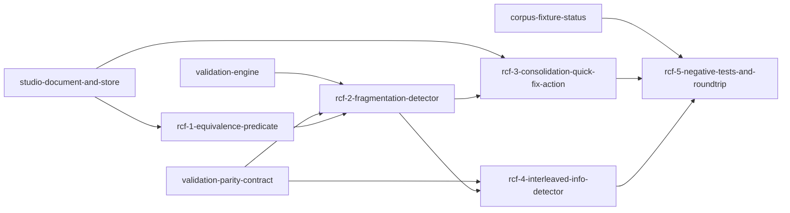

# Phase 1: rule-canonicalization-framework

**Parent Todo ID:** `rule-canonicalization-framework`
**Phase:** Phase 1
**Dependency Layer:** Layer 3 (depends on `studio-document-and-store` and `validation-engine`)
**D1 decomposition by:** gemini-3.1-pro (separate agent invocation, read-only)
**R1 review pass 1:** APPROVE-WITH-CHANGES — `rule-canonicalization-framework.r1-review-pass1.md` (3C+4M+3m+1n; all tactical contract pins; parent-verified fold-back applied)
**Status:** APPROVED FOR T1.

*TDD Note: Each ticket's Test plan files are authored FIRST and must FAIL before any implementation begins.*

## Ticket Dependency Graph

## Tickets

### Ticket: `rcf-1-equivalence-predicate`

#### Scope (1 paragraph)
Introduces the pure function `is_consolidatable(rule_a, rule_b, all_rules_between)` that implements the formal semantic equivalence predicate for rule consolidation. This ticket implements the predicate in both Python and TypeScript to ensure parity between the backend and the worker-hosted validation engine. The predicate strictly matches `(rule_type, source, payment_style, cap_mode, condition_trigger, condition_invert, condition_expr, group_id, coverage_mode, allow_negative_source)`, while rejecting any per-target differences (`max_amount_fixed`, `max_amount_expr`, `target_weights`) or intervening rules that mutate the source. It explicitly does NOT implement the diagnostic emission or the quick-fix mutation itself.

#### Files affected
- `src/bma_cfengine_app/ui/src/features/validation/canonicalizationHelpers.ts` — new; implements the TS predicate.
- `src/bma_standard_formulas/diagnostics/canonicalization_helpers.py` — new; implements the Python predicate.
- `tests/diagnostics/test_canonicalization_helpers.py` — new; Python unit tests.
- `src/bma_cfengine_app/ui/src/features/validation/canonicalizationHelpers.test.ts` — new; TS unit tests.

#### Dependencies
- `studio-document-and-store`

#### User journeys (1-3)
1. GIVEN two consecutive single-target rules with identical semantic properties WHEN checked by `is_consolidatable` THEN the function returns true.
2. GIVEN two rules with identical properties but an intervening rule that mutates their shared source WHEN checked THEN the function returns false.
3. GIVEN two rules with identical properties but different `payment_style` or `cap_mode` WHEN checked THEN the function returns false.

#### Acceptance criteria (numbered, testable)
1. `is_consolidatable(rule_a, rule_b, all_rules_between)` is implemented in both Python and TypeScript.
2. The predicate returns true ONLY if both rules share exactly the same `(rule_type, source, payment_style, cap_mode, condition_trigger, condition_invert, condition_expr, group_id, coverage_mode, allow_negative_source)`.
3. The predicate returns false if there are any per-target differences (e.g., `max_amount_fixed`, `max_amount_expr`, `target_weights`).
4. The predicate returns false if `all_rules_between` contains any rule that mutates the shared `source`. **Mutation definition (R1 Mi1)**: an intervening rule mutates the shared source if any of (a) its `to_targets` list contains the source, OR (b) its `source` field aliases via group routing to the shared source (e.g., the shared source is `INT_CASH` and the intervening rule's source is `GROUP_1.INT_CASH` resolving to the same logical pool).

#### Test plan
- `tests/diagnostics/test_canonicalization_helpers.py::test_is_consolidatable_positive_cases` — AC 1, 2
- `tests/diagnostics/test_canonicalization_helpers.py::test_is_consolidatable_rejects_per_target_differences` — AC 1, 3
- `tests/diagnostics/test_canonicalization_helpers.py::test_is_consolidatable_rejects_intervening_to_target_mutation` — AC 1, 4 (positive case for mutation-via-to_targets)
- `tests/diagnostics/test_canonicalization_helpers.py::test_is_consolidatable_rejects_intervening_group_alias_mutation` — AC 1, 4 (positive case for mutation-via-group-alias)
- `src/bma_cfengine_app/ui/src/features/validation/canonicalizationHelpers.test.ts` — Mirrors the Python tests exactly for TS parity.

#### Out-of-scope notes
Do not implement the diagnostic detector or the quick-fix action in this ticket. Do not implement `SHARED_TRIGGER_BRANCHABLE` (Phase 3).

---

### Ticket: `rcf-2-fragmentation-detector`

#### Scope (1 paragraph)
Implements the TS worker validator and Python decorator that walks `deal.waterfall_rules` to find runs of consolidatable rules and emits the `RULE_FRAGMENTATION_CONSOLIDATABLE` diagnostic. This ticket uses the `is_consolidatable` predicate to identify consecutive N rules that can be collapsed, formats a diagnostic payload with a populated QuickFix, and registers the new code in the diagnostic catalog (per the `validation-parity-contract` CI guard, every decorated/registered diagnostic must have a same-commit catalog entry). The TS validator follows the established pattern from ve-2 (`structuralValidators.ts`-style module-level `registerDiagnosticValidator(...)` call; the worker imports the module so registration runs before `iterDiagnosticValidators()` iterates). It explicitly does NOT implement the actual quick-fix mutation logic.

#### Files affected
- `src/bma_cfengine_app/ui/src/features/validation/canonicalizationValidators.ts` — new; module-level `registerDiagnosticValidator(...)` call for the fragmentation detector.
- `src/bma_cfengine_app/ui/src/features/validation/validationWorker.ts` — modified; add `import "./canonicalizationValidators"` so registration occurs before `iterDiagnosticValidators()` runs (matches the ve-2 pattern).
- `src/bma_standard_formulas/diagnostics/canonicalization_validators.py` — new; `@diagnostic_code` Python decorator.
- `docs/architecture/diagnostic_catalog.md` — modified; adds the `RULE_FRAGMENTATION_CONSOLIDATABLE` row in the same commit (R1 C1; vpc-4 CI guard requirement).

#### Dependencies
- `rcf-1-equivalence-predicate`
- `validation-engine`
- `validation-parity-contract` (catalog mechanism + parity framework)

#### User journeys (1-3)
1. GIVEN a deal with 3 consecutive consolidatable rules WHEN validated in the worker THEN it emits a `RULE_FRAGMENTATION_CONSOLIDATABLE` diagnostic with a QuickFix payload targeting the run.
2. GIVEN a deal with no consolidatable rules WHEN validated THEN no fragmentation diagnostics are emitted.
3. GIVEN a developer adds the new validator without a same-commit catalog row WHEN CI runs `python -m bma_standard_formulas.diagnostics.check` THEN it fails with a clear missing-catalog message.

#### Acceptance criteria (numbered, testable)
1. A TS worker validator (in `canonicalizationValidators.ts`) and Python decorator (in `canonicalization_validators.py`) walk `deal.waterfall_rules` and identify maximal runs of length >= 2 where `is_consolidatable` is true for all adjacent pairs.
2. **Catalog row pinned (R1 C1)**: `docs/architecture/diagnostic_catalog.md` gains a row with EXACTLY:
   - `code = RULE_FRAGMENTATION_CONSOLIDATABLE`
   - `severity = warning`
   - `path schema = deal.waterfall_rules[start_index..end_index]`
   - `message template = Rules {start_index} through {end_index} can be consolidated into one multi-target rule.`
   - `owner = both`
   - `quick fix = canonicalize_consolidate_rule_run`
   - `owning validator file:line = canonicalization_validators.py:<line>`
3. **Diagnostic payload schema pinned (R1 M4)**: emitted payload has:
   - `path = deal.waterfall_rules[{start_index}..{end_index}]` (concrete range)
   - `payload = { start_index: int, end_index: int, rule_ids: list[str], source: str, target_count: int }`
   - `fix = { action_id: 'canonicalize_consolidate_rule_run', params: { start_index: int, end_index: int } }`
4. The TS validator runs in the same Web Worker as the structural validators (registered via `registerDiagnosticValidator(...)` in `canonicalizationValidators.ts`; imported by `validationWorker.ts` at module load so registration happens before `iterDiagnosticValidators()` is called).
5. Python and TS metadata (`severity`, `path_schema`, `owner`) match the catalog row exactly; the vpc-4 CI guard exits 0 post-implementation.

#### Test plan
- `tests/diagnostics/test_canonicalization_validators.py::test_fragmentation_detector_emits_diagnostic_for_consecutive_run` — AC 1, 3
- `tests/diagnostics/test_canonicalization_validators.py::test_fragmentation_detector_ignores_non_consolidatable_rules` — AC 1
- `tests/diagnostics/test_canonicalization_validators.py::test_fragmentation_detector_payload_matches_pinned_schema` — AC 3 (asserts every payload field type + range path shape)
- `tests/diagnostics/test_canonicalization_validators.py::test_catalog_row_present_for_rule_fragmentation_consolidatable` — AC 2 (uses `parse_diagnostic_catalog` to assert the row exists with exact fields)
- `src/bma_cfengine_app/ui/src/features/validation/canonicalizationValidators.test.ts` — TS parity tests.
- AC 5 verified by running `python -m bma_standard_formulas.diagnostics.check` post-implementation; the vpc-4 CI guard already runs in CI, so the same-commit catalog requirement is enforced automatically.

#### Out-of-scope notes
Do not implement the `canonicalizeConsolidateRuleRun` action reducer logic in this ticket. Do not implement UI for the Problems Panel.

---

### Ticket: `rcf-3-consolidation-quick-fix-action`

#### Scope (1 paragraph)
Implements the typed DealAction that applies the consolidation quick-fix on the active session's working tree. This ticket adds the `canonicalizeConsolidateRuleRun` action variant to the `DealAction` discriminated union (sds-1 + sds-2 surface), which replaces N single-target rules with 1 multi-target rule based on the `start_index` and `end_index` parameters. The mutation flows through the existing exhaustive reducer pattern; the dispatch_revision counter (sds-5) increments so autosave fires; the resulting commit message is exact and user-attributed. It explicitly does NOT apply consolidation automatically during compile-to-IR (Phase 0 B6 contract preserved).

#### Files affected
- `src/bma_cfengine_app/ui/src/features/deals/store/actions.ts` — modified; defines the new `CanonicalizeConsolidateRuleRunAction` variant of `DealAction`; extends the exhaustive reducer.
- `src/bma_cfengine_app/ui/src/features/deals/store/actions.test.ts` — modified; adds reducer tests.
- `src/bma_cfengine_app/ui/src/features/deals/store/useDealStore.ts` — modified; adds `pending_commit_message: string | null` to `DealSession` state shape; reducer sets the message on this action.
- `src/bma_cfengine_app/ui/src/features/deals/store/autosave.ts` — modified; reads and clears `pending_commit_message` per-session before posting to commit endpoint; falls back to `"autosave"` when null.
- `src/bma_cfengine_app/ui/src/features/validation/quickFixRegistry.ts` — modified; registers `canonicalize_consolidate_rule_run` as a `DispatchQuickFix`.
- `src/bma_standard_formulas/diagnostics/quick_fix_registry.py` — modified; same registration on Python side for parity.
- `docs/architecture/diagnostic_catalog.md` — modified; adds `STALE_QUICKFIX` row in the same commit (vpc-4 contract).
- `src/bma_standard_formulas/diagnostics/canonicalization_validators.py` — modified; adds a `@diagnostic_code("STALE_QUICKFIX", ...)` sentinel decorator (no-op function body) so the catalog row passes the vpc-4 same-commit guard.

#### Dependencies
- `rcf-2-fragmentation-detector`
- `studio-document-and-store` (R1 M1; specifically sds-1 for `DealAction` / `dispatch(action)` / exhaustive reducer pattern; sds-5 for `dispatch_revision` counter so autosave fires after the consolidation mutation)
- `validation-engine` ve-5 retroactive fix-pass (QuickFix registry contract — `quick_fix_registry.py` / `quickFixRegistry.ts`)

#### User journeys (1-3)
1. GIVEN a `RULE_FRAGMENTATION_CONSOLIDATABLE` diagnostic WHEN the user dispatches the `canonicalizeConsolidateRuleRun` quick-fix THEN the store replaces the specified rule run with a single multi-target rule on the active session's working_tree only.
2. GIVEN the quick-fix is applied WHEN the autosave debouncer commits the change THEN the commit message is exactly `Canonicalize consolidate rule run [start..end]`.
3. GIVEN an invalid range (out-of-bounds, `start_index >= end_index`, or current rules at the indices are no longer consolidatable due to a stale diagnostic) WHEN the action is dispatched THEN it is a no-op and surfaces a `STALE_QUICKFIX` warning diagnostic on the active session.

#### Acceptance criteria (numbered, testable)
1. **Action shape pinned (R1 M2)**: `CanonicalizeConsolidateRuleRunAction = { type: 'canonicalizeConsolidateRuleRun'; payload: { start_index: number; end_index: number } }`. Included in the `DealAction` discriminated union; handled by the exhaustive reducer in `actions.ts`; the reducer's never-guard default branch still compile-fails if any future variant is added without a case.
2. **Active-session-only semantics (R1 M2)**: the reducer mutates ONLY `state.sessions[state.activeSessionId].working_tree.waterfall_rules`. No other session's working_tree is touched. Indices are interpreted against the active session's `waterfall_rules` array.
3. **Reducer correctness**: replaces rules from `start_index` (inclusive) to `end_index` (inclusive) with a single multi-target rule whose `to_targets` is the concatenation of the per-rule targets, preserving authored order. All other fields on the consolidated rule come from the first replaced rule (which is identical across the run by `is_consolidatable`'s contract). **Rule identity (D1 Mi1)**: the consolidated rule retains the `rule_id` of the first replaced rule to preserve entity identity and minimize diffs.
4. **Commit message via per-session pending slot (D1 M2 — Option B last-write-wins)**:
   - `DealSession` state shape gains a new field `pending_commit_message: string | null` (initial value `null`).
   - The `canonicalizeConsolidateRuleRun` reducer sets `state.sessions[active].pending_commit_message = "Canonicalize consolidate rule run [{start_index}..{end_index}]"` (literal square brackets and `..`) at the same time it mutates `working_tree.waterfall_rules`.
   - `autosave.ts` reads `pending_commit_message` per-session before each debounced commit POST, sends it as the `message` field, and clears the slot to `null` after the response (success or failure). When `null`, falls back to the existing `"autosave"` default.
   - **Last-write-wins semantics**: if multiple typed actions dispatch within the debounce window, each reducer overwrites the prior `pending_commit_message`; the autosave commit uses the most recent one. Earlier action labels are intentionally lost (per Phase 1 product decision).
   - Author remains `studio:autosave` (unchanged from the existing autosave path).
5. **Invalid-range no-op + STALE_QUICKFIX (R1 M2 + D1 M3)**: out-of-bounds indices, `start_index >= end_index`, or the current rules at those indices failing `is_consolidatable` produce a no-op (no mutation, no commit attempt) and append a `STALE_QUICKFIX` warning diagnostic to `state.sessions[state.activeSessionId].diagnostics`. **Catalog row pinned**: a same-commit row in `docs/architecture/diagnostic_catalog.md` with EXACTLY:
   - `code = STALE_QUICKFIX`
   - `severity = warning`
   - `path schema = deal.waterfall_rules`
   - `message template = QuickFix could not be applied to range [{start_index}..{end_index}]: {reason}.`
   - `owner = both`
   - `quick fix = (none)`
   - `owning validator file:line = canonicalization_validators.py:<line>` (no-op `@diagnostic_code` sentinel; mirrors the IR_VALIDATION_ERROR / MERGE_CONFLICT pattern). Python decorator + TS registration must agree on severity/path_schema/owner per vpc-4.
6. **Compile path UNCHANGED (Phase 0 B6)**: the compile-to-IR path remains byte-identical to its sds-3 behavior; canonicalization is opt-in only via this dispatched action. A regression test asserts that `compileToIR(working_tree_before_dispatch)` and `compileToIR(working_tree_before_dispatch_again_with_no_canonicalization)` are byte-identical (no implicit canonicalization at compile time).
7. **QuickFix registry registration (D1 M1)**: `canonicalize_consolidate_rule_run` is registered in BOTH `src/bma_cfengine_app/ui/src/features/validation/quickFixRegistry.ts` AND `src/bma_standard_formulas/diagnostics/quick_fix_registry.py` (added by ve-5 retroactive fix-pass) as a `DispatchQuickFix` with `actionType: 'canonicalizeConsolidateRuleRun'` (TS) / `action_type: 'canonicalizeConsolidateRuleRun'` (Python) and a user-facing `description: "Consolidate fragmented rules into a single multi-target rule."`. Phase 2 problems-panel calls `getQuickFix(diagnostic.fix.action_id)` and dispatches via the registered descriptor's `actionType`.

#### Test plan
- `src/bma_cfengine_app/ui/src/features/deals/store/actions.test.ts::test_canonicalize_consolidate_rule_run_replaces_rules_on_active_session` — AC 1, 2, 3
- `src/bma_cfengine_app/ui/src/features/deals/store/actions.test.ts::test_canonicalize_consolidate_rule_run_does_not_touch_other_sessions` — AC 2
- `src/bma_cfengine_app/ui/src/features/deals/store/actions.test.ts::test_canonicalize_consolidate_rule_run_increments_dispatch_revision` — AC 4 (asserts the autosave triggers per sds-5)
- `src/bma_cfengine_app/ui/src/features/deals/store/actions.test.ts::test_canonicalize_consolidate_rule_run_sets_pending_commit_message_on_active_session` — AC 4 (asserts the message slot is set with literal `Canonicalize consolidate rule run [{s}..{e}]`)
- `src/bma_cfengine_app/ui/src/features/deals/store/actions.test.ts::test_canonicalize_consolidate_rule_run_preserves_first_rule_id` — AC 3 (rule_id retention)
- `src/bma_cfengine_app/ui/src/features/deals/store/actions.test.ts::test_canonicalize_consolidate_rule_run_invalid_range_is_noop_with_stale_diagnostic` — AC 5
- `src/bma_cfengine_app/ui/src/features/deals/store/actions.test.ts::test_canonicalize_consolidate_rule_run_preserves_surrounding_rules` — AC 3
- `src/bma_cfengine_app/ui/src/features/deals/store/autosave.test.ts::test_autosave_consumes_pending_commit_message_and_clears_slot` — AC 4 (autosave path: reads, sends, clears)
- `src/bma_cfengine_app/ui/src/features/deals/store/autosave.test.ts::test_autosave_falls_back_to_default_message_when_pending_is_null` — AC 4 (default behavior preserved)
- `src/bma_cfengine_app/ui/src/features/deals/store/autosave.test.ts::test_autosave_last_write_wins_when_two_actions_within_debounce_window` — AC 4 (semantics)
- `src/bma_cfengine_app/ui/src/features/validation/quickFixRegistry.test.ts::test_canonicalize_consolidate_rule_run_registered_as_dispatch_quick_fix` — AC 7
- `tests/diagnostics/test_quick_fix_registry.py::test_canonicalize_consolidate_rule_run_registered_as_dispatch_quick_fix` — AC 7 (Python parity)
- `tests/diagnostics/test_diagnostic_catalog.py::test_stale_quickfix_is_cataloged` — AC 5 (catalog row presence)
- `src/bma_cfengine_app/ui/src/features/deals/store/compile.test.ts::test_compile_does_not_implicit_canonicalize_pre_dispatch` — AC 6 (regression on Phase 0 B6)

#### Out-of-scope notes
Do not modify the compile-to-IR pipeline to auto-consolidate rules (expressly forbidden by Phase 0 B6). Do not implement the Problems Panel rendering of the QuickFix button (Phase 2 ticket).

---

### Ticket: `rcf-4-interleaved-info-detector`

#### Scope (1 paragraph)
Implements the `INTERLEAVED_RULES_FACTORABLE` diagnostic as a heuristic info-only visibility detector (NOT a safe-consolidation claim). This ticket adds a TS worker validator and Python decorator that detect M rules with shared `(rule_type, source, payment_style)` separated by at least one rule that mutates the source. Because auto-fixing this pattern would require unsafe reordering without user judgment, this diagnostic is emitted purely for visibility with `fix = null` (NOT `manual_resolve_*`); the Phase 2 Problems Panel renders the diagnostic without any quick-fix button. It registers the new code in the diagnostic catalog. It explicitly does NOT detect or suggest `SHARED_TRIGGER_BRANCHABLE` (Phase 3 `branch-canonicalization-after-waterfall-branch`).

#### Files affected
- `src/bma_cfengine_app/ui/src/features/validation/canonicalizationValidators.ts` — modified; adds the interleaved detector via a second `registerDiagnosticValidator(...)` call.
- `src/bma_standard_formulas/diagnostics/canonicalization_validators.py` — modified; adds the Python decorator.
- `docs/architecture/diagnostic_catalog.md` — modified; adds the `INTERLEAVED_RULES_FACTORABLE` row in the same commit.

#### Dependencies
- `rcf-2-fragmentation-detector`
- `validation-parity-contract` (catalog mechanism)

#### User journeys (1-3)
1. GIVEN a deal with factorable rules separated by a source-mutating rule WHEN validated THEN it emits an `INTERLEAVED_RULES_FACTORABLE` diagnostic with severity `info` and `fix = null`.
2. GIVEN an `INTERLEAVED_RULES_FACTORABLE` diagnostic WHEN the Problems Panel inspects it THEN it renders the message but offers no quick-fix button (the `fix` field is `null`).

#### Acceptance criteria (numbered, testable)
1. **Algorithm pinned (D1 M2 — group + transitivity)**: group all rules in the waterfall by the tuple `(rule_type, source, payment_style)`. For any group with `len(group) >= 2`, examine the rules whose indices fall between `min(group_indices)` and `max(group_indices)` (exclusive of the group members themselves). If ANY rule in that range mutates the source (per the rcf-1 mutation predicate), emit a single `INTERLEAVED_RULES_FACTORABLE` diagnostic for the entire group (all indices). The group is treated as a whole, not split per-mutator. **Mutation predicate reuse (D1 M1)**: rcf-1 must export `mutates_source(intervening_rule, shared_source) -> bool` (Python: rename `_mutates_source` to public `mutates_source`; TS: add `export` to `mutatesSource`). rcf-4 imports it directly — no duplicated logic.
2. **Catalog row pinned (R1 C2 + D1 Mi3)**: `docs/architecture/diagnostic_catalog.md` gains a row with EXACTLY:
   - `code = INTERLEAVED_RULES_FACTORABLE`
   - `severity = info`
   - `path schema = deal.waterfall_rules[{indices}]`
   - `message template = Rules at {indices} share (rule_type, source, payment_style) but are interleaved with a source mutation; manual review recommended.`
   - `owner = both`
   - `quick fix = Manual review only; no automatic fix is offered.`
   - `owning validator file:line = canonicalization_validators.py:<line>`
3. The diagnostic severity is strictly set to `info`. **Emitted path format (D1 Mi3)**: `path = f"deal.waterfall_rules[{','.join(map(str, sorted(indices)))}]"` — comma-separated indices in ascending order so the UI can highlight the exact rules.
4. **Force `fix = null` (R1 C2 + D1 Mi4)**: Python emits `fix=None`; TypeScript omits the `fix` field entirely (matches the existing `structuralValidators.ts` convention for fix-less diagnostics; do NOT use `null` literal). Round-trip JSON serialization treats both as the absence of a quick fix; Phase 2 problems-panel must accept both representations as equivalent.
5. Python and TS metadata match the catalog row; the vpc-4 CI guard exits 0 post-implementation.

#### Test plan
- `tests/diagnostics/test_canonicalization_validators.py::test_interleaved_detector_emits_info_diagnostic` — AC 1, 2, 3
- `tests/diagnostics/test_canonicalization_validators.py::test_interleaved_detector_fix_is_null_never_autofix` — AC 4
- `tests/diagnostics/test_canonicalization_validators.py::test_interleaved_detector_path_uses_comma_separated_indices` — AC 3 (D1 Mi3 — `deal.waterfall_rules[1,3,5]` shape)
- `tests/diagnostics/test_canonicalization_validators.py::test_interleaved_detector_groups_transitively_with_internal_mutator` — AC 1 (D1 M2 — A,B,C all share key, mutator between A and C → single group {A,B,C})
- `tests/diagnostics/test_canonicalization_validators.py::test_interleaved_detector_ignores_rules_without_mutator` — AC 1 (D1 B1 — M=2 rules with shared key but no intervening mutator do NOT emit interleaved; this is rcf-2's territory if consolidatable)
- `tests/diagnostics/test_canonicalization_validators.py::test_catalog_row_present_for_interleaved_rules_factorable` — AC 2
- `src/bma_cfengine_app/ui/src/features/validation/canonicalizationValidators.test.ts` — TS parity tests for both detectors (rcf-2 + rcf-4); includes a parity test confirming TS omits `fix` while Python emits `fix=None` and both round-trip identically through JSON.
- AC 5 verified by `python -m bma_standard_formulas.diagnostics.check` post-implementation.

#### Out-of-scope notes
Do not implement an auto-fix for interleaved rules. Do not detect or suggest `SHARED_TRIGGER_BRANCHABLE` — that diagnostic belongs to the Phase 3 `branch-canonicalization-after-waterfall-branch` ticket and depends on the Proposal C `WaterfallBranch` schema which does not exist in Phase 1.

---

### Ticket: `rcf-5-negative-tests-and-roundtrip`

#### Scope (1 paragraph)
Implements the architectural correctness gate for the canonicalization framework: comprehensive negative tests (visually-similar but non-consolidatable rules) and round-trip semantic equivalence tests against the fixtures classified as STRUCTURAL or QUANTITATIVE GOLDEN in `tests/fixtures/STATUS.md` (the `corpus-fixture-status` deliverable). This ticket asserts that applying the `canonicalizeConsolidateRuleRun` quick-fix to any identified runs produces per-period, per-bond cashflow output that matches the pre-fix run within a strict tolerance — proving canonicalization is a true semantic-preserving rewrite. It explicitly does NOT introduce new canonicalization logic or new fixtures.

#### Files affected
- `tests/diagnostics/test_canonicalization_negative.py` — new; comprehensive negative tests.
- `tests/diagnostics/test_canonicalization_roundtrip.py` — new; round-trip semantic equivalence tests against fixtures.

#### Dependencies
- `rcf-3-consolidation-quick-fix-action`
- `rcf-4-interleaved-info-detector`
- `corpus-fixture-status` (R1 M3 + retroactive prospectus-inventory build; rcf-5 enumerates fixtures via `scripts.parse_prospectus_inventory.load_inventory()` + tier filter, NOT direct STATUS.md parsing)

#### User journeys (1-3)
1. GIVEN a fixture classified as STRUCTURAL or QUANTITATIVE GOLDEN in `tests/fixtures/STATUS.md` AND containing at least one fragmented rule run WHEN the canonicalization quick-fix is applied THEN the resulting per-period, per-bond cashflow vectors match the pre-fix vectors within tolerance.
2. GIVEN rules with visually similar but semantically distinct properties (e.g., different condition triggers, different payment styles, intervening source mutation) WHEN evaluated THEN they are strictly rejected by the consolidation framework — no `RULE_FRAGMENTATION_CONSOLIDATABLE` diagnostic is emitted.

#### Acceptance criteria (numbered, testable)
1. **Comprehensive negative tests**: visually-similar non-consolidatable rules do NOT trigger the consolidatable diagnostic. Cases covered (each its own test):
   - Same source + different `payment_style` (e.g., SEQUENTIAL vs PRO_RATA).
   - Same source + different `cap_mode`.
   - Same source + different `condition_trigger` (or `condition_invert`).
   - Same source + different `group_id` / `coverage_mode` / `allow_negative_source`.
   - Same source + intervening rule with `to_targets` containing the source (the rcf-1 mutation case).
   - Same source + intervening group-aliased mutation.
   - Same source + per-target `max_amount_fixed` / `max_amount_expr` / `target_weights` differences (rule-level fields that prevent consolidation).
2. **Inventory-driven fixture coverage (R1 M3 + D1 M1)**: round-trip tests load fixtures via `scripts.parse_prospectus_inventory.load_inventory()`, then filter to `tier in {"structural", "quantitative_golden"}` AND `fixture_dir is not None`. The minimum required set (verified by D1 audit against the inventory) is `fnr_2006_018`, `ginniemae_2025_203`, `verus_2024_9`, `cc_series_test`, `ford_2024_c`. Future inventory additions auto-extend coverage. RESEARCH-ONLY entries are excluded by tier filter. STATUS.md is NOT parsed directly; `prospectus_inventory.md` is the source of truth.
3. **Round-trip apply path (D1 M7)**: For each covered fixture: load the deal via the fixture loader pattern (per D1 M9 — use `importlib.import_module(f"tests.fixtures.{fixture.fixture_dir}")` falling back to `.deal_definition`; locate the callable matching `build_*_deal` via `getattr` or `inspect`). Invoke the rcf-2 fragmentation detector to enumerate consolidatable runs. Apply the canonicalization mutation in Python via a dedicated test helper `apply_consolidation_quickfix(deal, start_index, end_index)` defined in `tests/diagnostics/test_canonicalization_roundtrip.py` that performs the same rule-array slice-and-replace as the TS reducer. Run `bma_standard_formulas.deals.runtime.run_deal` on the deal before and after the mutation. (The TS `canonicalizeConsolidateRuleRun` reducer from rcf-3 is not Python-portable; the helper duplicates the slice logic for round-trip oracle testing only and is asserted byte-equivalent to the TS reducer's output via a separate comparison test.)
4. **Cashflow equivalence oracle (R1 C3 + D1 M4)**: assert per-period, per-bond cashflow vector equality between pre-fix and post-fix runs:
   - The set of bond IDs (`tranche_id`) in `result.bond_cashflows` is identical (exact equality).
   - The period count is identical.
   - For each `(tranche_id, period)` row: `tranche_id` and `period` are exact-equality matches; all `float`-typed fields (e.g., `begin_balance`, `end_balance`, `total_principal`, `interest_paid`, `principal_paid`, `loss`, `writedown`, etc. — every numeric field on the cashflow row) satisfy `abs(post - pre) <= CANONICALIZATION_ABS_TOL` AND `rel_error <= CANONICALIZATION_REL_TOL` where `rel_error = abs(post - pre) / max(abs(pre), 1.0)`.
   - Tolerance constants (D1 M5): defined at module scope in `tests/diagnostics/test_canonicalization_roundtrip.py` as `CANONICALIZATION_ABS_TOL = 1e-9` and `CANONICALIZATION_REL_TOL = 1e-12`. Tunable via a single Phase 0 amendment if required.
   - Any deviation fails the test with a clear message naming the bond, period, field, and the pre/post values.
5. **WAL / yield / trustee tie-out are NOT the equivalence oracle** (R1 C3 clarification): canonicalization equivalence is governed by the per-period cashflow vectors above. Each fixture's existing dedicated tests (e.g., `test_fnr_2006_018_decrement_table.py`) continue to govern quantitative tie-out independently.
6. **Skipped-fixture semantics pinned (D1 M6)**: if a fixture has zero consolidatable runs detected, the round-trip test for that fixture invokes `pytest.skip(reason=f"No consolidatable runs in {fixture_dir}; canonicalization round-trip trivially satisfied.")`. NOT `xfail`, NOT silent return. The runner output marks the test as `s` (skipped) with the reason visible.

#### Test plan
- `tests/diagnostics/test_canonicalization_negative.py::test_negative_different_payment_style_not_consolidatable` — AC 1
- `tests/diagnostics/test_canonicalization_negative.py::test_negative_different_cap_mode_not_consolidatable` — AC 1
- `tests/diagnostics/test_canonicalization_negative.py::test_negative_different_condition_trigger_not_consolidatable` — AC 1
- `tests/diagnostics/test_canonicalization_negative.py::test_negative_different_group_or_coverage_not_consolidatable` — AC 1
- `tests/diagnostics/test_canonicalization_negative.py::test_negative_intervening_to_target_mutation_not_consolidatable` — AC 1
- `tests/diagnostics/test_canonicalization_negative.py::test_negative_intervening_group_alias_mutation_not_consolidatable` — AC 1
- `tests/diagnostics/test_canonicalization_negative.py::test_negative_per_target_amount_or_weight_differences_not_consolidatable` — AC 1
- `tests/diagnostics/test_canonicalization_roundtrip.py::test_roundtrip_loads_fixtures_from_inventory` — AC 2 (asserts inventory-driven enumeration produces the required minimum set; uses `parse_prospectus_inventory.load_inventory()` + tier filter; verifies all 5 named fixtures are discovered)
- `tests/diagnostics/test_canonicalization_roundtrip.py::test_roundtrip_semantic_equivalence_per_fixture` — AC 3, 4, 6 (parametrized over discovered fixtures via inventory)
- `tests/diagnostics/test_canonicalization_roundtrip.py::test_apply_consolidation_quickfix_helper_matches_ts_reducer_byte_equivalent` — AC 3 (D1 M7 — proves the Python test helper's slice-and-replace produces byte-equivalent IR to the TS reducer's output, sampled against rcf-3's reducer test fixtures)
- `tests/diagnostics/test_canonicalization_roundtrip.py::test_roundtrip_quantitative_tie_out_governance_unchanged` — AC 5 (sanity: existing fixture tie-out tests still pass post-fix; no new claim is made about WAL/yield equivalence as the oracle)
- `tests/diagnostics/test_canonicalization_roundtrip.py::test_roundtrip_skips_fixtures_with_no_consolidatable_runs` — AC 6 (D1 M6 — verifies `pytest.skip` is invoked rather than `xfail` or silent pass)

#### Out-of-scope notes
Do not add new fixtures in this ticket. The `corpus-fixture-status` ticket handles authoritative classification; `rcf-5` consumes that classification. Do not weaken the equivalence tolerance from `1e-9 abs / 1e-12 rel` without an explicit Phase 0 amendment.

---

## Phase 1 Sequencing Impact

The `rule-canonicalization-framework` tickets are sequenced in Layer 3 — they can be worked on once `studio-document-and-store`, `validation-engine`, and `validation-parity-contract` are merged. `corpus-fixture-status` is a soft dependency for `rcf-5` (the STATUS.md classification is what `rcf-5`'s round-trip suite enumerates). The ordering within the set is:

- **rcf-1-equivalence-predicate**: foundational pure function; depends on `studio-document-and-store` for the IR types.
- **rcf-2-fragmentation-detector**: depends on `rcf-1`, `validation-engine`, and `validation-parity-contract` (the catalog mechanism).
- **rcf-3-consolidation-quick-fix-action**: depends on `rcf-2` and `studio-document-and-store` (sds-1 typed dispatch + sds-5 dispatch_revision).
- **rcf-4-interleaved-info-detector**: parallel to `rcf-3`, depends on `rcf-2` and `validation-parity-contract`.
- **rcf-5-negative-tests-and-roundtrip**: final correctness gate; depends on `rcf-3`, `rcf-4`, and `corpus-fixture-status`.

Once merged, this todo unblocks Phase 2 `problems-panel` (which renders the `RULE_FRAGMENTATION_CONSOLIDATABLE` diagnostics + dispatches the QuickFix). It also establishes the canonicalization framework pattern that the Phase 3 `branch-canonicalization-after-waterfall-branch` ticket will reuse for `SHARED_TRIGGER_BRANCHABLE`.

## Flags for the R1 Reviewer

1. **Worker-hosted, not main-thread**: per ve-1, the canonicalization detectors run in the same Web Worker as the structural validators. `canonicalizationValidators.ts` follows the `structuralValidators.ts` pattern from ve-2 — module-level `registerDiagnosticValidator(...)` call; the worker imports the module at startup so registration happens before `iterDiagnosticValidators()` runs.
2. **Compile path UNCHANGED**: per Phase 0 B6, compile-to-IR does NOT apply consolidation. Quick-fixes produce typed-action commits via the autosave path (sds-5 dispatch_revision triggers debounced commit). A regression test in `rcf-3` AC 6 enforces this.
3. **Cashflow equivalence oracle is per-period, per-bond vector equality** (rcf-5 AC 4) at `abs <= 1e-9 / rel <= 1e-12`. WAL / yield / trustee tie-out are NOT the canonicalization oracle.
4. **Inventory drives fixture coverage** (rcf-5 AC 2 — D1 fold-back): the round-trip suite enumerates fixtures via `parse_prospectus_inventory.load_inventory()` filtered to `tier in {structural, quantitative_golden}` + non-null `fixture_dir`. NOT direct STATUS.md parsing. Future inventory additions auto-extend.
5. **Phase 3 deferred**: `SHARED_TRIGGER_BRANCHABLE` is explicitly out-of-scope. Both rcf-1 and rcf-4 carry out-of-scope notes.
6. **Catalog parity contract honored**: every new diagnostic code (`RULE_FRAGMENTATION_CONSOLIDATABLE`, `INTERLEAVED_RULES_FACTORABLE`, `STALE_QUICKFIX`) has a same-commit catalog row enforced by the vpc-4 CI guard. Decorator metadata + TS registration metadata + catalog row must agree on severity / path_schema / owner.
7. **Diagnostic payload schema pinned** (rcf-2 AC 3): `payload = { start_index, end_index, rule_ids, source, target_count }`; `fix = { action_id: 'canonicalize_consolidate_rule_run', params: { start_index, end_index } }`. The Problems Panel and ve-4 merge semantics key off `code:path` and consume the QuickFix from `fix`.
8. **`fix = null` for INTERLEAVED_RULES_FACTORABLE** (rcf-4 AC 4 — D1 fold-back clarification): info-only heuristic detector. Phase 2 Problems Panel renders the message but offers no QuickFix button. Python emits `fix=None`; TS omits the `fix` field entirely (do NOT use `null` literal in TS — matches existing `structuralValidators.ts` convention).
9. **QuickFix registry contract** (rcf-3 AC 7 — D1 fold-back): `canonicalize_consolidate_rule_run` is registered as `DispatchQuickFix` in BOTH `quickFixRegistry.ts` and `quick_fix_registry.py`. Phase 2 problems-panel calls `getQuickFix(action_id)` to determine kind before dispatching.
10. **Per-session pending commit message slot** (rcf-3 AC 4 — D1 fold-back): typed-action commits surface in git log with semantic messages via `pending_commit_message: string | null` on `DealSession`. Last-write-wins when multiple actions dispatch within the autosave debounce window. `autosave.ts` reads + clears the slot per commit; falls back to `"autosave"` when null.
11. **Mutation predicate reuse** (rcf-4 AC 1 — D1 fold-back): rcf-1's `mutates_source` (Python) and `mutatesSource` (TS) MUST be exported (rcf-1 currently has them prefixed `_` / unexported). rcf-4 imports directly to avoid duplicated logic and predicate drift.
12. **rcf-5 Python apply helper** (rcf-5 AC 3 — D1 fold-back): the TS `canonicalizeConsolidateRuleRun` reducer is not Python-portable; rcf-5 implements `apply_consolidation_quickfix(deal, start_index, end_index)` in its own test module to perform the same slice-and-replace for round-trip testing. A separate test asserts the helper produces byte-equivalent output to the TS reducer.
