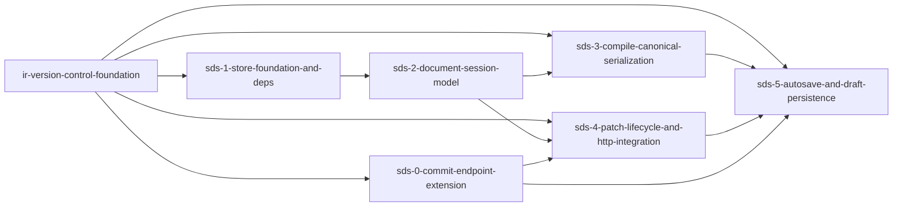

# Phase 1: studio-document-and-store

**Parent Todo ID:** `studio-document-and-store`
**Phase:** Phase 1
**Dependency Layer:** Layer 1 (depends on `ir-version-control-foundation`)
**D1 decomposition by:** gemini-3.1-pro (separate agent invocation, read-only)
**R1 review pass 1:** RETURN-FOR-REVISION — `studio-document-and-store.r1-review-pass1.md`
**Revision pass 2:** D1 resumed; 6 tickets (added `sds-0-commit-endpoint-extension`); pass-1 findings folded.
**R1 review pass 2:** RETURN-FOR-REVISION — `studio-document-and-store.r1-review-pass2.md`
**Revision pass 3:** D1 resumed; pass-2 findings folded (GitService extension scoped, builder-fixture materialization pinned, store-shape consistency, deal_id home, parent_sha nullable preservation, 409 envelope backward-compat, sds-1 forward-dep removed).
**Status:** APPROVED FOR T1 following parent-agent verification.

*TDD Note: Each ticket's Test plan files are authored FIRST and must FAIL before any implementation begins.*

## Ticket Dependency Graph



## Tickets

### Ticket: `sds-0-commit-endpoint-extension`

#### Scope (1 paragraph)
Corrigendum to `irvc-4-http-api` AND `irvc-1-core-git-service`. Extends `GitService.commit_deal(...)` with a `commit_target: str = "main"` keyword argument so the service can commit to any branch (not just `refs/heads/main`), and extends the merged `POST /deals/{deal_id}/commit` endpoint so the client can supply (a) the IR `payload` to commit (instead of the endpoint re-reading the current `deal.json` from `main` HEAD) and (b) the target `branch` (which the endpoint forwards to `commit_target`). `parent_sha` is validated against the **supplied** branch's tip, not main's, so ephemeral branches accept commits identically to main. Backward-compatible: existing callers that omit `payload` retain the previous "re-commit current `deal.json` on main" semantics, and existing callers that omit `branch`/`commit_target` get `"main"`. Per-branch policy (which branches accept which authorship) lives in the store layer (`sds-4` / `sds-5`), not in this endpoint or service. It explicitly does NOT add new HTTP routes, does NOT change merge semantics, and does NOT touch the SSE merge endpoint.

#### Files affected
- `src/bma_cfengine_app/orchestrator/deals/git_service.py` — modified; extends `commit_deal(...)` with the `commit_target` keyword argument and routes the write to `refs/heads/{commit_target}`.
- `src/bma_cfengine_app/api/routers/deals.py` — modified; extends `CommitRequest` and `commit_deal_endpoint`; forwards `body.branch` to `service.commit_deal(commit_target=...)`.
- `tests/orchestrator/deals/test_git_service_branch_commit.py` — new; service-level tests for non-main branch commits and branch-isolation invariants.
- `tests/api/routers/test_deals_commit_extension.py` — new; HTTP-level tests for the extended endpoint.

#### Dependencies
- `ir-version-control-foundation` (external Phase 1; specifically `irvc-1-core-git-service` and `irvc-4-http-api`)

#### User journeys (1-3)
1. GIVEN a client with a new working-tree IR payload WHEN they `POST /deals/{id}/commit` with `payload` set and `branch="ai/turn-abc123"` THEN the endpoint commits that payload to the ephemeral branch and returns the new SHA.
2. GIVEN a client targeting an ephemeral branch with a stale `parent_sha` WHEN they `POST /deals/{id}/commit` THEN the endpoint returns 409 Conflict because `parent_sha` does not match the ephemeral branch's tip (not main's tip).
3. GIVEN a legacy caller that omits `payload` and `branch` WHEN they `POST /deals/{id}/commit` THEN the endpoint preserves the merged irvc-4 behavior (re-commit current `deal.json` on `main`).

#### Acceptance criteria (numbered, testable)
1. `CommitRequest` is extended with exactly: `payload: dict[str, Any] | None = None` (when omitted, the endpoint preserves the merged irvc-4 read-then-recommit semantics from `main` HEAD) and `branch: str = "main"`. Existing fields `author: str`, `message: str`, `parent_sha: str | None = None`, `force: bool = False` are unchanged — note that `parent_sha` REMAINS nullable, matching the landed irvc-4 surface (`src/bma_cfengine_app/api/routers/deals.py` L896-900). `parent_sha=None` continues to permit the legacy "unborn-branch initial commit" path; do NOT regress this to non-nullable.
2. When `payload` is provided, the endpoint validates it with `DealDefinition.model_validate(payload)`. On validation success, the endpoint commits the exact UTF-8 bytes of `validated.model_dump_json(indent=2)` (Pydantic's canonical serializer — the field-order behavior matches `sds-3`'s field-order manifest). On validation failure, the endpoint returns `422 Unprocessable Entity` with the Pydantic validation error in the response body. The endpoint does NOT call `json.dumps` on the raw payload directly.
3. `parent_sha` is validated against the tip of the **supplied** `branch` (resolved via `GitService.branch_list(...)` / `GitService.log(branch=branch, limit=1)`). When `parent_sha` does not match that branch's tip and `force=False`, the endpoint returns `409 Conflict`. The 409 response body preserves the existing irvc-4 envelope verbatim: `{"detail": {"code": "STALE_PARENT_SHA", "head_sha": "<sha>"}}` — the only difference vs the legacy `branch="main"` path is which branch's tip is reported in `detail.head_sha`. The store reads `response.body.detail.head_sha` (NOT any renamed field) to preserve backward compatibility with existing callers.
4. `GitService.commit_deal(...)` is extended with a `commit_target: str = "main"` keyword argument. The new signature is:
   ```python
   def commit_deal(
       self,
       deal_payload: dict[str, Any] | bytes,
       *,
       author: str,
       message: str,
       parent_sha: str | None = None,
       commit_target: str = "main",
   ) -> str:
   ```
   The function commits to `refs/heads/{commit_target}` (NOT `refs/heads/main` unconditionally). `commit_target` is validated against irvc-1's slug grammar via the existing `_validate_branch_name` (or equivalent) helper from irvc-1; invalid names raise `INVALID_BRANCH_NAME` per irvc-1 AC 5. `parent_sha` is validated against the supplied branch's tip, not main's tip. The endpoint passes `commit_target=body.branch` to `service.commit_deal(...)`; invalid names return `400 Bad Request` at the HTTP layer (re-uses the existing irvc-1 validation path, no new validation logic).
5. Backward compatibility: when both `payload` and `branch` are omitted at the HTTP layer, AND when `commit_target` is omitted at the service layer, behavior is byte-identical to the merged irvc-4 / irvc-1 behavior (re-commit current main `deal.json`; commit to `refs/heads/main`). Existing irvc-1 and irvc-4 tests must continue to pass without modification.
6. **Service-level branch isolation**: `service.commit_deal(..., commit_target='ai/turn-abc')` advances ONLY `refs/heads/ai/turn-abc`; `refs/heads/main` is unchanged. A test creates a baseline `main` commit, then commits to an ephemeral branch via the new `commit_target` argument, then asserts (a) the ephemeral branch tip advances to the new SHA, (b) `main` HEAD is byte-identical to its pre-call value (same SHA, same `deal.json` content), (c) the new commit's parent SHA is the previous ephemeral branch tip (not main's tip).

#### Test plan
- `tests/orchestrator/deals/test_git_service_branch_commit.py::test_commit_deal_writes_to_supplied_commit_target_branch_only` — AC 4, 6 (asserts the ephemeral branch advances AND `main` is unchanged AND parent linkage is correct)
- `tests/orchestrator/deals/test_git_service_branch_commit.py::test_commit_deal_default_commit_target_remains_main_for_backward_compat` — AC 4, 5 (omitting `commit_target` writes to `refs/heads/main` exactly as the legacy signature did)
- `tests/orchestrator/deals/test_git_service_branch_commit.py::test_commit_deal_invalid_commit_target_raises_invalid_branch_name` — AC 4 (re-uses irvc-1's validator; raises `INVALID_BRANCH_NAME`)
- `tests/orchestrator/deals/test_git_service_branch_commit.py::test_commit_deal_parent_sha_validated_against_supplied_branch_tip_not_main` — AC 4 (creates a baseline main commit; commits to an ephemeral branch with `parent_sha` set to main's tip; expects the service to reject because the ephemeral branch is unborn / has a different tip)
- `tests/api/routers/test_deals_commit_extension.py::test_commit_with_payload_writes_supplied_bytes_to_main` — AC 1, 2
- `tests/api/routers/test_deals_commit_extension.py::test_commit_with_branch_routes_to_ephemeral_branch_tip` — AC 1, 3, 4 (creates `ai/turn-{slug}` via `POST /deals/{id}/branches`, commits a payload, asserts the branch tip advances and `main` does not)
- `tests/api/routers/test_deals_commit_extension.py::test_commit_with_stale_parent_sha_on_ephemeral_branch_returns_409_with_detail_head_sha` — AC 3 (asserts response body shape is exactly `{"detail": {"code": "STALE_PARENT_SHA", "head_sha": "<ephemeral-branch-tip>"}}`)
- `tests/api/routers/test_deals_commit_extension.py::test_commit_with_invalid_payload_returns_422_with_pydantic_error` — AC 2
- `tests/api/routers/test_deals_commit_extension.py::test_commit_with_invalid_branch_name_returns_400` — AC 4
- `tests/api/routers/test_deals_commit_extension.py::test_commit_with_null_parent_sha_permits_unborn_branch_initial_commit` — AC 1 (regression guard: ensures `parent_sha=None` is still accepted on unborn branches)
- `tests/api/routers/test_deals_commit_extension.py::test_legacy_call_without_payload_and_branch_matches_irvc4_behavior` — AC 5

#### Out-of-scope notes
This ticket is an irvc-1 / irvc-4 corrigendum; no Phase 0 contracts are reopened. Do not change merge semantics, do not change the SSE merge endpoint, do not change the diff/log/show endpoints, do not change the export endpoint. Per-branch authorship policy (`ai/turn-*` accepts `ai:writer:*` authors only, etc.) is enforced in the store, not in this API or service.

*Risk Note:* The merged irvc-4 endpoint and irvc-1 `GitService.commit_deal` are exercised by existing tests. The backward-compat ACs (5) are the regression gate; implementers must run the existing irvc-1 + irvc-4 test suites unchanged.

---

### Ticket: `sds-1-store-foundation-and-deps`

#### Scope (1 paragraph)
Adds `zustand` and `zundo` to the UI project dependencies and scaffolds the core `useDealStore.ts` reactive store. This ticket establishes the typed-action infrastructure (the `DealAction` discriminated-union type, the `dispatch(action)` helper, per-pane selectors) and defines the empty store shape including the root-level `deal_id`, `conflictState`, and `applyConflict` slots. Per Minor #1 fold-back, the initial scaffolding **pre-nests a single `main` `DocumentSession` record** under `state.sessions["main"]` with placeholder zero-valued fields, so that `sds-2`'s diff is purely additive (extending the session container to N>1 sessions and wiring per-session zundo) rather than restructuring the store shape. It implements a small initial action vocabulary (`addBond`, `setBondKind`, `setRulePriority`) to prove the dispatcher pattern. It explicitly does NOT implement the multi-session container semantics, per-session zundo wiring, compile-to-IR, HTTP integration, or auto-save.

#### Files affected
- `src/bma_cfengine_app/ui/package.json` — modified; adds `zustand` and `zundo`.
- `src/bma_cfengine_app/ui/src/features/deals/store/useDealStore.ts` — new.
- `src/bma_cfengine_app/ui/src/features/deals/store/actions.ts` — new.
- `src/bma_cfengine_app/ui/src/features/deals/store/selectors.ts` — new.
- `src/bma_cfengine_app/ui/src/features/deals/store/useDealStore.test.ts` — new.
- `src/bma_cfengine_app/ui/src/features/deals/store/actions.test.ts` — new.
- `src/bma_cfengine_app/ui/src/features/deals/store/selectors.test.ts` — new.

#### Dependencies
- none (no Phase-1 prerequisites; sibling to `sds-0` at Layer 0)

#### User journeys (1-3)
1. GIVEN a React component WHEN it dispatches an `addBond` typed action via the store dispatcher THEN the active session's `working_tree.bonds` array gains the new entry.
2. GIVEN a pane component WHEN it subscribes to a per-pane selector (e.g., `useBondsSelector`) THEN it re-renders only when its slice changes.
3. GIVEN a fresh store WHEN initialized THEN `state.deal_id` is the empty string and the placeholder `main` session record exists.

#### Acceptance criteria (numbered, testable)
1. `zustand` and `zundo` are added to `src/bma_cfengine_app/ui/package.json` `dependencies`. The exact versions are pinned (current latest stable as of the implementation date — implementer documents the pinned version in the commit message).
2. `useDealStore` is created with the exact root-level state shape:
   ```ts
   type DealStoreState = {
     sessions: Record<string, DocumentSession>;
     activeSessionId: string;       // initialized to "main"
     deal_id: string;               // initialized to "" until a deal is loaded
     conflictState: ConflictState | null;  // initialized to null; pinned in sds-4 AC 5
     applyConflict: ApplyConflict | null;  // initialized to null; pinned in sds-4 AC 3
   };
   ```
   `state.sessions` is pre-populated with a single entry keyed `"main"` and `state.activeSessionId = "main"`. The session's `working_tree` is typed `DealState = DealDefinition` (the existing structural mirror in `src/bma_cfengine_app/ui/src/features/deals/ir-types.ts`). A test asserts that a fixture's `deal.json` parsed via `JSON.parse(...) as DealState` populates `state.sessions["main"].working_tree` without any field renames or shape transforms (top-level keys present; no fields dropped or renamed). The exhaustive declaration-order assertion against the field-order manifest lives in `sds-3` (not here) to avoid a forward dependency.
3. The typed action layer defines:
   - `type DealAction = AddBondAction | SetBondKindAction | SetRulePriorityAction`
   - `type AddBondAction = { type: 'addBond'; payload: BondDef }`
   - `type SetBondKindAction = { type: 'setBondKind'; payload: { bond_id: string; kind: BondKind } }`
   - `type SetRulePriorityAction = { type: 'setRulePriority'; payload: { rule_id: string; priority: number } }`
   - `function dispatch(action: DealAction): void`
   - An exhaustive `switch` over `action.type` enforced by a `never`-guard in the default branch (compile-time-fails if a new action variant is added without a case).
4. The three initial actions (`addBond`, `setBondKind`, `setRulePriority`) mutate `state.sessions[state.activeSessionId].working_tree` and never touch any other session.
5. Per-pane selectors (`useBondsSelector`, `useAccountsSelector`, `useRulesSelector`) are implemented as `useDealStore(state => state.sessions[state.activeSessionId].working_tree.<slice>)` with reference-equality memoization.
6. **`deal_id` initialization and setter**: `state.deal_id` is initialized to `""` on store creation. A `setDealId(deal_id: string)` typed action sets `state.deal_id` and is used as the temporary deal-loading entry point until a richer `loadDeal(deal_id, working_tree, base_sha)` action lands (deal-loading orchestration is out of scope for this ticket; tracked separately). `state.deal_id` is the single source of truth for which deal the store represents; per-session `deal_id` fields do NOT exist (all sessions for one open deal share the same root `deal_id`). The `local_draft_*` semantics live on `state.deal_id` (`state.deal_id` starts as `local_draft_${uuid}` for new drafts and is rewritten on promotion in `sds-5`), NOT on `session_id`.

#### Test plan
- `src/bma_cfengine_app/ui/src/features/deals/store/useDealStore.test.ts::test_store_initializes_with_root_state_shape_pin` — AC 2 (asserts root keys `sessions`, `activeSessionId`, `deal_id`, `conflictState`, `applyConflict` are present with the documented initial values)
- `src/bma_cfengine_app/ui/src/features/deals/store/useDealStore.test.ts::test_store_initializes_with_single_main_session_and_empty_dealstate_shape` — AC 2
- `src/bma_cfengine_app/ui/src/features/deals/store/useDealStore.test.ts::test_fixture_deal_json_parses_into_working_tree_without_field_renames` — AC 2 (loads a `tests/fixtures/fnr_2006_018` Python-emitted `deal.json` via `JSON.parse` into the working_tree and asserts no field is dropped or renamed)
- `src/bma_cfengine_app/ui/src/features/deals/store/useDealStore.test.ts::test_setDealId_action_updates_root_deal_id` — AC 6
- `src/bma_cfengine_app/ui/src/features/deals/store/actions.test.ts::test_addBond_updates_active_session_working_tree` — AC 3, 4
- `src/bma_cfengine_app/ui/src/features/deals/store/actions.test.ts::test_setBondKind_and_setRulePriority_dispatch_correctly` — AC 3, 4
- `src/bma_cfengine_app/ui/src/features/deals/store/actions.test.ts::test_unknown_action_type_fails_compile_via_never_guard` — AC 3 (uses `// @ts-expect-error` to assert exhaustiveness)
- `src/bma_cfengine_app/ui/src/features/deals/store/selectors.test.ts::test_per_pane_selectors_return_correct_slices_with_referential_stability` — AC 5

#### Out-of-scope notes
Do not implement multi-session semantics (sds-2). Do not wire per-session zundo (sds-2). Do not implement compile-to-IR (sds-3). Do not implement HTTP integration (sds-4) or auto-save (sds-5). The single `main` session record is a scaffolding placeholder; sds-2 owns its full semantic activation. Deal-loading orchestration is out of scope; `setDealId` is the temporary entry point used by tests.

---

### Ticket: `sds-2-document-session-model`

#### Scope (1 paragraph)
Activates the `DocumentSession` abstraction with full literal-typed field shapes, per-session zundo (architecture option (a): per-session temporal instance carried in `DocumentSession.zundo_history`), the `createEphemeralSession` action that bridges to `POST /deals/{deal_id}/branches` + `GET /deals/{deal_id}/show` for working-tree seeding, multi-ephemeral-session coexistence, and the per-session `diagnostics` slot required by `validation-engine` downstream. It refactors `useDealStore` to support N coexisting sessions (1 primary + 0-or-more ephemerals). It explicitly does NOT implement the Apply/Discard patch lifecycle (sds-4), the compile-to-IR step (sds-3), or auto-save (sds-5).

#### Files affected
- `src/bma_cfengine_app/ui/src/features/deals/store/session.ts` — new; `DocumentSession` type, `BranchName` branded type, `createEphemeralSession` action.
- `src/bma_cfengine_app/ui/src/features/deals/store/diagnostics-types.ts` — new; placeholder TS structural mirror of `DiagnosticPayload` (the full vpc-3 parity contract is `validation-engine`'s job).
- `src/bma_cfengine_app/ui/src/features/deals/store/useDealStore.ts` — modified; extends the `sessions` container to N>1 sessions, wires per-session zundo, adds `setDiagnostics(sessionId, diagnostics)` action.
- `src/bma_cfengine_app/ui/src/features/deals/store/actions.ts` — modified; adds `createEphemeralSession`, `setDiagnostics`, `setActiveSession`.
- `src/bma_cfengine_app/ui/src/features/deals/store/session.test.ts` — new.
- `src/bma_cfengine_app/ui/src/features/deals/store/diagnostics-types.test.ts` — new.

#### Dependencies
- `sds-1-store-foundation-and-deps`

#### User journeys (1-3)
1. GIVEN a loaded deal (`state.deal_id` set) WHEN the system calls `createEphemeralSession({ branch_name: 'ai/turn-abc123', base_sha, ui_role: 'preview' })` THEN a new session record is added with `working_tree` seeded from `GET /deals/${state.deal_id}/show?sha={base_sha}&path=deal.json` and the main session is untouched.
2. GIVEN three coexisting sessions (main + two ephemerals) WHEN an action is dispatched to ephemeral session #2 THEN sessions main and #1 are unchanged AND per-session zundo histories remain independent.
3. GIVEN a validation pass WHEN `setDiagnostics(sessionId, payloads)` is dispatched THEN only that session's `diagnostics` slot is replaced.

#### Acceptance criteria (numbered, testable)
1. `DocumentSession` is exactly:
   ```ts
   type BranchName = string & { __brand: 'BranchName' }; // satisfies /^(main|ai\/turn-[a-z0-9][a-z0-9-]{0,63}|solver\/run-[a-z0-9][a-z0-9-]{0,63}|what-if\/[a-z0-9][a-z0-9-]{0,63})$/
   type DocumentSession = {
     session_id: string;                       // matches /^(main|ephemeral_[0-9a-f-]{36}|local_draft_[0-9a-f-]{36})$/
     branch_name: BranchName;
     base_sha: string;                         // 40-char lowercase hex; '' allowed only for unborn local_draft_* sessions
     working_tree: DealState;                  // = DealDefinition (ir-types.ts mirror)
     validation_target: 'self';                // literal; reserved for future expansion
     commit_target: BranchName;                // typically equals branch_name; future-flexible
     zundo_history: TemporalState<DealState>;  // PER-SESSION temporal instance; see AC 4
     ui_role: 'primary' | 'preview';
     diagnostics: DiagnosticPayload[];         // see AC 5
   };
   ```
   A `mkBranchName(name: string): BranchName` constructor validates and brands; raw strings cannot be assigned to a `BranchName`-typed field. The slug regex matches irvc-1 AC 5 exactly.
2. `useDealStore` holds `sessions: Record<string, DocumentSession>` and `activeSessionId: string`. Multiple ephemeral sessions coexist; `Object.keys(state.sessions).length` may exceed 2. The store-shape is flat: `sessions[id].working_tree` (NOT `sessions[id].state.working_tree`) is the access path; there is NO wrapper object.
3. `createEphemeralSession({ branch_name, base_sha, ui_role })` action:
   - Generates `session_id = 'ephemeral_' + crypto.randomUUID()`.
   - Calls `POST /deals/${state.deal_id}/branches` with `{ name: branch_name, from_sha: base_sha }`. The URL uses the root-level `state.deal_id` from `sds-1` AC 6 (NOT the active session's session_id or any per-session deal_id field — sessions for one open deal share the root `deal_id`).
   - Calls `GET /deals/${state.deal_id}/show?sha={base_sha}&path=deal.json` and parses the response into `DealState`.
   - Adds the new session record to `state.sessions` with the seeded `working_tree`, a fresh per-session `zundo_history: TemporalState<DealState>`, and `diagnostics: []`.
   - Returns the new `session_id`.
   - Does NOT mutate the main session (or any other existing session).
   - On any HTTP failure, surfaces an error and does NOT add a partial session record.
4. **Per-session zundo (option (a), sanctioned shape)**: each `DocumentSession`'s `zundo_history` field IS the per-session temporal instance returned from `temporal(...)` middleware applied to a sub-store keyed on that session's `working_tree` slice. The store shape stays flat (`sessions: Record<string, DocumentSession>` — there is NO wrapper object wrapping `{ state, temporal }`). `undo()` / `redo()` dispatched in the active session operate **only** on `sessions[activeSessionId].zundo_history`. Switching `activeSessionId` does NOT emit a temporal entry on either session.
5. `DocumentSession.diagnostics: DiagnosticPayload[]` is initialized to `[]` for every session. `setDiagnostics(sessionId: string, payloads: DiagnosticPayload[])` replaces the slot atomically (the previous array reference is replaced, not mutated). The slot is per-session: `setDiagnostics('main', [...])` does not mutate `state.sessions['ephemeral_xxx'].diagnostics`. `DiagnosticPayload` is structurally `{ code: string; severity: 'error'|'warning'|'info'; path: string; message: string; payload: Record<string, unknown> }` — matches `bma_standard_formulas.diagnostics.payload.DiagnosticPayload`. This is a placeholder until vpc-3 lands the full parity-checked registry; the comment `// FUTURE: vpc-3 registry parity` is placed at the type definition.
6. The store always initializes with exactly one session keyed `"main"` with `ui_role: 'primary'`. The main session is non-deletable: a `deleteSession('main')` call is a no-op (or throws — implementer's call) and surfaces a `WARNING` diagnostic.

#### Test plan
- `src/bma_cfengine_app/ui/src/features/deals/store/session.test.ts::test_document_session_type_pins_all_field_shapes_with_literal_precision` — AC 1 (compile-time + runtime: asserts `BranchName` rejects raw strings, asserts every `DocumentSession` field is present with the literal types from AC 1)
- `src/bma_cfengine_app/ui/src/features/deals/store/session.test.ts::test_branch_name_brand_rejects_invalid_slug_matches_irvc1_regex` — AC 1
- `src/bma_cfengine_app/ui/src/features/deals/store/session.test.ts::test_session_access_path_is_flat_no_wrapper_object` — AC 2, 4 (asserts `sessions[id].working_tree` access works and `sessions[id].state` does NOT exist)
- `src/bma_cfengine_app/ui/src/features/deals/store/session.test.ts::test_createEphemeralSession_uses_root_deal_id_in_branches_and_show_urls` — AC 3 (mocked fetch; asserts the two HTTP calls use `/deals/${state.deal_id}/...` URLs)
- `src/bma_cfengine_app/ui/src/features/deals/store/session.test.ts::test_createEphemeralSession_calls_branches_and_show_endpoints_and_seeds_working_tree` — AC 3
- `src/bma_cfengine_app/ui/src/features/deals/store/session.test.ts::test_createEphemeralSession_does_not_mutate_main_session` — AC 3
- `src/bma_cfengine_app/ui/src/features/deals/store/session.test.ts::test_createEphemeralSession_http_failure_does_not_create_partial_session_record` — AC 3
- `src/bma_cfengine_app/ui/src/features/deals/store/session.test.ts::test_actions_mutate_only_active_session_working_tree` — AC 2, 4
- `src/bma_cfengine_app/ui/src/features/deals/store/session.test.ts::test_zundo_per_session_instance_isolated_between_sessions` — AC 4 (creates main + 2 ephemerals; dispatches actions in each; asserts each session's `zundo_history.getState().pastStates.length` reflects only its own action count)
- `src/bma_cfengine_app/ui/src/features/deals/store/session.test.ts::test_active_session_switch_does_not_emit_temporal_entry` — AC 4
- `src/bma_cfengine_app/ui/src/features/deals/store/session.test.ts::test_multiple_ephemeral_sessions_coexist_with_independent_mutations` — AC 2 (creates 3 ephemerals; dispatches an action to session 2; asserts sessions 1 and 3 working_trees are unchanged; asserts `Object.keys(state.sessions).length === 4`)
- `src/bma_cfengine_app/ui/src/features/deals/store/session.test.ts::test_setDiagnostics_replaces_slot_atomically_per_session` — AC 5
- `src/bma_cfengine_app/ui/src/features/deals/store/diagnostics-types.test.ts::test_diagnostic_payload_shape_matches_python_envelope` — AC 5 (structural test: imports the TS type, asserts all five fields are present with correct primitive types)
- `src/bma_cfengine_app/ui/src/features/deals/store/session.test.ts::test_store_initializes_with_main_session_primary_role` — AC 6
- `src/bma_cfengine_app/ui/src/features/deals/store/session.test.ts::test_main_session_cannot_be_deleted` — AC 6

#### Out-of-scope notes
Do not implement Apply/Discard (`sds-4`). Do not implement compile-to-IR (`sds-3`). Do not implement auto-save or sessionStorage recovery (`sds-5`). Do not implement the full vpc-3 TS worker registry; the placeholder `DiagnosticPayload` type alias is sufficient at this layer.

*Risk Note:* zundo's `temporal` middleware is designed for whole-store undo. The sanctioned shape places the per-session temporal instance directly in `DocumentSession.zundo_history`; implementer instantiates per-session temporal middleware over a per-session sub-store slice keyed on `working_tree`. If the zundo API does not directly support this nested pattern, the implementer may need to wrap a manual past/future stack that exposes the same `pause()` / `resume()` / `handleSet()` / `getState()` surface — escalate before substituting a different store shape.

---

### Ticket: `sds-3-compile-canonical-serialization`

#### Scope (1 paragraph)
Implements the deterministic compile-to-IR step in TypeScript that emits byte-identical JSON to Python's `model_dump_json(indent=2)` post-migration output. This is the architectural correctness gate for the entire ticket set. It establishes the Pydantic-to-TS field-order propagation mechanism (a JSON manifest emitted by a Python introspection script and vendored into the UI build) and the Python-emits-canonical-fixtures harness for the round-trip property test (per R1 Critical #1's pinned mechanism (a)). The canonical-fixture emitter handles both fixture conventions: directories with a `deal_definition.py` builder (e.g., `tests/fixtures/fnr_2006_018/`) materialize `deal.json` by re-emitting from the builder, and directories with an already-present `deal.json` pass through. It explicitly does NOT apply any multi-target consolidation, branch consolidation, or other semantic canonicalization — fragmented multi-target rules round-trip in fragmented form.

#### Files affected
- `src/bma_cfengine_app/ui/src/features/deals/store/compile.ts` — new; `compileToIR(working_tree: DealState): string`.
- `src/bma_cfengine_app/ui/src/features/deals/store/compile.test.ts` — new; unit tests for field order, list preservation, formatting, non-canonicalization, and the field-order manifest exhaustive assertion.
- `src/bma_cfengine_app/ui/src/features/deals/store/compile.roundtrip.test.ts` — new; Vitest round-trip property test that reads Python-emitted canonical artifacts and asserts byte-identity.
- `scripts/emit_field_order.py` — new; Python introspection that walks `DealDefinition` and every nested model, writing a nested `{ModelName: [field_names_in_declaration_order]}` map.
- `src/bma_standard_formulas/deals/schemas/field_order.json` — new (generated artifact, checked into the repo as the source of truth).
- `src/bma_cfengine_app/ui/src/features/deals/field_order.json` — new (vendored copy used by the TS bundle; sync enforced by CI).
- `scripts/emit_canonical_fixtures.py` — new; Python script that iterates `tests/fixtures/*/deal_definition.py` AND `tests/fixtures/*/deal.json`. For each fixture directory, it materializes both `<fixture>/deal.json` (re-emitted from the builder if builder-based; passthrough if already present) and `<fixture>/deal.canonical.json` (post-migration `model_dump_json(indent=2)` output). Each fixture directory ends up with both files after the script runs. Current fixture directories the emitter must handle: `tests/fixtures/fnr_2006_018/` (builder: `deal_definition.py`), `tests/fixtures/ginniemae_2025_203/`, `tests/fixtures/verus_2024_9/`, `tests/fixtures/cc_series_test/`, `tests/fixtures/ford_2024_c/`. The emitter discovers either a `deal_definition.py` export or an existing `deal.json` and processes both forms.
- `tests/scripts/test_emit_field_order.py` — new; tests the Python introspection script + the `--check` drift guard.
- `tests/scripts/test_emit_canonical_fixtures.py` — new; tests the canonical-fixture emitter + the fixture-count parity guard + builder materialization.
- `.github/workflows/ci.yml` — modified; adds two CI guards: `python scripts/emit_field_order.py --check` and `python scripts/emit_canonical_fixtures.py --check` (both fail if generated artifacts drift from committed bytes), plus a fixture-count parity guard (`count(*.canonical.json) == count(deal.json)` AND same fixture directories).

#### Dependencies
- `sds-2-document-session-model`
- `ir-version-control-foundation` (external Phase 1; the round-trip helper consumes post-migration `deal.json` produced by irvc-3's migration semantics)

#### User journeys (1-3)
1. GIVEN a loaded post-migration deal in a session's `working_tree` WHEN `compileToIR(working_tree)` is called THEN the resulting JSON string is byte-identical to the Python `DealDefinition.model_dump_json(indent=2)` output for the same payload.
2. GIVEN every fixture under `tests/fixtures/` (builder-based or `deal.json`-based) WHEN the round-trip test runs THEN every fixture compiles to bytes identical to its committed `deal.canonical.json` artifact, and a second compile produces the same bytes (idempotency).
3. GIVEN a developer adds a new field to `DealDefinition` in Python WHEN they commit without re-running `scripts/emit_field_order.py` THEN the CI drift guard fails with a clear message indicating which model gained / lost / reordered a field.

#### Acceptance criteria (numbered, testable)
1. `compileToIR(working_tree: DealState): string` is implemented in `compile.ts`. The signature is exact; the return is a JSON string (not a parsed object).
2. Field ordering uses the vendored `field_order.json` manifest. For each model encountered during serialization, the compile step emits fields in the order listed under that model's entry. Fields absent from the manifest fail compile-time with a clear error (forces the developer to regenerate the manifest). A test asserts that every `DealDefinition` top-level field appears in the manifest AND in the compile output, in the same declaration order.
3. List ordering is preserved as authored. The compile step NEVER sorts arrays. A test loads a fixture with an authored-non-alphabetical ordering (e.g., `bonds` in reverse-alphabetical order) and asserts the compile output preserves that order.
4. Stable formatting: floats use Python's default `json.dumps` representation (no scientific notation for in-range values; trailing `.0` for integer-valued floats matching Pydantic's behavior), enums emit as their string value with case preserved from the Pydantic definition, `None` round-trips as `null`, absent-optional-fields are omitted exactly when Pydantic omits them (`exclude_none=False` semantics; field with `default=None` and value `None` emits `"field": null`; field with `default=PydanticUndefined` and unset emits nothing). All of these are pinned by direct comparison to the `deal.canonical.json` artifact in the round-trip test.
5. The compile step performs NO multi-target consolidation, NO branch consolidation, NO parallel-cascade refactoring, NO shared-trigger sequence consolidation, NO field renames. A positive test references a specific fixture (`tests/fixtures/fnr_2006_018/`) that contains at least one fragmented multi-target rule sequence; the test asserts that `compileToIR(load(fixture).working_tree)` emits the rules in their fragmented authored form (rules A→X, A→Y, A→Z stay as three separate rules, NOT consolidated into one A→{X,Y,Z}).
6. **Field-order manifest mechanism**: `scripts/emit_field_order.py` walks `DealDefinition` and every nested Pydantic model (via `model_fields`) and writes `src/bma_standard_formulas/deals/schemas/field_order.json` as `{ "DealDefinition": ["field1", "field2", ...], "BondDef": [...], ... }`. A build-time vendor step (Vite plugin OR a pre-commit hook OR a `pnpm run sync:field-order` script — implementer's call) copies the file to `src/bma_cfengine_app/ui/src/features/deals/field_order.json`. A CI job runs `python scripts/emit_field_order.py --check` and fails if the generated bytes do not match the committed bytes. A second CI step fails if the Python source and TS-vendored copies diverge.
7. **Round-trip harness mechanism (pinned per R1 Critical #1 mechanism (a); builder materialization per R1 pass-2 new Major #1)**: `scripts/emit_canonical_fixtures.py` iterates the fixture set and for each fixture directory materializes BOTH files:
   - **`<fixture>/deal.json`** — re-emitted from the `deal_definition.py` builder if present (uses `model_dump_json(indent=2)` on the post-migration model); passthrough copy of the existing `deal.json` if already present.
   - **`<fixture>/deal.canonical.json`** — post-migration `migrate_deal_payload` + `DealDefinition.model_validate` + `model_dump_json(indent=2)` output.
   Both files are checked into the repo. The Vitest round-trip test `compile.roundtrip.test.ts` (a) reads each `<fixture>/deal.json` (the source), (b) parses it through the store's load path, (c) calls `compileToIR(working_tree)`, (d) asserts byte-identity to `<fixture>/deal.canonical.json` (the post-migration target), (e) re-runs the compile a second time on the same store state and asserts byte-identity again (idempotency).
8. **Fixture-count parity guard**: a CI step asserts that the set of fixture directories containing `deal.json` is EQUAL to the set of fixture directories containing `deal.canonical.json` (same directories, same counts). New fixtures added without regenerating their canonical artifact fail CI. Minimum fixture coverage (the round-trip MUST exercise at least these; additional fixtures auto-extend the test): `fnr_2006_018`, `ginniemae_2025_203`, `verus_2024_9`, `cc_series_test`, `ford_2024_c`.

#### Test plan
- `src/bma_cfengine_app/ui/src/features/deals/store/compile.test.ts::test_compile_returns_string_with_pydantic_field_order` — AC 1, 2
- `src/bma_cfengine_app/ui/src/features/deals/store/compile.test.ts::test_compile_uses_field_order_manifest_for_every_top_level_dealdef_field` — AC 2 (exhaustive: verifies every `DealDefinition` field appears in the manifest AND in the compile output, in declaration order)
- `src/bma_cfengine_app/ui/src/features/deals/store/compile.test.ts::test_compile_fails_when_model_missing_from_field_order_manifest` — AC 2
- `src/bma_cfengine_app/ui/src/features/deals/store/compile.test.ts::test_compile_preserves_list_order_no_sort` — AC 3 (uses authored reverse-alphabetical bonds list)
- `src/bma_cfengine_app/ui/src/features/deals/store/compile.test.ts::test_compile_float_enum_null_formatting_matches_pydantic` — AC 4
- `src/bma_cfengine_app/ui/src/features/deals/store/compile.test.ts::test_compile_does_not_auto_canonicalize_fragmented_multi_target_rules` — AC 5 (positive test on `fnr_2006_018`)
- `src/bma_cfengine_app/ui/src/features/deals/store/compile.roundtrip.test.ts::test_canonical_post_migration_round_trip_byte_identity_for_every_fixture` — AC 6, 7, 8 (iterates all `tests/fixtures/*/deal.json`)
- `src/bma_cfengine_app/ui/src/features/deals/store/compile.roundtrip.test.ts::test_second_compile_is_byte_identical_idempotency` — AC 7
- `tests/scripts/test_emit_field_order.py::test_emitter_walks_all_nested_models_and_records_declaration_order` — AC 6
- `tests/scripts/test_emit_field_order.py::test_check_mode_fails_on_drift` — AC 6
- `tests/scripts/test_emit_canonical_fixtures.py::test_emitter_produces_byte_stable_canonical_artifacts_across_runs` — AC 7
- `tests/scripts/test_emit_canonical_fixtures.py::test_emitter_materializes_deal_json_from_builder_when_only_deal_definition_py_present` — AC 7 (builder convention: input is `deal_definition.py`, emitter writes `deal.json` AND `deal.canonical.json`)
- `tests/scripts/test_emit_canonical_fixtures.py::test_emitter_passthrough_when_deal_json_already_present` — AC 7 (passthrough convention)
- `tests/scripts/test_emit_canonical_fixtures.py::test_fixture_count_parity_guard_fails_when_deal_json_added_without_canonical` — AC 8

#### Out-of-scope notes
Do not implement the canonicalization linter quick-fixes (that is `rule-canonicalization-framework`). Do not implement `StudioSidecar` serialization (that is `studio-document-persistence-and-migration`). Do not change `migrate_deal_payload` semantics (that is irvc-3's surface). The fixture-build helper is a development-time tool; it is not invoked from runtime application code.

*Risk Note:* The vendored `field_order.json` introduces a build-time coupling between Python and TypeScript. The CI drift guard is the primary defense; a missed regeneration after a Pydantic model change is a hard CI failure rather than a silent runtime divergence. Newly-added fixtures must follow ONE of the two supported conventions: (1) a `deal_definition.py` builder that exports a `DealDefinition` instance, OR (2) a pre-existing `deal.json`. Mixed-state directories (both present but inconsistent) MUST fail the parity guard at CI time.

---

### Ticket: `sds-4-patch-lifecycle-and-http-integration`

#### Scope (1 paragraph)
Implements the proposed → previewed → applied/discarded patch lifecycle backed by the HTTP endpoints in `ir-version-control-foundation` and the extended commit endpoint in `sds-0`. It adds the store actions `applyEphemeralSessionToMain`, `discardEphemeralSession`, and `previewEphemeralSession`, and pins the three-way-merge conflict UX on Apply (per R1 Critical #3) and the "exactly one zundo entry" mechanism via explicit `zundo_history.pause()` / `zundo_history.resume()` wrapping on the main session's per-session temporal instance (per R1 Critical #5 + pass-2 store-shape sanction). It wires the full 409 Conflict UX (Reload / Save anyway / Force) on stale `parent_sha` during commits (per R1 Major #6), reading `response.body.detail.head_sha` per the preserved irvc-4 envelope. It explicitly does NOT implement debounced auto-save (that is `sds-5`).

#### Files affected
- `src/bma_cfengine_app/ui/src/features/deals/store/lifecycle.ts` — new; `applyEphemeralSessionToMain`, `discardEphemeralSession`, `previewEphemeralSession`, `forceCommit`, `reloadFromHead`.
- `src/bma_cfengine_app/ui/src/features/deals/store/api.ts` — new; typed HTTP client for `POST /deals/{id}/merge`, `POST /deals/{id}/commit`, `DELETE /deals/{id}/branches/{name:path}`, including 409 handling.
- `src/bma_cfengine_app/ui/src/features/deals/store/lifecycle.test.ts` — new.
- `src/bma_cfengine_app/ui/src/features/deals/store/api.test.ts` — new.

#### Dependencies
- `sds-2-document-session-model`
- `sds-0-commit-endpoint-extension`
- `ir-version-control-foundation` (external Phase 1)

#### User journeys (1-3)
1. GIVEN an ephemeral session in preview mode AND `main` has NOT advanced since `base_sha` WHEN the user clicks Apply THEN the store calls `POST /deals/{id}/merge` (with `squash=true` since the branch is `ai/turn-*` or `solver/run-*`), the response is `status='success'`, the main session's `base_sha` and `working_tree` update, exactly ONE zundo entry is appended to the main session's history, the ephemeral session is deleted, and Cmd-Z on the main session reverts the entire Apply.
2. GIVEN an ephemeral session AND `main` has advanced (user edited main concurrently) WHEN the user clicks Apply THEN `POST /deals/{id}/merge` returns `status='conflict'` with a `MergeConflictPayload`, the store sets `state.applyConflict = { sessionId, diagnostic }`, the main session remains unchanged, and the ephemeral session is preserved for resolution.
3. GIVEN a commit attempt with a stale `parent_sha` WHEN the store receives 409 THEN it sets `state.conflictState`, and the user can either `forceCommit(sessionId)` (retry with `force=true`) or `reloadFromHead(sessionId)` (discard pending changes, re-seed `working_tree` from current `head_sha`).

#### Acceptance criteria (numbered, testable)
1. `previewEphemeralSession(sessionId: string): void` sets `state.activeSessionId = sessionId` and ensures `state.sessions[sessionId].ui_role === 'preview'`. The main session's state is untouched (its `working_tree`, `zundo_history`, and `base_sha` are not modified).
2. **AC 2a (Apply success path)**: `applyEphemeralSessionToMain(sessionId: string): Promise<void>` calls `POST /deals/${state.deal_id}/merge` with body `{ branch: state.sessions[sessionId].branch_name, into: 'main' }`. The router defaults `squash=true` for `ai/turn-*` and `solver/run-*` per irvc-5c (no client-side `squash` arg needed). When the response is `{ status: 'success', sha: <new_main_sha> }`:
   - The main session's `base_sha` updates to `<new_main_sha>`.
   - The main session's `working_tree` is re-seeded from `GET /deals/${state.deal_id}/show?sha={new_main_sha}&path=deal.json`.
   - Exactly ONE zundo entry is appended to the main session's temporal history. The mechanism (using the sanctioned store shape — `zundo_history` directly on the `DocumentSession`): `state.sessions['main'].zundo_history.pause(); /* mutate base_sha + working_tree + delete ephemeral session */; state.sessions['main'].zundo_history.resume(); state.sessions['main'].zundo_history.handleSet(state)`. The test asserts `state.sessions['main'].zundo_history.getState().pastStates.length === N+1` where `N` is the count immediately before Apply, regardless of how many internal mutations the Apply path performs.
   - The ephemeral session record is deleted from `state.sessions`.
   - The ephemeral session's zundo history is discarded with the session (no leak).
3. **AC 2b (Apply conflict path per R1 Critical #3)**: When `POST /deals/${state.deal_id}/merge` returns `{ status: 'conflict', diagnostic: MergeConflictPayload }`:
   - The main session's `base_sha`, `working_tree`, and `zundo_history` are unchanged.
   - The ephemeral session is preserved (NOT deleted).
   - `state.applyConflict = { sessionId, diagnostic }` is set so a downstream UI (out of scope here) can surface a resolution affordance.
   - No zundo entry is written.
   - A test mocks `POST /merge` to return `status='conflict'` with a valid `MergeConflictPayload` (carrying `entity_kind`, `entity_id`, `field_path`, `ours_value`, `theirs_value`, `ancestor_value` per irvc-2 AC 5) and asserts the above.
4. `discardEphemeralSession(sessionId: string): Promise<void>` calls `DELETE /deals/${state.deal_id}/branches/{branch_name}` (path-typed URL segment per irvc-4 AC 1) and:
   - On success: deletes `state.sessions[sessionId]`.
   - The main session's `working_tree`, `base_sha`, `zundo_history`, and `diagnostics` are all unchanged.
   - On HTTP failure: the session record is preserved and an error diagnostic is surfaced; the call is idempotent (a retry after server-side eventual-deletion is a no-op).
5. **AC 5 (409 Conflict UX per R1 Major #6; envelope per pass-2 new Major #4)**: The HTTP client for `POST /deals/${state.deal_id}/commit` (using `sds-0`'s extended endpoint with `payload` + `branch`) handles 409 Conflict by:
   - Reading `response.body.detail.head_sha` from the 409 response (the irvc-4 envelope `{"detail": {"code": "STALE_PARENT_SHA", "head_sha": "<sha>"}}` is preserved verbatim per `sds-0` AC 3; the store reads `detail.head_sha`, NOT a renamed `current_head_sha` field).
   - Setting `state.conflictState = { kind: 'STALE_PARENT_SHA', sessionId, head_sha: <detail.head_sha>, attempted_commit: { author, message, payload } }`.
   - `forceCommit(sessionId): Promise<void>` retries the commit with `force=true` and the same payload; on success, clears `conflictState`.
   - `reloadFromHead(sessionId): Promise<void>` discards the pending commit, re-seeds the session's `working_tree` from `GET /deals/${state.deal_id}/show?sha={head_sha}&path=deal.json`, updates `base_sha = head_sha`, and clears `conflictState`. NOTE: `reloadFromHead` discards uncommitted edits; the test verifies this is the documented contract.

#### Test plan
- `src/bma_cfengine_app/ui/src/features/deals/store/lifecycle.test.ts::test_preview_ephemeral_session_sets_ui_role_and_active_without_touching_main` — AC 1
- `src/bma_cfengine_app/ui/src/features/deals/store/lifecycle.test.ts::test_apply_success_path_updates_main_base_sha_and_working_tree_and_deletes_ephemeral` — AC 2 (mocked `POST /merge` returns `status='success'`)
- `src/bma_cfengine_app/ui/src/features/deals/store/lifecycle.test.ts::test_apply_success_path_appends_exactly_one_zundo_entry_via_pause_resume_on_main_zundo_history` — AC 2 (asserts `state.sessions['main'].zundo_history.getState().pastStates.length === N+1` precisely)
- `src/bma_cfengine_app/ui/src/features/deals/store/lifecycle.test.ts::test_apply_conflict_path_leaves_main_unchanged_and_sets_applyConflict_state` — AC 3 (mocked `POST /merge` returns `status='conflict'` with `MergeConflictPayload`)
- `src/bma_cfengine_app/ui/src/features/deals/store/lifecycle.test.ts::test_apply_conflict_path_preserves_ephemeral_session_and_writes_no_zundo` — AC 3
- `src/bma_cfengine_app/ui/src/features/deals/store/lifecycle.test.ts::test_discard_ephemeral_session_calls_delete_endpoint_and_leaves_main_untouched` — AC 4
- `src/bma_cfengine_app/ui/src/features/deals/store/lifecycle.test.ts::test_discard_http_failure_preserves_session_record` — AC 4
- `src/bma_cfengine_app/ui/src/features/deals/store/api.test.ts::test_commit_409_conflict_reads_detail_head_sha_from_irvc4_envelope` — AC 5 (asserts the store parses the envelope `{"detail": {"code": "STALE_PARENT_SHA", "head_sha": "<sha>"}}`)
- `src/bma_cfengine_app/ui/src/features/deals/store/api.test.ts::test_commit_409_conflict_sets_conflictState_with_head_sha_and_attempted_payload` — AC 5
- `src/bma_cfengine_app/ui/src/features/deals/store/api.test.ts::test_forceCommit_retries_with_force_true_and_clears_conflictState_on_success` — AC 5
- `src/bma_cfengine_app/ui/src/features/deals/store/api.test.ts::test_reloadFromHead_discards_pending_and_reseeds_working_tree_from_head_sha` — AC 5

#### Out-of-scope notes
Do not implement the UI dialogs for conflict resolution (Phase 2 workbench surface). Do not implement debounced auto-save (`sds-5`). Do not implement the AI writer pipeline (`ai-pipeline-writer`, Phase 2/3). Do not implement the solver result dialog (Phase 4). Do not change irvc-4 router behavior; this ticket consumes the existing surface plus the `sds-0` extension.

*Risk Note:* The "exactly one zundo entry" mechanism depends on the per-session zundo architecture choice from sds-2 AC 4 (option (a): per-session temporal instance on `DocumentSession.zundo_history`). If implementer encounters an API incompatibility with `pause()` / `resume()` / `handleSet()` under per-session instances, escalate before substituting an alternative — the AC test pins the observable behavior (`pastStates.length === N+1`), not the specific zundo API call.

---

### Ticket: `sds-5-autosave-and-draft-persistence`

#### Scope (1 paragraph)
Implements debounced auto-save to the active session's branch (using the `sds-0`-extended `POST /deals/{id}/commit` endpoint) and `sessionStorage`-backed crash recovery for uncommitted `working_tree` state per `(state.deal_id, session_id)`. It implements the `local_draft_{uuid}` promotion path where a never-committed draft (with `state.deal_id` set to `local_draft_{uuid}`) is promoted to a real `git init` + initial commit on the first explicit Save, rewriting `state.deal_id` to the real backend-issued ID. It explicitly does NOT implement `StudioSidecar` persistence or "Saving..." UI affordances.

#### Files affected
- `src/bma_cfengine_app/ui/src/features/deals/store/autosave.ts` — new; debounced effect + `sessionStorage` writer/reader + `local_draft_*` promotion path.
- `src/bma_cfengine_app/ui/src/features/deals/store/useDealStore.ts` — modified; subscribes the debounced effect to typed-action dispatches and synchronously writes sessionStorage on every action.
- `src/bma_cfengine_app/ui/src/features/deals/store/autosave.test.ts` — new.

#### Dependencies
- `sds-3-compile-canonical-serialization`
- `sds-4-patch-lifecycle-and-http-integration`
- `sds-0-commit-endpoint-extension`
- `ir-version-control-foundation` (external Phase 1)

#### User journeys (1-3)
1. GIVEN a user dispatching rapid typed actions in the active session WHEN they pause for 2000ms THEN a single debounced auto-save fires `compileToIR(working_tree)` and `POST /deals/${state.deal_id}/commit` with `payload` and `branch = active session's branch_name`.
2. GIVEN uncommitted edits in the active session WHEN the browser tab crashes and reloads THEN the store reads the matching `sessionStorage` entry (key `bma:draft:${state.deal_id}:${session_id}`), detects the entry is for the same `base_sha`, and restores the `working_tree` with a `INFO` diagnostic ("Restored unsaved edits").
3. GIVEN a brand-new draft deal with `state.deal_id = local_draft_{uuid}` WHEN the user clicks an explicit "Save" THEN the store calls a backend "create deal" endpoint (or equivalent) to `git init` a new repo and produce an initial commit, `state.deal_id` is rewritten to the real backend-issued ID, the sessionStorage key migrates accordingly, and subsequent auto-saves run normally.

#### Acceptance criteria (numbered, testable)
1. **Debounce mechanism (per R1 Minor #3)**: a 2000ms debounce window (measured from the timestamp of the last typed-action dispatch) triggers a single `POST /deals/${state.deal_id}/commit` call against the active session. The body uses the `sds-0` extended shape: `{ author, message: '<auto-generated message>', parent_sha: state.sessions[activeSessionId].base_sha, branch: state.sessions[activeSessionId].branch_name, payload: JSON.parse(compileToIR(working_tree)) }`. A Vitest test uses fake timers and asserts: (a) one commit fires exactly at 2000ms after the last action; (b) a burst of 5 actions within 1500ms produces exactly ONE commit (not 5); (c) actions during the debounce window reset the timer.
2. **Synchronous sessionStorage write**: every typed action dispatch synchronously writes the active session's `working_tree` to `sessionStorage`. The write happens in the same tick as the action dispatch (before the debounced commit fires) so crash recovery does not lose work between an action and the next commit.
3. **sessionStorage key + restore contract (per R1 Major #8; deal_id home per pass-2 new Major #5)**:
   - Key shape: `bma:draft:${state.deal_id}:${session_id}` (the deal_id segment comes from root `state.deal_id` per `sds-1` AC 6, NOT from any per-session field).
   - Stored value: `{ working_tree: DealState; base_sha: string; saved_at: string /* ISO8601 */ }` (JSON-serialized).
   - On store init for a given `(deal_id, session_id)`:
     - Read the sessionStorage entry. If absent, no-op.
     - If `entry.base_sha === currentBaseSha && JSON.stringify(entry.working_tree) !== JSON.stringify(currentWorkingTree)`: restore `entry.working_tree` into the session and surface an `INFO`-severity `DiagnosticPayload` with `code = 'DRAFT_RESTORED'` and `message = 'Restored unsaved edits'`.
     - If `entry.base_sha !== currentBaseSha`: discard the entry (the user has loaded a newer commit) and surface an `INFO` diagnostic with `code = 'DRAFT_DISCARDED'` and `message = 'Unsaved edits discarded because the deal advanced'`. Then delete the entry from sessionStorage.
     - If `entry.base_sha === currentBaseSha && entry.working_tree === currentWorkingTree`: no-op (clean state).
   - Two tests cover the restore-vs-discard branches.
4. **`local_draft_*` promotion (per master contract bullet 7; deal_id home per pass-2 new Major #5)**:
   - A store with `state.deal_id` starting with `local_draft_` (e.g., `local_draft_{uuid}`) does NOT auto-save to the backend on debounce; it only writes to sessionStorage (key `bma:draft:local_draft_{uuid}:{session_id}`).
   - An explicit `promoteLocalDraft(): Promise<void>` action calls a backend "create deal" path (assumed available; if not, this ticket surfaces a `BLOCKED_ON_BACKEND` diagnostic and the parent agent escalates a downstream ticket).
   - On promotion success: `state.deal_id` is rewritten to the real backend-issued ID, every session's `base_sha` is set to the initial commit SHA, and ALL sessionStorage keys for this store migrate from `bma:draft:local_draft_{uuid}:{session_id}` to `bma:draft:{real_deal_id}:{session_id}` (one rename per active session, typically just `main`).
   - Subsequent auto-saves behave normally (debounced `POST /commit` with `payload` and `branch=main`).
5. The autosave layer respects `state.conflictState`: if `conflictState` is set (from `sds-4` AC 5), the debounced commit is skipped until `forceCommit` or `reloadFromHead` clears it. A test asserts that actions dispatched while `conflictState` is set do not fire `POST /commit`.

#### Test plan
- `src/bma_cfengine_app/ui/src/features/deals/store/autosave.test.ts::test_debounced_autosave_fires_single_commit_at_2000ms_with_extended_payload` — AC 1 (fake timers)
- `src/bma_cfengine_app/ui/src/features/deals/store/autosave.test.ts::test_action_burst_within_debounce_window_produces_exactly_one_commit` — AC 1 (5 actions within 1500ms → 1 commit)
- `src/bma_cfengine_app/ui/src/features/deals/store/autosave.test.ts::test_working_tree_persists_synchronously_to_sessionStorage_on_every_action` — AC 2
- `src/bma_cfengine_app/ui/src/features/deals/store/autosave.test.ts::test_sessionStorage_key_uses_root_state_deal_id` — AC 3 (asserts the key prefix is built from `state.deal_id`, not from any per-session field)
- `src/bma_cfengine_app/ui/src/features/deals/store/autosave.test.ts::test_store_init_restores_when_sessionStorage_base_sha_matches_and_working_tree_differs` — AC 3 (restore branch)
- `src/bma_cfengine_app/ui/src/features/deals/store/autosave.test.ts::test_store_init_discards_when_sessionStorage_base_sha_does_not_match` — AC 3 (discard branch; asserts `DRAFT_DISCARDED` diagnostic and sessionStorage key removed)
- `src/bma_cfengine_app/ui/src/features/deals/store/autosave.test.ts::test_local_draft_state_deal_id_does_not_autosave_to_backend` — AC 4
- `src/bma_cfengine_app/ui/src/features/deals/store/autosave.test.ts::test_promote_local_draft_rewrites_state_deal_id_and_migrates_sessionStorage_keys` — AC 4
- `src/bma_cfengine_app/ui/src/features/deals/store/autosave.test.ts::test_autosave_is_suppressed_when_conflictState_is_set` — AC 5

#### Out-of-scope notes
Do not implement the `StudioSidecar` sidecar.json persistence (`studio-document-persistence-and-migration`). Do not implement "Saving..." UI indicators or last-saved timestamps (Phase 2 workbench surface). Do not implement the backend "create deal" endpoint if it does not yet exist; if missing, surface `BLOCKED_ON_BACKEND` and escalate.

*Risk Note:* The 2000ms debounce interval is pinned for the test contract but may be tuned during Phase 2 UX validation. Any tuning lands as a separate atomic ticket, not silently. sessionStorage has a per-origin size limit (~5MB in most browsers); very large deals may exceed it. If a write fails with `QuotaExceededError`, the autosave layer surfaces a `WARNING` diagnostic and continues — the debounced backend commit remains the durability path.

---

## Phase 1 Sequencing Impact

This ticket set is six tickets (`sds-0` through `sds-5`) plus the irvc-1 / irvc-4 corrigendum represented by `sds-0`. All depend transitively on `ir-version-control-foundation` (specifically `irvc-1-core-git-service` for the `commit_deal` extension, `irvc-4-http-api` for the HTTP surface, and `irvc-3-legacy-migration` for the post-migration `deal.json` semantics used by the round-trip property test).

Ordering within the set:
- **sds-0-commit-endpoint-extension** (Layer 0 alongside sds-1; irvc-1 + irvc-4 corrigendum): unblocks `sds-4` and `sds-5`. Can land in parallel with `sds-1` and `sds-2` because no UI code depends on it until the patch-lifecycle and autosave tickets open.
- **sds-1-store-foundation-and-deps** (Layer 0): scaffolds the store with the pre-nested `main` session record AND the root-level `deal_id` / `conflictState` / `applyConflict` slots so `sds-2`, `sds-4`, and `sds-5` are additive; unblocks `sds-2`.
- **sds-2-document-session-model** (Layer 1): activates multi-session, per-session zundo (via `DocumentSession.zundo_history`), `createEphemeralSession`, and the `diagnostics` slot; unblocks `sds-3` and `sds-4`.
- **sds-3-compile-canonical-serialization** (Layer 2): architectural correctness gate. Carries the field-order manifest + the Python-emits-canonical-fixtures harness (with builder-fixture materialization) + the round-trip property test. Unblocks `sds-5`.
- **sds-4-patch-lifecycle-and-http-integration** (Layer 2): Apply/Discard/Preview + 409 UX + three-way-merge conflict path. Unblocks `sds-5`.
- **sds-5-autosave-and-draft-persistence** (Layer 3): debounced auto-save + sessionStorage crash recovery + `local_draft_*` promotion. Final ticket in the set.

Once the full set is merged, it unblocks all Phase 2 pane work (Spreadsheet, Graph, Text, Inspector dock) which mounts onto this store. It also unblocks `studio-document-persistence-and-migration` because the `StudioSidecar` layout-overrides slot binds to the store's session state. The `validation-engine` ticket (which lands the TS worker registry under `vpc-3`) will consume the `setDiagnostics` action and the per-session `diagnostics` slot pinned in `sds-2` AC 5; the placeholder `DiagnosticPayload` type alias in this set is the contract `validation-engine` will satisfy.

## Flags for the R1 Reviewer

1. **sds-0 is an irvc-1 + irvc-4 corrigendum, not a re-architecture.** It extends `GitService.commit_deal` with a `commit_target` keyword argument AND extends `CommitRequest` / `commit_deal_endpoint` for branch-targeted commits with payloads, without changing any other irvc surface (merge semantics, SSE, diff/log/show/export are untouched). It does NOT reopen any Phase 0 contract. Backward compatibility is the regression gate (AC 5).
2. **Field-order manifest is the chosen Python↔TS field-order propagation mechanism.** Alternatives considered and rejected:
   - Re-implementing Pydantic introspection in TS at runtime (rejected: requires a Pydantic-equivalent class-graph walker in TS; high maintenance cost).
   - Sorting both sides alphabetically (rejected: violates Phase 0 fold-back B6 requirement that field order match Pydantic declaration order, not alphabetical).
   - Runtime reflection via a TS decorator catalog (rejected: TS does not have stable runtime class metadata without `reflect-metadata`, which has been deprecated upstream).
   The chosen mechanism (Python-emitted JSON manifest + vendored copy + CI drift guard) is the minimal-coupling option that satisfies byte-identity without adding a runtime dependency.
3. **Zundo-per-session is option (a) per R1 Major #2 sanction + pass-2 store-shape pin.** Each `DocumentSession`'s `zundo_history` field IS the per-session temporal instance. The store shape stays flat (`sessions: Record<string, DocumentSession>` — no `{ state, temporal }` wrapper). Access path is `sessions[id].working_tree` and `sessions[id].zundo_history`. Option (b) (single global temporal with custom `partialize`) was rejected because the cross-session-leak risk around `activeSessionId` swaps is hard to fully test and easy to regress.
4. **Round-trip harness uses Python-emits-canonical-fixtures (mechanism (a)) with builder materialization.** The Vitest test reads `<fixture>/deal.canonical.json` artifacts checked into the repo. The canonical-fixture emitter handles BOTH fixture conventions: builder-based (`deal_definition.py` exports a `DealDefinition` → emitter writes both `deal.json` and `deal.canonical.json`) and passthrough (`deal.json` already present → emitter writes only `deal.canonical.json`). The alternatives (Vitest shells out to Python at test time; CI-only artifact diff job) were rejected for test reliability + dev-machine reproducibility.
5. **Per-session `diagnostics` slot is a placeholder for `validation-engine`.** The TS `DiagnosticPayload` type in this ticket set is a structural mirror of `bma_standard_formulas.diagnostics.payload.DiagnosticPayload`; the full vpc-3 parity-checked registry lands in `validation-engine`. The `// FUTURE: vpc-3 registry parity` marker is placed at the type definition.
6. **`local_draft_*` promotion depends on a backend "create deal" path that may not yet exist.** `sds-5` AC 4 documents the path and surfaces `BLOCKED_ON_BACKEND` if the endpoint is missing at implementation time, so the parent agent can escalate a follow-on ticket rather than blocking the entire ticket. Flag if this should instead be a hard dependency on a new ticket.
7. **Pass-2 close (this revision):** `sds-0` extends both the HTTP endpoint AND `GitService.commit_deal` for branch-targeted commits; the irvc-4 `detail.head_sha` 409 envelope is preserved verbatim for backward compat (no rename to `current_head_sha`); `deal_id` lives at root store level (`state.deal_id`) and is the single source of truth across all sessions; the canonical-fixture emitter materializes `deal.json` for builder fixtures so the round-trip harness has a uniform input source; the sds-1 forward-dep clause on the field-order manifest was removed (the exhaustive manifest assertion lives in `sds-3` where the manifest is introduced); `parent_sha` remains nullable in `CommitRequest` matching the landed irvc-4 surface.
