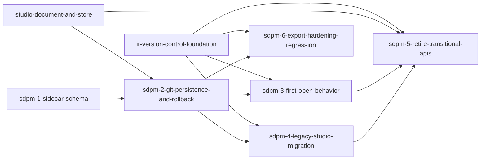

# Phase 1: studio-document-persistence-and-migration

**Parent Todo ID:** `studio-document-persistence-and-migration`
**Phase:** Phase 1
**Dependency Layer:** Layer 2 (depends on `ir-version-control-foundation` and `studio-document-and-store`)
**D1 decomposition by:** gemini-3.1-pro (separate agent invocation, read-only)
**R1 review pass 1:** RETURN-FOR-REVISION — `studio-document-persistence-and-migration.r1-review-pass1.md`
**Revision pass 2:** D1 fold-back applied (parent-coordinated; pass-1 findings folded).
**R1 review pass 2:** APPROVE-WITH-CHANGES — `studio-document-persistence-and-migration.r1-review-pass2.md` (parent-verified residual patches applied)
**Status:** APPROVED FOR T1.

*TDD Note: Each ticket's Test plan files are authored FIRST and must FAIL before any implementation begins.*

## Ticket Dependency Graph


## Tickets

### Ticket: `sdpm-1-sidecar-schema`

#### Scope (1 paragraph)
Introduces the `StudioSidecar` Pydantic model representing the minimal, view-local deal state. This ticket defines the sidecar schema with exactly three fields (`schema_version`, `layout_overrides`, `ui_preferences`) and explicitly excludes AI provenance, notes, tags, and scratchwork from the sidecar model. It sets up basic round-trip serialization tests for the model. It does NOT implement file persistence, git integration, or HTTP endpoints.

#### Files affected
- `src/bma_standard_formulas/deals/schemas/studio_sidecar.py` — new; defines the `StudioSidecar` Pydantic model.
- `tests/schemas/test_studio_sidecar.py` — new; unit tests for schema validation and default behaviors.

#### Dependencies
- none

#### User journeys (1-3)
1. GIVEN a valid JSON payload containing graph layout overrides and UI preferences WHEN parsed into `StudioSidecar` THEN validation succeeds and the typed structure is retained.
2. GIVEN a sidecar payload with extraneous fields like `ai_provenance` or `notes` WHEN validated THEN the resulting model omits those fields, enforcing the lean schema contract.

#### Acceptance criteria (numbered, testable)
1. `StudioSidecar` Pydantic model is created with exactly these fields: `schema_version: str = "1.0.0"`, `layout_overrides: dict[str, dict[str, Any]]` (keyed by entity_id; each inner dict requires `x: float`, `y: float`; `collapsed: bool | None` is optional), and `ui_preferences: dict[str, Any]`.
2. The schema explicitly has NO slots for AI provenance, per-entity notes, tags, or scratchwork.
3. Serialization and deserialization round-trip accurately without dropping or renaming the permitted fields.

#### Test plan
- `tests/schemas/test_studio_sidecar.py::test_studio_sidecar_model_validates_exact_fields` — AC 1, 2
- `tests/schemas/test_studio_sidecar.py::test_studio_sidecar_roundtrip_serialization` — AC 3

#### Out-of-scope notes
Do not implement the persistence layer (`sdpm-2`) or migration hooks (`sdpm-4`). Scenarios are a separate field class in `scenarios.json` and are out of scope here (`scenarios-step` in Phase 4).

---

### Ticket: `sdpm-2-git-persistence-and-rollback`

#### Scope (1 paragraph)
Integrates `StudioSidecar` persistence into the git-backed deal store. Modifies the commit path to write `deal.json` AND `sidecar.json` atomically in a single git commit. Modifies the internal load path to read both artifacts from the current commit, implementing a parse-failure rollback mechanism: if `sidecar.json` fails Pydantic validation, the broken file is archived within the repo as `sidecar.broken.json` (not exported), the load yields an empty sidecar (triggering auto-layout downstream), and an INFO-level diagnostic is emitted. It does NOT implement first-open initialization or legacy payload migration.

#### Files affected
- `src/bma_cfengine_app/orchestrator/deals/git_service.py` — modified; extends `commit_deal` to support atomic writes of multiple JSON payloads.
- `src/bma_cfengine_app/orchestrator/deals/deal_store.py` — modified; wires sidecar persistence and parse-failure rollback during load.
- `tests/orchestrator/deals/test_deal_store_sidecar_persistence.py` — new; tests atomic save and rollback mechanics.

#### Dependencies
- `sdpm-1-sidecar-schema`
- `ir-version-control-foundation` (external Phase 1)
- `studio-document-and-store` (external Phase 1)

#### User journeys (1-3)
1. GIVEN a deal with both engine IR and sidecar modifications WHEN committed THEN both `deal.json` and `sidecar.json` are written to the branch in a single atomic git commit.
2. GIVEN a commit containing a corrupted `sidecar.json` WHEN the deal is loaded THEN the IR loads successfully, the sidecar is archived as `sidecar.broken.json`, an empty sidecar is substituted, and an INFO diagnostic alerts the user.

#### Acceptance criteria (numbered, testable)
1. `GitService.commit_deal` is extended with the following exact signature:
   ```python
   def commit_deal(
       self,
       deal_payload: dict[str, Any] | bytes,
       *,
       author: str,
       message: str,
       parent_sha: str | None = None,
       commit_target: str = "main",
       sidecar_payload: dict[str, Any] | bytes | None = None,
   ) -> str:
   ```
   One commit tree writes `deal.json` AND (when `sidecar_payload` is provided) `sidecar.json` atomically. `parent_sha` validation against `commit_target` is preserved. There is no separate `commit_deal_with_sidecar` path.
2. The internal load flow reads both `deal.json` and `sidecar.json`.
3. If `sidecar.json` fails `StudioSidecar` Pydantic validation, it is written only to the working tree as `sidecar.broken.json` for **read-time local recovery only**; no archival commit is created. The next successful save with a valid sidecar overwrites or removes the local broken file from the working tree before committing — `sidecar.broken.json` MUST NOT be committed to history. This keeps the recovery artifact local-only and avoids permanent pollution of the commit tree.
4. On sidecar parse failure, the load proceeds with an empty `StudioSidecar` and surfaces an `INFO`-severity `DiagnosticPayload` with `code = 'SIDECAR_LOAD_FAILED'` and message `"Sidecar could not be loaded; falling back to defaults. No deal data was lost."`.
5. `CommitRequest` in `routers/deals.py` is extended with `sidecar_payload: dict[str, Any] | None = None`. The endpoint forwards it to `service.commit_deal(...)`. Omitting `sidecar_payload` preserves existing `irvc-4`/`sds-0` behavior.

#### Test plan
- `tests/orchestrator/deals/test_deal_store_sidecar_persistence.py::test_commit_deal_writes_deal_and_sidecar_atomically` — AC 1
- `tests/orchestrator/deals/test_deal_store_sidecar_persistence.py::test_load_deal_reads_deal_and_sidecar` — AC 2
- `tests/orchestrator/deals/test_deal_store_sidecar_persistence.py::test_corrupted_sidecar_triggers_rollback_archive_and_diagnostic` — AC 3, 4

#### Out-of-scope notes
Do not implement first-open fallback for entirely missing sidecars (`sdpm-3`). Export hardening relies on the boundary defined in `irvc-5a` and tested in `sdpm-6`.

---

### Ticket: `sdpm-3-first-open-behavior`

#### Scope (1 paragraph)
Implements two first-open initialization paths. (1) Missing `.git/`: if a deal directory has `deal.json` but lacks `.git/`, it executes `git init` and makes an initial commit authored by `system:migration`. (2) Missing `sidecar.json`: if a deal has a git repo but lacks `sidecar.json` in the current commit, it returns an empty sidecar (which instructs the frontend to use dagre/elk auto-layout and default UI preferences). It does NOT handle complex legacy `studio_v{N}.json` migration.

#### Files affected
- `src/bma_cfengine_app/orchestrator/deals/deal_store.py` — modified; adds first-open checks and `git init` logic for IR-only paths.

#### Dependencies
- `sdpm-2-git-persistence-and-rollback`

#### User journeys (1-3)
1. GIVEN a pre-existing deal directory with only `deal.json` WHEN loaded by the orchestrator THEN the system runs `git init`, creates a `system:migration` commit, and yields the IR with an empty sidecar.
2. GIVEN a deal imported externally lacking a sidecar WHEN opened in the Studio THEN it falls back to an empty sidecar without error, triggering UI auto-layout.

#### Acceptance criteria (numbered, testable)
1. If `.git/` is absent but `deal.json` exists, run `git init` and create an initial commit containing `deal.json`. The commit author MUST be `system:migration`; the commit subject MUST be `Migrate deal.json`; the commit body MUST be empty unless `sdpm-4` provenance is present.
2. If `sidecar.json` is missing in the current commit, the load flow yields a default empty `StudioSidecar` instance without emitting an error diagnostic.

#### Test plan
- `tests/orchestrator/deals/test_deal_store_first_open.py::test_missing_git_dir_triggers_git_init_and_system_migration_commit` — AC 1
- `tests/orchestrator/deals/test_deal_store_first_open.py::test_missing_sidecar_yields_empty_sidecar_instance` — AC 2

#### Out-of-scope notes
Legacy `studio_v{N}.json` migration is handled in `sdpm-4`.

---

### Ticket: `sdpm-4-legacy-studio-migration`

#### Scope (1 paragraph)
Implements the legacy `studio_v{N}.json` migration hook extending the `irvc-3` migration window. Introduces `migrate_studio_payload(...)` to process legacy snapshots: it extracts Blockly layout XML strings into `layout_overrides` in the sidecar, maps legacy per-entity notes hidden in `block.data` payloads into formal IR `description` fields on nodes, and dumps legacy AI provenance records into the migration commit's message body. It does NOT retain legacy APIs or manifest transitional fields (`sdpm-5`).

#### Files affected
- `src/bma_cfengine_app/orchestrator/deals/deal_store.py` — modified; wires the `migrate_studio_payload` step during legacy first-open migrations.
- `src/bma_standard_formulas/deals/schemas/migrations/studio_migration.py` — new; `migrate_studio_payload(...)` implementation.
- `tests/orchestrator/deals/test_studio_migration.py` — new.

#### Dependencies
- `sdpm-2-git-persistence-and-rollback`
- `ir-version-control-foundation` (specifically `irvc-3-legacy-migration`)

#### User journeys (1-3)
1. GIVEN a legacy deal containing `studio_v1.json` with AI provenance and custom node layout WHEN loaded for the first time THEN the sidecar is populated with layout overrides, IR gains description fields, and the commit message contains the AI provenance.

#### Acceptance criteria (numbered, testable)
1. `migrate_studio_payload(...)` parses legacy `studio_v{N}.json` snapshots.
2. Legacy Blockly layout XML is extracted and transformed into the `layout_overrides` dictionary structure in the new `StudioSidecar`.
3. Legacy per-entity notes (from `block.data` payloads) are explicitly injected into the IR `description` fields (e.g. `CalculationNode.description`, `BondDef.description`).
4. Legacy AI provenance, if present, is formatted and appended to the migration commit message using the exact footer format:
   ```
   Migrate v{N}

   Legacy-Studio-Provenance:
   <canonical JSON object, sorted keys, 2-space indent>
   ```
   If no provenance is present, the `Legacy-Studio-Provenance:` section is omitted entirely.

#### Test plan
- `tests/orchestrator/deals/test_studio_migration.py::test_migrate_studio_payload_extracts_layout_xml_to_overrides` — AC 1, 2
- `tests/orchestrator/deals/test_studio_migration.py::test_legacy_notes_are_mapped_to_ir_description_fields` — AC 3
- `tests/orchestrator/deals/test_studio_migration.py::test_legacy_ai_provenance_is_added_to_migration_commit_message` — AC 4

#### Out-of-scope notes
Retiring the actual APIs is done in `sdpm-5`. The UI consumption of `layout_overrides` is Phase 2 graph pane work.

---

### Ticket: `sdpm-5-retire-transitional-apis`

#### Scope (1 paragraph)
Finalizes the migration cutover by removing the transitional `manifest.json` fields (`studio_current_version`, `studio_versions`) and explicitly retiring all legacy `studio_v{N}.json` persistence APIs. The APIs (`save_studio_ir`, `load_studio_snapshot`, `list_studio_deals`, `save_solver_preset`, `list_solver_presets`) and their corresponding FastAPI router endpoints are completely removed (not rewired). It does NOT leave any deprecated surface area functional.

#### Files affected
- `src/bma_cfengine_app/api/routers/deals.py` — modified; legacy studio endpoints deleted.
- `src/bma_cfengine_app/orchestrator/deals/deal_store.py` — modified; legacy methods deleted and manifest writer updated.

#### Dependencies
- `sdpm-3-first-open-behavior`
- `sdpm-4-legacy-studio-migration`

#### User journeys (1-3)
1. GIVEN the updated application WHEN a client calls a legacy studio route (e.g., `POST /deals` for `save_studio_ir`, `GET /deals/{deal_id}/solver-presets` for `list_solver_presets`) THEN it returns a 404 Not Found, enforcing the hard cutover. Each of the five deleted routes returns 404; verified by table-driven test.
2. GIVEN a newly saved deal WHEN inspecting `manifest.json` THEN `studio_current_version` and `studio_versions` keys are absent.

#### Acceptance criteria (numbered, testable)
1. The `manifest.json` writer logic is updated to emit exactly these fields: `deal_id`, `deal_name`, `asset_class`, `schema_version_pin`, `created_at`, `updated_at`. The fields `studio_current_version`, `studio_versions`, and `solver_presets_library` are explicitly rejected/absent. Any tests asserting their presence are removed or updated.
2. `save_studio_ir`, `load_studio_snapshot`, `list_studio_deals`, `save_solver_preset`, and `list_solver_presets` are deleted from `deal_store.py`.
3. The following legacy FastAPI endpoints are deleted from `routers/deals.py`:
   - `GET /deals` → `list_studio_deals`
   - `GET /deals/{deal_id}` → `load_studio_snapshot`
   - `POST /deals` → `save_studio_ir`
   - `GET /deals/{deal_id}/solver-presets` → `list_solver_presets`
   - `POST /deals/{deal_id}/solver-presets` → `save_solver_preset`

   Internal helpers `_ensure_canonical_deal` and `_extract_collateral_risk_settings` are rewired onto git-backed canonical `deal.json` reads (via `service.show(head_sha, 'deal.json')` + `DealDefinition.model_validate`); legacy snapshot fallback is removed. Deleted endpoints return 404.

#### Test plan
- `tests/orchestrator/deals/test_deal_store_manifest.py::test_manifest_strictly_excludes_transitional_studio_keys` — AC 1
- `tests/api/routers/test_deals_legacy.py::test_legacy_studio_endpoints_return_404` — AC 2, 3

#### Out-of-scope notes
This is purely a deletion/cleanup ticket. No new functionality is introduced.

---

### Ticket: `sdpm-6-export-hardening-regression`

#### Scope (1 paragraph)
Regression test hardening the canonical export boundary. Verifies that `sidecar.json` and `sidecar.broken.json` cannot be accessed or exported via `export_deal()` or the public API. Relies on the strict file isolation boundary established by `irvc-5a`. It does NOT introduce new export logic; it purely pins the negative test constraints.

#### Files affected
- `tests/orchestrator/deals/test_operational_export_sidecar.py` — new.

#### Dependencies
- `sdpm-2-git-persistence-and-rollback`
- `ir-version-control-foundation` (specifically `irvc-5a-export-and-fsck`)

#### User journeys (1-3)
1. GIVEN a user requesting a deal export WHEN `export_deal()` is executed THEN the result contains only the IR payload, explicitly omitting the sidecar.

#### Acceptance criteria (numbered, testable)
1. `export_deal()` must strictly return the canonical `deal.json` bytes.
2. Attempting to retrieve `sidecar.json` or `sidecar.broken.json` through the export mechanism — including `GET /deals/{deal_id}/export?sha={sha}` — must fail or explicitly omit them.

#### Test plan
- `tests/orchestrator/deals/test_operational_export_sidecar.py::test_export_deal_strictly_excludes_sidecar_and_broken_archives` — AC 1, 2
- `tests/api/routers/test_deals_export_sidecar.py::test_export_endpoint_returns_only_deal_json_and_never_sidecar` — AC 2

#### Out-of-scope notes
The following artifacts are strictly excluded from any export path: `sidecar.json`, `sidecar.broken.json`, `scenarios.json`, `turn_transcripts/`, `discarded_branches/`, `.git/`. Export of `scenarios.json` in counterparty bundles is handled in the separate `export-deal-package` ticket in Phase 4.

## Phase 1 Sequencing Impact

The `studio-document-persistence-and-migration` set depends on both `ir-version-control-foundation` and `studio-document-and-store` being fully merged.
- **sdpm-1** (Sidecar Schema) establishes the data structures and is Layer 0 for this subset.
- **sdpm-2** (Git Persistence and Rollback) integrates the schema into the git orchestrator.
- **sdpm-3** and **sdpm-4** cover the initialization and legacy migration hooks, unblocking the final cleanup.
- **sdpm-5** (Cleanup) is the final closure ticket that retires the legacy API surface, enforcing the hard cutover.
- **sdpm-6** is an ongoing regression guard.

Once merged, the sidecar safely persists view-local user state (like node graph layout overrides) independently from the exported engine IR, fulfilling the core architectural promise for the Studio Design tools in Phase 2.

## Flags for the R1 Reviewer

1. **Git-Init Create-Deal Backend Follow-On (deferred Phase 2):** Per `sds-5`'s `BLOCKED_ON_BACKEND` diagnostic, a true git-init backend endpoint for new deal creation may still be missing. If not addressed, `promoteLocalDraft` remains blocked. This is classified as a deferred Phase 2 sibling ticket; it is out of scope for Phase 1.
2. **Hard Cutover for APIs:** `sdpm-5` chooses explicit removal over rewiring for the legacy `studio_v{N}.json` APIs. This avoids maintaining parallel complex persistence paths.
3. **Broken Sidecar Archival:** `sdpm-2` writes `sidecar.broken.json` to the working tree for read-time local recovery only; it is NOT committed to history. The next successful save with a valid sidecar removes the local broken file before committing. This ensures debuggability for layout parse failures without polluting commit history.
