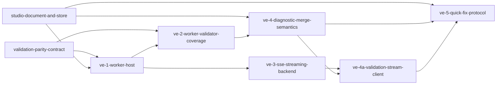

# Phase 1: validation-engine

**Parent Todo ID:** `validation-engine`
**Phase:** Phase 1
**Dependency Layer:** Layer 2 (depends on `validation-parity-contract` and `studio-document-and-store`)
**D1 decomposition by:** gemini-3.1-pro (separate agent invocation, read-only)
**R1 review pass 1:** RETURN-FOR-REVISION — `validation-engine.r1-review-pass1.md`
**Revision pass 2:** D1 fold-back applied (parent-coordinated; pass-1 findings folded).
**R1 review pass 2:** APPROVE-WITH-CHANGES — `validation-engine.r1-review-pass2.md` (parent-verified residual 3 patches applied)
**Status:** APPROVED FOR T1.

*TDD Note: Each ticket's Test plan files are authored FIRST and must FAIL before any implementation begins.*

## Ticket Dependency Graph


## Tickets

### Ticket: `ve-1-worker-host`

#### Scope (1 paragraph)
Implements the TS Web Worker host and the bridge between the main thread Zustand store and the worker. It moves the TS validator registry (`vpc-3`) into a true off-main-thread Web Worker instance. The worker triggers on store dispatch (with a debounced trigger), runs all registered worker validators against the current `working_tree`, and returns an array of `DiagnosticPayload` objects to the main thread. It does NOT build new validators, merge semantics, or the graphical Problems Panel.

#### Files affected
- `src/bma_cfengine_app/ui/src/features/validation/validationWorker.ts` — new; Web Worker entry point executing the registry.
- `src/bma_cfengine_app/ui/src/features/validation/workerBridge.ts` — new; handles debounced messaging between the main thread and the worker.
- `src/bma_cfengine_app/ui/src/features/deals/store/useDealStore.ts` — modified; wires the worker bridge to store updates and stores returned diagnostics.

#### Dependencies
- `validation-parity-contract` (vpc-3 registry)
- `studio-document-and-store` (sds-2 diagnostics slot)

#### User journeys (1-3)
1. GIVEN a deal working tree loaded in the store WHEN the user mutates the document THEN the Web Worker is invoked via a debounced trigger off-main-thread, returning updated diagnostic payloads.
2. GIVEN rapid successive user typing WHEN the store mutates rapidly THEN the worker invocation is debounced so validation only runs on settled states.

#### Acceptance criteria (numbered, testable)
1. A true TS Web Worker is instantiated to host the validation registry and its execution.
2. The worker receives the serialized `working_tree` from the main thread and executes all registered TS validators.
3. Worker execution is debounced via `VALIDATION_DEBOUNCE_MS = 300` (constant exported from the worker bridge module). The debounce starts on every store dispatch event; if no further dispatches occur within 300ms, the worker is invoked. A burst of dispatches within 300ms produces exactly ONE worker invocation. Test uses fake timers and asserts exact 300ms timing.
4. The worker returns `DiagnosticPayload[]` back to the main thread, which updates the `DocumentSession` diagnostics slot.

> **Risk Note:** 300ms is tunable based on Phase-2 UX telemetry; tuning lands as a separate atomic ticket.

#### Test plan
- `src/bma_cfengine_app/ui/src/features/validation/validationWorker.test.ts::test_worker_executes_validators_and_returns_payloads` — AC 1, 2, 4
- `src/bma_cfengine_app/ui/src/features/validation/workerBridge.test.ts::test_bridge_debounces_rapid_mutations` — AC 3

#### Out-of-scope notes
Do not implement the backend SSE stream, the backend-wins merge logic, or quick fixes here.

---

### Ticket: `ve-2-worker-validator-coverage`

#### Scope (1 paragraph)
Converts a specific set of existing Pydantic structural checks into TS worker validators to establish best-effort latency-cheap feedback. This ticket implements validations for: bond name uniqueness (duplicate-name detection), reference integrity (broken `from_sources`/`to_targets`), multi-target rule weight sums (must sum to 1.0), kind ↔ schedule source consistency, NLA-vs-required_subordination consistency, and multi-group routing rules. It does NOT port runtime-only checks or carry tie-out.

#### Files affected
- `src/bma_cfengine_app/ui/src/features/validation/structuralValidators.ts` — modified; new worker validators added.
- `src/bma_standard_formulas/diagnostics/structural_validators.py` — modified; Python equivalents decorated.
- `docs/architecture/diagnostic_catalog.md` — modified; new codes registered.
- `tests/fixtures/diagnostic_parity/*` — new/modified; parity JSON fixtures added.

#### Dependencies
- `ve-1-worker-host`
- `validation-parity-contract` (catalog parser + parity fixture framework)

#### User journeys (1-3)
1. GIVEN a working tree with a rule targeting a non-existent bond WHEN the worker runs THEN a `REFERENCE_BROKEN` diagnostic is emitted immediately.
2. GIVEN a deal with two bonds named "Tranche_A" WHEN the worker runs THEN a `BOND_NAME_DUPLICATE` diagnostic is emitted.

#### Acceptance criteria (numbered, testable)
1. The six listed validation areas (duplicate names, broken refs, weight sums, kind ↔ schedule source consistency, NLA consistency, multi-group rules) are ported to TS worker validators. For kind ↔ schedule source consistency: PAC/TAC bonds require either `schedule_contract` OR `schedule_model_type` to be set; non-PAC/TAC bonds must NOT have either.
2. The corresponding Python model validators and structural checks are decorated with `@diagnostic_code` with the appropriate owner.
3. All new diagnostic codes are registered in the markdown catalog.
4. Parity fixtures exist and pass for each new worker validator, proving identical code and path outputs between Python and TS.

#### Test plan
- `tests/diagnostics/test_diagnostic_parity_coverage.py::test_new_worker_validators_maintain_parity` — AC 1, 4 (Parametrized over the 6 new validation areas)
- `src/bma_cfengine_app/ui/src/features/validation/structuralValidators.test.ts::test_worker_validators_catch_specific_errors` — AC 1

#### Out-of-scope notes
Do not implement quick-fixes for these validators yet (that is `ve-5`).

---

### Ticket: `ve-3-sse-streaming-backend`

#### Scope (1 paragraph)
Implements a new SSE streaming endpoint for authoritative server-side deep diagnostics. The endpoint accepts a repository SHA and streams `DiagnosticPayload` events as it evaluates static backend validation only (`_validate_references`, Pydantic model validators, cataloged structural validators). Runtime checks like `compute_carry_tieout` are NOT included here because they require `DealRunInput` + `ScenarioOutputBundle` which the SHA-only endpoint cannot produce. A separate runtime-validation ticket can layer those in once the run/scenario inputs are stable (out of scope for ve-3). The endpoint exposes an EventSource-compatible stream; client subscription + merge into the store is `ve-4a`'s responsibility, NOT ve-3's. It does NOT implement the client-side merge logic.

#### Files affected
- `src/bma_cfengine_app/api/routers/deals.py` — modified; new SSE validate stream endpoint.
- `src/bma_cfengine_app/orchestrator/deals/validation_service.py` — modified/new; backend generator yielding diagnostics.

#### Dependencies
- `ve-1-worker-host` (conceptually runs alongside)

#### User journeys (1-3)
1. GIVEN a committed working tree WHEN the client connects to the SSE validation endpoint THEN it receives a deterministic sequence of `DiagnosticPayload` events terminating in a stream close.

#### Acceptance criteria (numbered, testable)
1. A new endpoint `GET /deals/{deal_id}/validate/stream?sha=<sha>` is exposed. Returns 404 if the deal or SHA is not found; returns 422 if the SHA is malformed.
2. The endpoint executes static backend validation: `_validate_references`, Pydantic model validators, cataloged structural validators. Runtime/output-dependent checks are explicitly excluded.
3. The endpoint yields `ValidationStreamEvent` JSON payloads framed as `data: <ValidationStreamEvent JSON>\n\n` SSE events (no `event:` lines). The exact event schema is:

   ```python
   class ValidationStreamEvent(BaseModel):
       event_type: Literal['diagnostic', 'validation_complete', 'validation_failed']
       payload: DiagnosticPayload | None = None  # present when event_type == 'diagnostic'
       error: str | None = None  # present when event_type == 'validation_failed'
   ```

4. `validation_complete` is the success terminal event; `validation_failed` is the error terminal event. The stream closes immediately after the terminal event.

#### Test plan
- `tests/api/routers/test_deals_validation_sse.py::test_validate_stream_yields_payloads_and_closes` — AC 1, 3, 4
- `tests/api/routers/test_deals_validation_sse.py::test_validate_stream_emits_complete_terminal_then_closes` — AC 4 (asserts exactly one terminal `validation_complete` event; stream closes immediately after)
- `tests/api/routers/test_deals_validation_sse.py::test_validate_stream_emits_failed_terminal_on_validation_exception` — AC 4 (asserts `validation_failed` terminal on exception; stream closes)
- `tests/api/routers/test_deals_validation_sse.py::test_validate_stream_includes_deep_checks` — AC 2 (asserts static structural validators are invoked; carry tie-out is absent)

#### Out-of-scope notes
Do not implement the client-side merge of these SSE events into the Zustand store.
Runtime/output-dependent checks (carry tie-out, post-run cashflow assertions) are out of scope; they need run inputs not available from a static SHA.

---

### Ticket: `ve-4-diagnostic-merge-semantics`

#### Scope (1 paragraph)
Implements the client-side merge logic for combining fast worker diagnostics and authoritative backend diagnostics. It adds a `mergeDiagnostics` action to the store that enforces backend-wins-on-shared-code semantics: if the backend and worker emit a diagnostic with identical `code` and `path`, the backend's version replaces the worker's. It does NOT implement the quick-fix protocol.

#### Files affected
- `src/bma_cfengine_app/ui/src/features/deals/store/useDealStore.ts` — modified; extends the store with `mergeDiagnostics`.
- `src/bma_cfengine_app/ui/src/features/deals/store/actions.ts` — modified; typed action variant if needed.

#### Dependencies
- `ve-2-worker-validator-coverage`
- `ve-3-sse-streaming-backend`
- `studio-document-and-store` (sds-2 diagnostics slot + `setDiagnostics` action)

#### User journeys (1-3)
1. GIVEN a worker diagnostic is in state WHEN the backend streams a diagnostic with the exact same code and path but a richer message THEN the backend diagnostic overwrites the worker diagnostic in the store.

#### Acceptance criteria (numbered, testable)
1. Store exposes a `mergeDiagnostics(sessionId, source, payloads)` action where source is `'worker'` or `'backend'`.
2. When merging, backend diagnostics overwrite worker diagnostics that share the exact same `code` and `path`.
3. Non-overlapping worker diagnostics are retained alongside backend diagnostics in the unified session state.
4. Diagnostics are stored as a flat `DiagnosticPayload[]` in the `DocumentSession.diagnostics` slot (preserving the sds-2 contract). Source identity is tracked via an internal `_diagnosticSourceMap: Map<diagnosticKey, 'worker'|'backend'>` keyed by `code+path`; this map is not exposed externally. Subsequent merges use the map to identify and overwrite worker vs backend entries correctly.

#### Test plan
- `src/bma_cfengine_app/ui/src/features/deals/store/validationMerge.test.ts::test_mergeDiagnostics_backend_wins_on_conflict` — AC 1, 2
- `src/bma_cfengine_app/ui/src/features/deals/store/validationMerge.test.ts::test_mergeDiagnostics_retains_non_overlapping` — AC 3
- `src/bma_cfengine_app/ui/src/features/deals/store/validationMerge.test.ts::test_mergeDiagnostics_source_map_overwrites_correctly` — AC 4

#### Out-of-scope notes
Do not build the Problems Panel UI.

---

### Ticket: `ve-4a-validation-stream-client`

#### Scope (1 paragraph)
Implements the client-side EventSource connection that ingests the SSE stream from `ve-3` and dispatches diagnostic events into the Zustand store via the `mergeDiagnostics` action introduced in `ve-4`. This is the wiring layer between the backend SSE endpoint and the frontend merge reducer. It does NOT implement the merge semantics (that is `ve-4`) or the Problems Panel UI.

#### Files affected
- `src/bma_cfengine_app/ui/src/features/validation/validationStreamClient.ts` — new; EventSource connection lifecycle and dispatch logic.
- `src/bma_cfengine_app/ui/src/features/validation/validationStreamClient.test.ts` — new; mock EventSource tests.

#### Dependencies
- `ve-3-sse-streaming-backend`
- `ve-4-diagnostic-merge-semantics` (lands `mergeDiagnostics` action first; ve-4a wires it up)

#### User journeys (1-3)
1. GIVEN a committed SHA WHEN the client calls `subscribeToValidationStream` THEN an EventSource opens and diagnostic events are merged into the store as they arrive.
2. GIVEN a `validation_failed` event arrives WHEN the client receives it THEN an error-severity diagnostic is merged and the EventSource is closed.

#### Acceptance criteria (numbered, testable)
1. A `subscribeToValidationStream(dealId, sha, sessionId, store)` function opens an EventSource connection to `GET /deals/{dealId}/validate/stream?sha={sha}`.
2. Each `diagnostic` event payload is dispatched to `store.mergeDiagnostics(sessionId, 'backend', [event.payload])`.
3. On `validation_complete`, the EventSource is closed.
4. On `validation_failed`, the EventSource is closed and an `error`-severity `DiagnosticPayload` is merged into the store.
5. Returns an `unsubscribe()` function for caller cleanup.
6. **Stale stream/session protection (R1 pass-2 NF1)**: when `unsubscribe()` is called OR a newer subscription supersedes the previous one for the same `sessionId`, any in-flight events from the obsolete stream MUST be ignored (not dispatched to `mergeDiagnostics`). The function MUST track the active subscription's `(dealId, sha, sessionId)` tuple and reject events whose stream is no longer the active one for that session.

#### Test plan
- `src/bma_cfengine_app/ui/src/features/validation/validationStreamClient.test.ts::test_subscribe_dispatches_diagnostic_events` — AC 1, 2
- `src/bma_cfengine_app/ui/src/features/validation/validationStreamClient.test.ts::test_subscribe_closes_on_validation_complete` — AC 3
- `src/bma_cfengine_app/ui/src/features/validation/validationStreamClient.test.ts::test_subscribe_merges_error_and_closes_on_validation_failed` — AC 4
- `src/bma_cfengine_app/ui/src/features/validation/validationStreamClient.test.ts::test_unsubscribe_closes_event_source` — AC 5
- `src/bma_cfengine_app/ui/src/features/validation/validationStreamClient.test.ts::test_subscribe_ignores_stale_stream_events_for_superseded_sha_or_session` — AC 6 (creates two consecutive subscriptions for the same sessionId; asserts events from the first stream after the second subscribed are NOT merged)

#### Out-of-scope notes
Do not implement merge semantics (that is `ve-4`). Do not implement the Problems Panel UI.

---

### Ticket: `ve-5-quick-fix-protocol`

#### Scope (1 paragraph)
Defines the typed `QuickFix` protocol on diagnostic payloads and implements initial quick-fixes for select validators. It also introduces the error-count store selector required to gate Run/Solve execution. It does NOT build the graphical Problems Panel that renders these fixes, nor does it implement the Run/Solve gate UI.

#### Files affected
- `src/bma_standard_formulas/diagnostics/payload.py` — modified; adds `QuickFix` typing.
- `src/bma_cfengine_app/ui/src/features/validation/types.ts` — modified; adds `QuickFix` type interface.
- `src/bma_cfengine_app/ui/src/features/validation/structuralValidators.ts` — modified; worker validators emit quick-fixes where applicable.
- `src/bma_cfengine_app/ui/src/features/deals/store/selectors.ts` — modified; adds the `getErrorCount` selector.

#### Dependencies
- `ve-4a-validation-stream-client`
- `studio-document-and-store` (sds-1 typed DealAction dispatch surface — QuickFix actions flow through `dispatch()`, which requires the landed typed dispatch surface from sds-1)

#### User journeys (1-3)
1. GIVEN a diagnostic emitted for a broken reference WHEN the diagnostic is inspected THEN it carries a quick-fix action payload to correct the reference.
2. GIVEN a session with active errors WHEN the UI queries the gate selector THEN it returns the accurate count of `error`-severity diagnostics.

#### Acceptance criteria (numbered, testable)
1. `QuickFix` is an additive optional field on `DiagnosticPayload` (Python: `fix: QuickFix | None = None`; TS: `fix?: QuickFix`). Existing 5-field payloads remain valid (no schema change). The QuickFix schema is exactly: `{ action_id: str, params: dict[str, Any] }` where `action_id` matches a registered DealAction `type` (e.g., `'addBond'`, `'setBondKind'`) and `params` is the typed payload for that action.
2. At least one worker validator (e.g., `REFERENCE_BROKEN` or `BOND_NAME_DUPLICATE`) emits a populated `QuickFix` field.
3. The store exposes a `getErrorCount(sessionId)` selector that returns the integer count of diagnostics with `severity='error'`.

#### Test plan
- `tests/diagnostics/test_payload.py::test_quick_fix_schema_serialization` — AC 1
- `tests/diagnostics/test_payload.py::test_payload_remains_backward_compatible_with_no_fix` — AC 1 (asserts that constructing a `DiagnosticPayload` without `fix` still works; `fix` defaults to `None`)
- `src/bma_cfengine_app/ui/src/features/validation/quickFix.test.ts::test_worker_validator_emits_quick_fix` — AC 2
- `src/bma_cfengine_app/ui/src/features/deals/store/selectors.test.ts::test_getErrorCount_returns_error_severity_sum` — AC 3

#### Out-of-scope notes
Do not build the Problems Panel UI. The actual "Run / Solve" gating UI is part of Phase 2; this ticket just exposes the selector.

---

## Phase 1 Sequencing Impact
The `validation-engine` is a structurally core feature that provides real-time feedback during edits and gates simulation runs. It is unblocked because its prerequisites (`validation-parity-contract`, `studio-document-and-store`) have established the registry/guard contract and the store session abstractions. Once all `ve-*` tickets are merged, the validation engine is ready for Phase 2 UI consumers (like the `problems-panel` and pane validation adornments). The visual Problems Panel is owned by the separate `problems-panel` Phase 2 todo; this decomposition delivers the diagnostic data contract + merge semantics + quick-fix protocol that the panel will consume.

## Flags for the R1 Reviewer
1. **No Worker-Side Quick Fix Exec:** `ve-5` only *defines* the QuickFix payload. The worker does not execute the fix; it passes an action intent to the main thread where the Zustand store processes it.
2. **EventSource Streaming vs Fetch:** `ve-3` uses standard SSE (EventSource) for the stream. Client connection persistence during rapid edits may require careful abort controller handling, which should be vetted during PR review.
3. **Parity Testing Overhead:** `ve-2` ports a subset of checks. Ensuring the parity fixture set remains synced for these ported checks is crucial; the CI guard from `vpc-4` will enforce catalog compliance here.
