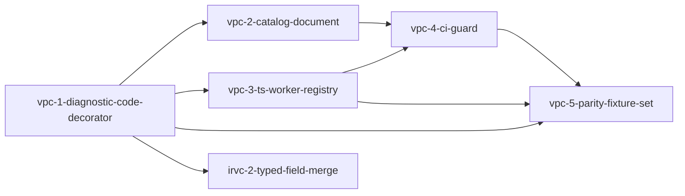

# Phase 1: validation-parity-contract

**Parent Todo ID:** `validation-parity-contract`
**Phase:** Phase 1
**Dependency Layer:** Layer 0 (No Phase-1 prerequisites)

*TDD Note: Each ticket's Test plan files are authored FIRST and must FAIL before any implementation begins.*

## Ticket Dependency Graph

## Tickets

### Ticket: `vpc-1-diagnostic-code-decorator`

#### Scope (1 paragraph)
Introduces the foundational Python diagnostic catalog mechanism required by both the Pydantic validators and cross-todo features like git merge conflict payload reporting. This ticket establishes the `@diagnostic_code` decorator, the module-level registry, the canonical `DiagnosticPayload` envelope, and the standard enums for severity and ownership. It provides the lookup APIs needed to inspect registered validators and serves as the strict cross-todo dependency for `irvc-2-typed-field-merge`. It explicitly does NOT create the markdown catalog document or the CI enforcement script.

#### Files affected
- `src/bma_standard_formulas/diagnostics/__init__.py` — new; exposes the public API for the diagnostics package.
- `src/bma_standard_formulas/diagnostics/decorator.py` — new; implements the `@diagnostic_code` decorator.
- `src/bma_standard_formulas/diagnostics/registry.py` — new; implements the module-level typed registry and lookup APIs.
- `src/bma_standard_formulas/diagnostics/payload.py` — new; defines the `DiagnosticPayload`, `Severity`, and `Owner` schemas/types.

#### Dependencies
- none

#### User journeys (1-3)
1. GIVEN a Python Pydantic validator WHEN the developer decorates it with `@diagnostic_code("FOO_ERROR", severity="error", path_schema="deal.bonds[*].balance", owner="both")` THEN the validator's metadata is recorded and it becomes available in the module-level registry.
2. GIVEN a registered diagnostic code WHEN another subsystem (like a test or the `irvc-2` merge logic) calls `get_diagnostic("FOO_ERROR")` THEN it receives a full `DiagnosticDescriptor` containing the metadata and the validator's exact location in the codebase.
3. GIVEN an attempt to decorate a second validator with an already-registered code but conflicting metadata WHEN the module loads THEN a `DuplicateDiagnosticError` is raised immediately.

#### Acceptance criteria (numbered, testable)
1. The `Severity` enum is exactly `error`, `warning`, `info`. The `Owner` enum is exactly `worker`, `backend`, `both`.
2. The `DiagnosticPayload` Pydantic model is defined with exactly these fields: `code: str`, `severity: Severity`, `path: str` (concrete path, not schema), `message: str`, `payload: dict[str, Any]`.
3. The `@diagnostic_code` decorator signature is exactly: `@diagnostic_code(code: str, *, severity: Severity, path_schema: str, owner: Owner) -> Callable[..., Callable[..., Any]]`.
4. The `DiagnosticDescriptor` model contains exactly: `code: str`, `severity: Severity`, `path_schema: str`, `owner: Owner`, `validator_qualname: str` (the `func.__module__ + "." + func.__qualname__` of the decorated function), `validator_file_line: tuple[str, int]`.
5. The registry API implements `get_diagnostic(code: str) -> DiagnosticDescriptor` (raises `DiagnosticNotRegisteredError` if missing), `iter_diagnostics() -> Iterator[DiagnosticDescriptor]`, and `register_diagnostic(descriptor: DiagnosticDescriptor) -> None` (raises `DuplicateDiagnosticError` on conflicting re-registration).
6. The `path_schema` string template explicitly supports JSON-Path-like subsets: `.field` (e.g. `.coupon`), `[*]` (array indexing), and `[id_var]` (dynamic key indexing).

#### Test plan
- `tests/diagnostics/test_decorator.py::test_decorator_records_descriptor_metadata_correctly` — AC 3, 4, 6
- `tests/diagnostics/test_registry.py::test_registry_lifecycle_and_lookups` — AC 5
- `tests/diagnostics/test_registry.py::test_duplicate_registration_raises_error` — AC 5
- `tests/diagnostics/test_payload.py::test_payload_and_enums_conform_to_schema` — AC 1, 2

#### Out-of-scope notes
Do not create the `diagnostic_catalog.md` document, the markdown parser, or the CI guard. Do not update existing codebase validators to use the decorator.

---

### Ticket: `vpc-2-catalog-document`

#### Scope (1 paragraph)
Establishes the human-readable markdown source-of-truth for all registered diagnostics. This ticket introduces `diagnostic_catalog.md`, mapping out the structural schema for catalog entries (code, severity, path schema, message template, owner, quick-fix mapping, owning validator location) without registering the full codebase's codes yet. It includes a parser to convert this markdown table into structured records for consumption by tooling.

#### Files affected
- `docs/architecture/diagnostic_catalog.md` — new; the markdown file containing the catalog schema table.
- `scripts/parse_diagnostic_catalog.py` — new; a parser that reads the markdown table and returns structured records.

#### Dependencies
- `vpc-1-diagnostic-code-decorator`

#### User journeys (1-3)
1. GIVEN the `diagnostic_catalog.md` document WHEN a developer wants to find the specification for a diagnostic code THEN they can read the table to see its severity, message template, and quick-fix mappings.
2. GIVEN the markdown catalog WHEN the `parse_diagnostic_catalog.py` script is executed THEN it correctly parses the markdown tables into typed Python dictionaries or dataclasses.

#### Acceptance criteria (numbered, testable)
1. `docs/architecture/diagnostic_catalog.md` is created with a documented table schema encompassing: code, severity, path schema, message template, owner, quick-fix mapping, and owning validator file:line.
2. `scripts/parse_diagnostic_catalog.py` accurately extracts rows from the markdown table into structured records.
3. The parser detects malformed markdown schemas and raises an error, ensuring CI can fail on syntax deviations.

#### Test plan
- `tests/scripts/test_parse_diagnostic_catalog.py::test_parser_extracts_structured_records_from_markdown` — AC 1, 2
- `tests/scripts/test_parse_diagnostic_catalog.py::test_parser_fails_on_malformed_markdown_table` — AC 3

#### Out-of-scope notes
Do not wire this parser into a CI guard job yet (that is `vpc-4`). Do not backfill the catalog with the existing system's validation codes.

---

### Ticket: `vpc-3-ts-worker-registry`

#### Scope (1 paragraph)
Builds the TypeScript worker-side counterpart to the Python diagnostic registry. This ticket scaffolds the diagnostic registry for the UI validation worker, ensuring the frontend can declare and lookup TypeScript validation rules with the exact same metadata structure (code, severity, pathSchema, owner) as the Python backend.

#### Files affected
- `src/bma_cfengine_app/ui/src/features/validation/diagnosticRegistry.ts` — new; implements the frontend diagnostic validation registry and types.
- `src/bma_cfengine_app/ui/src/features/validation/diagnosticRegistry.test.ts` — new; Vitest suite for the registry.

#### Dependencies
- `vpc-1-diagnostic-code-decorator`

#### User journeys (1-3)
1. GIVEN a TypeScript validation rule WHEN the developer calls `registerDiagnosticValidator` THEN it is recorded in the worker's registry with its associated metadata.
2. GIVEN an attempt to register a duplicate diagnostic code in the TypeScript registry WHEN `registerDiagnosticValidator` is called THEN the registry detects the collision and throws an error.

#### Acceptance criteria (numbered, testable)
1. The TypeScript implementation defines `Severity`, `Owner`, and `DiagnosticPayload` types mirroring the Python definitions.
2. `registerDiagnosticValidator({ code, severity, pathSchema, owner, fn })` adds the validator descriptor to the registry and returns it.
3. The registry supports looking up a validator by code.
4. Attempting to register the same code twice with conflicting metadata throws an error.

#### Test plan
- `src/bma_cfengine_app/ui/src/features/validation/diagnosticRegistry.test.ts` — tests for AC 1, 2, 3, 4 (covers registration, lookup, duplicate detection).

#### Out-of-scope notes
Do not write parity tests for the actual validation functions across Python/TypeScript (that is `vpc-5`). Do not build the CI guard script (that is `vpc-4`).

---

### Ticket: `vpc-4-ci-guard`

#### Scope (1 paragraph)
Implements the CI enforcement tooling that ensures the diagnostic catalog document, the Python decorator registry, and the TypeScript worker registry remain synchronized. This ticket creates a CLI check that enumerates validators across both languages, compares them against the parsed markdown catalog, and aggressively fails on any divergence, ensuring the catalog remains the strict, reliable source of truth.

#### Files affected
- `src/bma_standard_formulas/diagnostics/check.py` — new; the core validation logic for synchronization checks.
- `src/bma_cfengine_app/ui/package.json` — modified; adds a `diagnostic:check` script in the pnpm workspace that wraps the Python CLI.
- `.github/workflows/ci.yml` — modified; adds a `diagnostic-check` job that runs `python -m bma_standard_formulas.diagnostics.check` on every PR.

#### Dependencies
- `vpc-1-diagnostic-code-decorator`
- `vpc-2-catalog-document`
- `vpc-3-ts-worker-registry`

#### User journeys (1-3)
1. GIVEN a developer adds a Python `@diagnostic_code` but forgets to add it to `diagnostic_catalog.md` WHEN they push their commit THEN the CI guard job fails with a clear message indicating the missing catalog entry.
2. GIVEN a catalog entry marked with `owner: both` WHEN the TypeScript registry lacks the corresponding implementation THEN the CI guard fails.
3. GIVEN a diagnostic whose path schema diverges between the catalog and the Python decorator WHEN the CI guard runs THEN it detects the mismatch and fails.

#### Acceptance criteria (numbered, testable)
1. A CLI tool `python -m bma_standard_formulas.diagnostics.check` is implemented that aggregates data from the Python registry, the TS registry (e.g. by executing a tiny TS script to dump keys, or regex, or AST), and the markdown catalog parser.
2. The tool fails (exit code > 0) if a decorated Python validator lacks a catalog entry.
3. The tool fails if a catalog entry with `owner in {worker, both}` has no corresponding TS worker validator registered.
4. The tool fails if the Python and TS sides diverge on `severity` or `path_schema` for the same code.
5. The tool fails if a commit adds a decorated validator (Python or TS) without updating the catalog file in the same commit. (This uses a `git diff --name-only HEAD~1 HEAD`-style check; document the trade-off that this check is skipped on the first commit of a new branch).
6. A `diagnostic:check` script is exposed via `pnpm` and runs in the PR CI workflow.

#### Test plan
- `tests/diagnostics/test_ci_guard.py::test_ci_guard_fails_on_missing_catalog_entry` — AC 1, 2
- `tests/diagnostics/test_ci_guard.py::test_ci_guard_fails_on_missing_ts_implementation_for_both_owner` — AC 1, 3
- `tests/diagnostics/test_ci_guard.py::test_ci_guard_fails_on_metadata_divergence_between_python_and_ts` — AC 1, 4
- `tests/diagnostics/test_ci_guard.py::test_ci_guard_diff_check_enforces_same_commit_catalog_updates` — AC 5
- AC 6 (pnpm script + CI workflow integration) is verified by inspection of `src/bma_cfengine_app/ui/package.json` and `.github/workflows/ci.yml`, not by a Python test (analogous to `irvc-1` AC 6).

#### Out-of-scope notes
Do not write parity tests for the actual validation functions (that is `vpc-5`). Do not build a git hook to run the check locally (enforcement relies on CI).

---

### Ticket: `vpc-5-parity-fixture-set`

#### Scope (1 paragraph)
Implements the shared behavioral test suite that ensures the TypeScript and Python validators yield identical diagnostic output for the same invalid deal inputs. This ticket sets up a suite of shared JSON fixtures and corresponding test runners in both Pytest and Vitest, asserting that codes owned by `worker` or `both` return strictly identical paths and error codes across the stack.

#### Files affected
- `tests/fixtures/diagnostic_parity/` — new directory; holds JSON fixtures for invalid deals.
- `tests/diagnostics/test_diagnostic_parity.py` — new; Pytest runner for the fixtures against the Python registry.
- `src/bma_cfengine_app/ui/src/features/validation/diagnosticParity.test.ts` — new; Vitest runner for the fixtures against the TS registry.

#### Dependencies
- `vpc-1-diagnostic-code-decorator`
- `vpc-3-ts-worker-registry`
- `vpc-4-ci-guard`

#### User journeys (1-3)
1. GIVEN a JSON fixture of an invalid deal WHEN the Pytest parity runner executes THEN it asserts the Python validators return the exact expected codes and paths.
2. GIVEN the same JSON fixture WHEN the Vitest parity runner executes THEN it asserts the TS validators return the exact expected codes and paths.
3. GIVEN a discrepancy where the TS worker fails to catch an error that Python catches for an `owner: both` code WHEN the parity test suite runs THEN CI fails.

#### Acceptance criteria (numbered, testable)
1. A shared directory `tests/fixtures/diagnostic_parity/` exists to store invalid deal payloads.
2. The Pytest runner (`test_diagnostic_parity.py`) loads all fixtures, executes the Python validation suite, and asserts the resulting diagnostic codes and paths match the expected output.
3. The Vitest runner loads all fixtures, executes the TS validation suite, and asserts the resulting diagnostic codes and paths match the expected output.
4. For every catalog code with `owner in {worker, both}`, both test runners must assert code+path equality for the overlapping subset.
5. Codes marked `owner: backend` are excluded from parity equality checks in the TS runner.

#### Test plan
- `tests/diagnostics/test_diagnostic_parity.py` — AC 1, 2, 4, 5
- `src/bma_cfengine_app/ui/src/features/validation/diagnosticParity.test.ts` — AC 1, 3, 4, 5

#### Out-of-scope notes
Do not migrate every existing validation rule into this parity suite immediately; establish the framework and seed it with a small number of rules to prove the testing apparatus works.

---

## Phase 1 Sequencing Impact

`vpc-1-diagnostic-code-decorator` is a strict cross-todo dependency for `irvc-2-typed-field-merge` (which requires it to register the `MERGE_CONFLICT` diagnostic). Thus, `vpc-1` **must merge** before `irvc-2` can pass R1 and proceed to T1.

The remaining tickets (`vpc-2`, `vpc-3`, `vpc-4`, `vpc-5`) can safely land in parallel with later `irvc` tickets or subsequent pane work. They are decoupled from the immediate core version control blocker.

## Flags for the R1 Reviewer

1. **Registry Placement:** The diagnostic Python components are placed in `src/bma_standard_formulas/diagnostics/` rather than `bma_cfengine_app/`. This is because Pydantic validators in `bma_standard_formulas/deals/schemas/` need to import the decorator, and the standard formulas package represents the core data model and validation contract.
2. **Path Schema Subset:** The `path_schema` currently relies on a minimal JSON-path subset (`.field`, `[*]`, `[id_var]`). The exact parsing/matching capabilities are deliberately kept minimal in `vpc-1` to limit scope. Expanding this to full JSONPath is deferred until driven by concrete complex validator needs.
3. **TypeScript Extractor Approach:** `vpc-4-ci-guard` requires extracting TS registry keys to compare with the Python registry. Since statically parsing TS files is brittle, the CI script may need to invoke a thin TS script via `node` (or `tsx`/`ts-node`) that imports the registry and dumps the registered keys to stdout.
4. **Gradual Adoption:** The parity test suite (`vpc-5`) sets up the framework but does not mandate an immediate 100% conversion of all existing Python validators. Converting existing rules to the catalog is an ongoing incremental process throughout the redesign.
