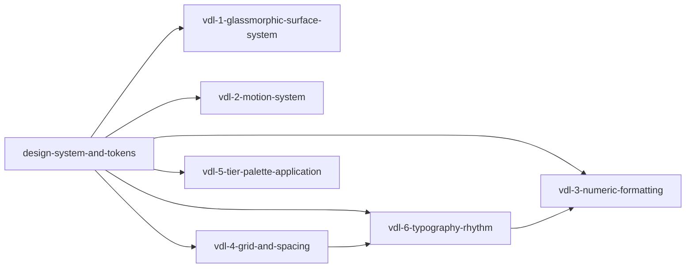

# Phase 1: visual-design-language

**Parent Todo ID:** `visual-design-language`
**Phase:** Phase 1
**Dependency Layer:** Layer 1 (Depends on `design-system-and-tokens`)
**D1 decomposition by:** gemini-3.1-pro (separate agent invocation, read-only)
**Status:** D1 review pending

*TDD Note: Each ticket's Test plan files are authored FIRST and must FAIL before any implementation begins.*

## Ticket Dependency Graph

## Tickets

### Ticket: `vdl-1-glassmorphic-surface-system`

#### Scope (1 paragraph)
Implements translucent plus backdrop-blur surface tokens and utility classes built over the foundational dark navy theme defined by `design-system-and-tokens`. This ticket provides layered surface depth tokens (e.g., `surface-1`, `surface-2`, `surface-overlay`) utilizing glassmorphism while ensuring WCAG contrast compliance. It adds Storybook stories showcasing each surface depth to pin contrast targets and layout boundaries, ensuring future panels (like `problems-panel`) have a compliant base component.

#### Files affected
- `src/frontend/design-system/surfaces/Surface.tsx` — new; core component and token bindings.
- `src/frontend/design-system/surfaces/Surface.stories.tsx` — new; isolated Storybook tests for glassmorphic layers.
- `src/frontend/styles/theme.css` (or equivalent token config) — modified; exports layered surface tokens.

#### Dependencies
- `design-system-and-tokens`

#### User journeys (1-3)
1. GIVEN a dark navy application backdrop WHEN a floating panel is rendered THEN it uses `surface-overlay` with backdrop-blur, maintaining legibility of the content within.
2. GIVEN nested content regions WHEN rendered THEN they progressively use `surface-1` and `surface-2` depth tokens to establish visual hierarchy without opaque backgrounds.

#### Acceptance criteria (numbered, testable)
1. Layered surface tokens (`surface-1`, `surface-2`, `surface-overlay`) are defined and exported, wrapping Layer-1 design tokens.
2. The `Surface` component supports an explicit `depth` prop which maps directly to the corresponding token layer.
3. Backdrop-blur and translucency rules are strictly applied on dark navy base colors.
4. Storybook stories demonstrate contrast compliance on all surface variants (minimum 4.5:1 for text on these translucent backgrounds).

#### Test plan
- `tests/frontend/design-system/test_surface_rendering.tsx` — AC 1, 2
- `tests/frontend/design-system/test_surface_a11y.tsx` — AC 4 (jest-axe or axe-core testing contrast on transparent backgrounds)

#### Out-of-scope notes
Do not redefine base color tokens; strictly consume from `design-system-and-tokens`. Do not build the `problems-panel` itself.

---

### Ticket: `vdl-2-motion-system`

#### Scope (1 paragraph)
Centralizes the application's animation primitives using `framer-motion`, establishing standard 150ms (quick fade) and 250ms (standard transition) preset timings. It enforces accessibility by implementing a centralized `useReducedMotion` hook and respecting the `prefers-reduced-motion` media query at the provider level, falling back to instant state changes when requested. This ticket creates reusable primitives for entrance, exit, and list stagger animations.

#### Files affected
- `src/frontend/design-system/motion/presets.ts` — new; 150ms and 250ms framer-motion variants.
- `src/frontend/design-system/motion/hooks.ts` — new; `useReducedMotion` wrapper.
- `src/frontend/design-system/motion/MotionProvider.tsx` — new; global reduced-motion respect enforcement.

#### Dependencies
- `design-system-and-tokens`

#### User journeys (1-3)
1. GIVEN a user interacting with a modal WHEN it opens THEN it animates using the 250ms standard entrance primitive.
2. GIVEN a user with `prefers-reduced-motion` OS settings WHEN a panel opens THEN the transition happens instantly (0ms) without fading or sliding.

#### Acceptance criteria (numbered, testable)
1. Standard framer-motion presets are exported for 150ms (`quick`) and 250ms (`standard`) transitions.
2. `useReducedMotion` is implemented, successfully intercepting OS-level `prefers-reduced-motion` settings.
3. Reusable motion components (`FadeIn`, `SlideUp`, `StaggerList`) automatically disable animations if reduced motion is preferred.

#### Test plan
- `tests/frontend/design-system/test_motion_presets.ts` — AC 1
- `tests/frontend/design-system/test_reduced_motion.tsx` — AC 2, 3 (Mock OS media query and verify framer-motion `animate` prop becomes `false` or `0`)

#### Out-of-scope notes
Do not apply these animations to actual business logic panes yet. Only build the primitives.

---

### Ticket: `vdl-3-numeric-formatting`

#### Scope (1 paragraph)
Establishes a unified format system for numerics across the studio. It introduces strictly typed formatters for currency (USD, EUR, etc.), percentages, basis points (bps), and integers. It introduces the `<MetricMonoValue>` component which forces Geist Mono, right-aligns by default, and enforces tabular numbers (`font-variant-numeric: tabular-nums`) so that data columns remain aligned across all surfaces (including the upcoming `problems-panel`).

#### Files affected
- `src/frontend/utils/formatters.ts` — new; typed formatters (currency, percent, bps, integer).
- `src/frontend/design-system/typography/MetricMonoValue.tsx` — new; Geist Mono tabular numeric wrapper.

#### Dependencies
- `design-system-and-tokens`
- `vdl-6-typography-rhythm`

#### User journeys (1-3)
1. GIVEN a bond with a 5.25% coupon WHEN rendered THEN the MetricMonoValue component displays it right-aligned with standard % formatting.
2. GIVEN a column of varying financial amounts WHEN rendered in a table THEN the decimal points align perfectly due to tabular numbers.

#### Acceptance criteria (numbered, testable)
1. Formatters successfully parse and format currency, percentage, bps, and integers, strictly rejecting or gracefully handling `NaN`/`null`.
2. `<MetricMonoValue>` automatically applies Geist Mono, right alignment, and `tabular-nums`.
3. Currency formatter respects locale and requested currency code.

#### Test plan
- `tests/frontend/utils/test_formatters.ts` — AC 1, 3 (covers edge cases like 0, negative values, large numbers, undefined)
- `tests/frontend/design-system/test_metric_mono_value.tsx` — AC 2 (verifies applied styles and alignment props)

#### Out-of-scope notes
Do not build the datagrid or table component. Only provide the formatting logic and the text wrapper component.

---

### Ticket: `vdl-4-grid-and-spacing`

#### Scope (1 paragraph)
Enforces an 8px spatial grid across all layouts. It defines layout component primitives (`Stack`, `Inline`, `Grid`) that only accept predefined spacing tokens (multiples of 8px). To prevent regression, it introduces an ESLint plugin/rule that strictly bans arbitrary pixel or rem spacing values in local CSS-in-JS or Tailwind classes, forcing all spacing to flow through the design system tokens.

#### Files affected
- `src/frontend/design-system/layout/Stack.tsx` — new.
- `src/frontend/design-system/layout/Inline.tsx` — new.
- `src/frontend/design-system/layout/Grid.tsx` — new.
- `.eslintrc.js` or `eslint-plugin-local` — modified; introduces spacing-enforcement rule.

#### Dependencies
- `design-system-and-tokens`

#### User journeys (1-3)
1. GIVEN an engineer building a new form WHEN they use the `Stack` component THEN they can only specify spacing from the approved 8px token scale (e.g., `gap="spacing-2"` for 16px).
2. GIVEN an engineer writing arbitrary CSS like `margin-top: 14px` WHEN they run the linter THEN the build fails, enforcing the 8px grid constraint.

#### Acceptance criteria (numbered, testable)
1. `Stack`, `Inline`, and `Grid` components are implemented, typed to accept only spacing tokens from `design-system-and-tokens`.
2. An ESLint rule is configured to block raw `px`, `em`, or `rem` values in padding/margin declarations outside of the token definition file.

#### Test plan
- `tests/frontend/design-system/test_layout_primitives.tsx` — AC 1
- `tests/lint/test_spacing_rule.ts` — AC 2 (AST verification that bad padding strings are flagged)

#### Out-of-scope notes
Do not refactor existing application views to use these primitives (that will be done iteratively or in specific pane tickets). 

---

### Ticket: `vdl-5-tier-palette-application`

#### Scope (1 paragraph)
Maps the foundational OKLCH tier palette into semantic visualization scales for chart and cashflow components. It documents the semantic mapping mapping (e.g., senior=tier-1, mezzanine=tier-2, equity=tier-3) and exposes these mapped colors as programmatic arrays that chart libraries (like Recharts or generic SVG visualizations) can consume. It ensures that the color tiers provide enough distinction for colorblind users when rendered adjacent to each other.

#### Files affected
- `src/frontend/design-system/colors/tier-palette.ts` — new; semantic mapping arrays.
- `docs/architecture/decisions/00x-tier-palette-semantics.md` — new; documented mappings.

#### Dependencies
- `design-system-and-tokens`

#### User journeys (1-3)
1. GIVEN a bond cashflow waterfall chart WHEN it renders multiple tranches THEN it consumes the semantic tier palette, consistently mapping senior debt to tier-1 and equity to the final tier.

#### Acceptance criteria (numbered, testable)
1. Semantic tier palettes are exported as array utilities for charting (e.g., `getTierColor(trancheIndex)`).
2. The mapping logic correctly handles wrap-around or saturation shifts if the number of data series exceeds the baseline tier count.

#### Test plan
- `tests/frontend/design-system/test_tier_palette.ts` — AC 1, 2

#### Out-of-scope notes
Do not build the actual bond cashflow charts or waterfall visualizations. Only provide the charting palette logic.

---

### Ticket: `vdl-6-typography-rhythm`

#### Scope (1 paragraph)
Establishes vertical rhythm, heading scales, and text contrast requirements, pinned to WCAG standards. This standardizes all typography outside of the numeric formatting, creating `Heading`, `Text`, and `Label` primitives that consume typographic tokens. It ensures line heights fall onto the 8px grid (established by `vdl-4`) to maintain vertical rhythm.

#### Files affected
- `src/frontend/design-system/typography/Text.tsx` — new.
- `src/frontend/design-system/typography/Heading.tsx` — new.

#### Dependencies
- `design-system-and-tokens`
- `vdl-4-grid-and-spacing`

#### User journeys (1-3)
1. GIVEN a dense configuration panel WHEN text is rendered THEN line heights mathematically align with the 8px background grid.

#### Acceptance criteria (numbered, testable)
1. `Text` and `Heading` components only accept semantic size tokens.
2. Line-height tokens strictly align with 8px multiples (e.g., 16px font with 24px line-height).
3. Text colors map to the dark navy theme's high-contrast text tokens.

#### Test plan
- `tests/frontend/design-system/test_typography_rhythm.tsx` — AC 1, 2

#### Out-of-scope notes
Do not redefine the fonts themselves (Geist Mono/Sans), only their structural application.

---

## Phase 1 Sequencing Impact

The `visual-design-language` todo acts as the Layer 1 bridge between foundational tokens and feature implementation. 
- All tickets depend explicitly on `design-system-and-tokens` providing the Layer 0 definitions.
- **`problems-panel`** and all future studio panes are completely blocked on `vdl-1` (surfaces), `vdl-2` (motion), and `vdl-3` (numerics). 
- `vdl-4` (grid) and `vdl-6` (typography) establish lint rules and structural constraints that must be in place before pane implementations begin to prevent costly UI regressions.
- No new features can render numerical data, floating panels, or transitions until this set is completed.

## Flags for the R1 Reviewer

1. **Token Coupling:** All tickets explicitly assume `design-system-and-tokens` will provide the Layer-0 foundational tokens (colors, base typography, raw spacing values). If that scope shifts, this decomposition will need corresponding adjustments.
2. **ESLint Rigidity:** `vdl-4` introduces an AST-level ESLint rule banning raw pixel margins/paddings. This is a strict operational change that will impact developer velocity slightly but enforces the 8px grid. Does the R1 reviewer approve of this aggressive enforcement?
3. **Glassmorphism Contrast:** `vdl-1` mandates a minimum 4.5:1 text contrast on translucent backgrounds against dark navy. This might require aggressive opacity bounds for the backdrop.
4. **Motion System Scope:** Is `framer-motion` confirmed as the primary physics/animation library for the project, or should we decouple via CSS transitions for standard UI interactions?
